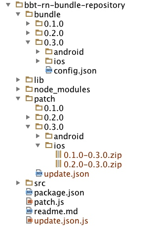

# ReactNative增量升级方案

# 前言
facebook的react-native给我们带来了用js写出原生应用的同时，也使得使用RN编写的代码的在线升级变得可能，终于可以不通过应用市场来进行升级，极大的提升了app修bug和赋予新功能的能力。----使用h5的方式也可以做到，但是rn的用户体验可要远远超过h5啊。

一般使用RN编写的app的线上使用方式，是将react-native bundle命令打出bundle文件和assets文件夹，直接内置到app中，app在viewcontroller或者activity中直接加载app内部的bundle文件，比如下图。


当修改了代码或者图片的时候，只要app使用新的bundle文件和assets文件夹，就完成了一次在线升级。

本文主要基于以上思路，讲解增量升级的解决方案。

# 何为增量？

 一个完整的RN-app程序通常包含以下几个部分：
 
 1. native代码部分-objc或者java
 2. js代码部分-rn代码、依赖的第三方库、业务代码等
 3. 图片资源部分

native代码别想了，没法在线升级，要是能大家就都不使用应用市场ota升级了。
 
能进行在线升级的是js代码部分和图片资源部分，具体到代码就是bundle文件和assets文件夹。

因为在线升级是要走网络的，我们要想办法将网络消耗降到最低，所以要使用增量升级的方式。

针对js代码部分（即bundle文件）的增量指的是，代码的改动有多少，增量patch的补丁就有多少，那些没有改动的代码部分是不在补丁的范围内的。

针对图片部分（即assets）的增量指的是，升级补丁包中只包含新增的图片和有改动的图片。

那么在app端，下载升级补丁包，只需要和现有的版本进行合并，就能计算出最新版本的全量包。

总结下流程：()中为例子

首先，计算增量包：新版本(v10) - 旧版本(v1到v9) = 增量包 （会有9个包，v1~v10.zip,v2~v10.zip,,,,,v9-v10.zip）

然后，app根据自己的当前版本(比如V6)，下载对应的增量包（V6-V10.zip）。

最后，app中通过 旧版本(v6) + 增量包(v6~v10.zip) = 新版本(v10) ，计算出了新版本的全量包。

 
# 增量算法
 
 assets增量算法，比较简单，就是比对，可以很容易的比较出新增的文件，和不同的文件（使用md5）。
 
 bundle文件的增量算法，确实比较复杂，刚开始没有什么头绪，后来在leader的指引下，很幸运的找到了google写的一个开源的库，可以对大字符串进行diff和patch，并且支持java、objc、js等等语言，完全的满足了我们的需求。

只用到2个接口，具体请参考github上的文档

1. 生成增量包时候：patch_make(text1, text2) => patches 
2. app生成全量包时候：patch_apply(patches, text1) => [text2, results]

google开源库地址：https://github.com/bystep15/google-diff-match-patch


# codepush

微软的codepush也做了类似的事情，不过由于以下原因，我们团队没敢使用其作为解决方案。

1. 其增量升级仅仅是针对图片资源的 
2. 其升级服务器端程序并不开源
3. 其升级服务器在美国，国内访问很慢且不稳定

不过，codepush客户端的源码和文档也给我们提供了很多思路，在此感谢codepush团队。

codepush地址：http://microsoft.github.io/code-push/

# bundle要求的app最小版本

本文中一般用min-v或者appMinV表示。

因为js代码是依赖于native代码的，所以，jsbundle对app的版本有要求，所以有这个概念。

试想，如果bundle依赖了一个native的一个新的接口，这个接口在v3版本的app中才发布，如果v2版本的app升级了这个bundle，那么必然会报错，严重的可能会导致app的崩溃。


# 系统结构设计与各模块职责


# bundle仓库设计

存储全量bundle和生成增量patch


## node patch 命令

在bundle目录下放入一个符合要求【参考目录结构说明】的新版本目录，比如0.3.0,然后执行以下命令。

命令：node patch 版本号 ， 示例：node patch 0.3.0

-d参数: node patch 版本号 -d ，如果加入-d参数，会先删除patch目录下的对应版本目录，然后进行patch生成

然后在patch目录中就会生成0.3.0的增量包，同时patch目录下的update.json文件也会重新生成.

## node update.json 命令

在patch目录下重新生成update.json文件

## 目录结构说明


```
bundle   存放全量bundle和全量assets的目录,里面的文件基本上是使用react-native bundle命令生成的
    0.1.0
        略
    0.2.0
        android
            略，同ios
        ios
            config.json    此版本的配置信息，包含要求app的最低版本等，手动配置
            index.jsbundle    全量jsbundle文件，使用react-native bundle命令生成
            assets    全量图片目录，使用react-native bundle命令生成
    0.3.0
        略
        
patch   存放增量补丁的目录，里面文件都是命令生成的，无需手动维护    
    0.1.0
        第一版本无文件
    0.2.0
        android
                略，同ios
        ios
            0.1.0-0.2.0.zip    增量包.zip
    0.3.0
        android
                略，同ios
        ios
            0.1.0-0.3.0.zip    增量包.zip
            0.2.0-0.3.0.zip    增量包.zip
    update.json    所有的升级包信息
src    存放打包用的源码
lib    存放打包用依赖的第三方的源码
patch.js    patch命令入口
update.json.js    update.json命令入口
```
## config.json示例

```
{
  "v": "0.3.0", //版本
  "min-v": "4.0.0", //此版本要求的最小app版本
  "date": "2016-01-01", //打包日期
  "des": [
    "修复xxbug", "添加xx功能"
  ]
}

```


## update.json示例

```
[
  {
    "v": "0.1.0",
    "min-v": "4.0.0",
    "date": "2016-01-01",
    "des": [
      "修复xxbug",
      "添加xx功能"
    ],
    "iosBundleMd5": "11f82563f8fd3f22dccb80ad2297f7bc",
    "androidBundleMd5": "11f82563f8fd3f22dccb80ad2297f7bc"
  },
  {
    "v": "0.2.0",
    "min-v": "4.0.0",
    "date": "2016-01-01",
    "des": [
      "修复xxbug",
      "添加xx功能"
    ],
    "iosBundleMd5": "3ca2824b008132cee515c0ea29938ff2",
    "androidBundleMd5": "3ca2824b008132cee515c0ea29938ff2"
  },
  {
    "v": "0.3.0",
    "min-v": "4.0.0",
    "date": "2016-01-01",
    "des": [
      "修复xxbug",
      "添加xx功能"
    ],
    "iosBundleMd5": "dbb81d2383112abb50eb19970c486acd",
    "androidBundleMd5": "dbb81d2383112abb50eb19970c486acd"
  }
]

```

# 升级服务器设计

## 接口patch/query

例如：http://localhost:3000/patch/query?bundleV=0.2.0&appV=4.0.0&platform=ios

此接口会有以下4个场景的使用情况，每个场景返回的json示例已经提供在后面文档中。

### 输入参数

    ```
    bundleV : app中的bundle版本
    appV : app版本
    platform : app的平台

    ```

### 返回json各项说明


 1. status : 本次请求后台是否发生了错误
 1. msg : 给用户看的中文提示信息，静默升级时候没什么用
 1. latestBundleV : 当前的最新bundle版本
 1. latestAppMinV : 最新bundle要求的app最低版本
 1. canUpdate : 能否升级，boolean
 1. canUpdateBundleV : 能升级的bundle版本
 1. canUpdateAppMinV : 能升级的bundle要求的app最低版本
 1. patchUrl : 补丁包相对地址
 1. platform : 平台：ios or android


### 场景1

能升级，且能升级到最新版

```
{
   status: 'success',
   msg: '可以升级，bundle最新版为0.3.0',
   latestBundleV: '0.3.0',
   latestAppMinV: '4.0.0',
   canUpdate: true,
   canUpdateBundleV: '0.3.0',
   canUpdateAppMinV: '4.0.0',
   patchUrl: 'patch/0.3.0/ios/0.2.0-0.3.0.zip',
   platform: 'ios'
}
```

### 场景2
无需升级,已经是最新版本

```
{
   status: 'success',
   msg: '无需升级，已经是最新版本',
   canUpdate: false,
   platform: 'ios'
}
```

### 场景3
能升级,能升级到当前appMinV的最新bundle版本,但不是最新的bundle,想升最新bundle，必须先升app

```
{
   status: 'success',
   msg: '可以升级，但app版本3.0.0太低，只能升到bundleV0.2.0，bundleV最新为0.3.0',
   latestBundleV: '0.3.0',
   latestAppMinV: '4.0.0',
   canUpdate: true,
   canUpdateBundleV: '0.2.0',
   canUpdateAppMinV: '3.0.0',
   patchUrl: 'patch/0.2.0/ios/0.1.0-0.2.0.zip',
   platform: 'ios'
}
```

### 场景4
不能升级,已经是当前appMinV的最新bundle,但不是最新的bundle,想升最新bundle，必须先升app

```
{
   status: 'success',
   msg: '不能升级，当前已经是app3.0.0的最新bundle了，但不是最新bundle0.3.0，想升级bundle到最新，请先升级app',
   latestBundleV: '0.3.0',
   latestAppMinV: '4.0.0',
   canUpdate: false,
   platform: 'ios'
}
```

# native客户端设计

客户端的主要工作就是发请求到升级服务器询问是否能升级，然后根据返回的信息，下载升级包，解压升级包，安装升级包。

过程中要保证下载的文件是正确的（md5校验），要保证补丁安装之后的全量bundle文件是正确的（md5校验）。

整个过程用户无感知。

此部分详细设计后边会补充。

# 遗留问题
目前rn将安卓的图片放入到res目录中，导致安卓图片不能使用在线升级的解决方案，但是codepush的作者已经重构了此部分内容，并提pr到rn，rn团队也接受了这个pr，会在近期的版本中发布。

参考地址：https://github.com/facebook/react-native/pull/4527

# 近期开源
本部分内容核心的几个部分都已经完成，近期完善之后，会开源出来。


