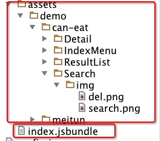
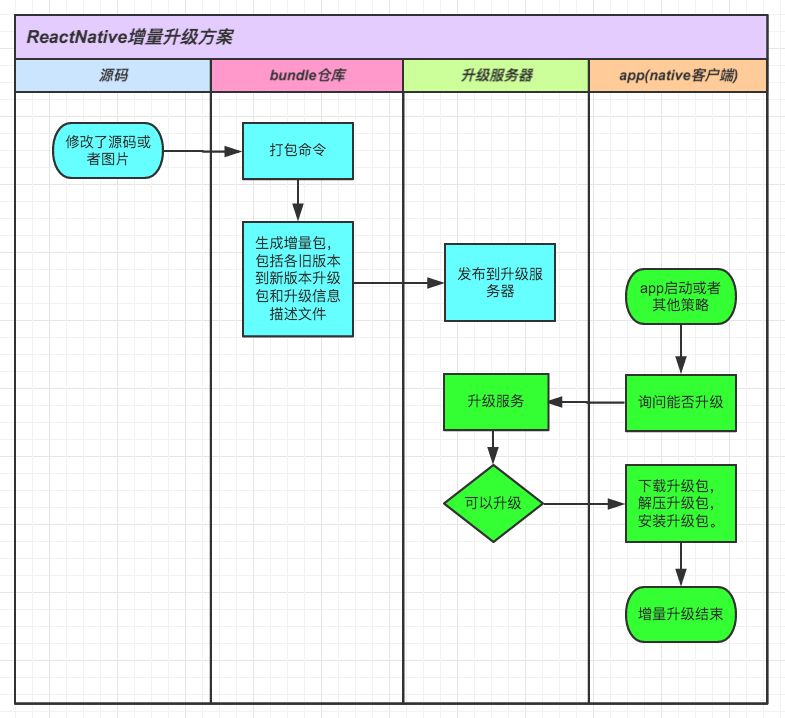

#ReactNative增量升级方案

#前言
facebook的react-native给我们带来了用js写出原生应用的同时，也使得使用RN编写的代码的在线升级变得可能，终于可以不通过应用市场来进行升级，极大的提升了app修bug和赋予新功能的能力。----使用h5的方式也可以做到，但是rn的用户体验可要远远超过h5啊。

一般使用RN编写的app的线上使用方式，是将react-native bundle命令打出bundle文件和assets文件夹，直接内置到app中，app在viewcontroller或者activity中直接加载app内部的bundle文件，比如下图。

当修改了代码或者图片的时候，只要app使用新的bundle文件和assets文件夹，就完成了一次在线升级。

本文主要基于以上思路，讲解增量升级的解决方案。

#何为增量？

 一个完整的RN-app程序通常包含以下几个部分：
 
 1. native代码部分-objc或者java
 2. js代码部分-rn代码、依赖的第三方库、业务代码等
 3. 图片资源部分

native代码别想了，没法在线升级，要是能大家就都不使用应用市场ota升级了。
 
能进行在线升级的是js代码部分和图片资源部分，具体到代码就是bundle文件和assets文件夹。

因为在线升级是要走网络的，我们要想办法将网络消耗降到最低，所以要使用增量升级的方式。

针对js代码部分（即bundle文件）的增量指的是，代码的改动有多少，增量patch的补丁就有多少，那些没有改动的代码部分是不在补丁的范围内的。

针对图片部分（即assets）的增量指的是，升级补丁包中只包含新增的图片和有改动的图片。

那么在app端，下载升级补丁包，只需要和现有的版本进行合并，就能计算出最新版本的全量包。

总结下流程：()中为例子

首先，计算增量包：新版本(v10) - 旧版本(v1到v9) = 增量包 （会有9个包，v1~v10.zip,v2~v10.zip,,,,,v9-v10.zip）

然后，app根据自己的当前版本(比如V6)，下载对应的增量包（V6-V10.zip）。

最后，app中通过 旧版本(v6) + 增量包(v6~v10.zip) = 新版本(v10) ，计算出了新版本的全量包。

 
#增量算法
 
 assets增量算法，比较简单，就是比对，可以很容易的比较出新增的文件，和不同的文件（使用md5）。
 
 bundle文件的增量算法，确实比较复杂，刚开始没有什么头绪，后来在团队boss的指引下，很幸运的找到了google写的一个开源的库，可以对大字符串进行diff和patch，并且支持java、objc、js等等语言，完全的满足了我们的需求。

只用到2个接口，具体请参考github上的文档

1. 生成增量包时候：patch_make(text1, text2) => patches 
2. app生成全量包时候：patch_apply(patches, text1) => [text2, results]

google开源库地址：https://github.com/bystep15/google-diff-match-patch

#系统结构设计与各模块职责

#bundle仓库设计

#升级服务器设计

#native客户端设计

