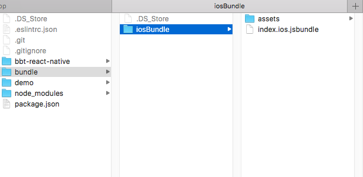

# ReactNative打离线包-ios篇

官方文档，内容很旧：<http://facebook.github.io/react-native/docs/running-on-device-ios.html#content>

相关链接：<https://github.com/facebook/react-native/issues/4084>

离线包就是把RN和你写的js图片等资源都打包放入app，不需要走网络下载。

升级服务器的使用方法：
在mobile-rn/bbt-rn-update-server目录中，执行命令npm start，然后访问http://localhost:3000/

#打包命令说明

react-native bundle

Options:

  --entry-file        Path to the root JS file, either absolute or relative to JS root                                   [required]
  
  --platform          Either "ios" or "android"         
                                                                 
  --transformer       Specify a custom transformer to be used (absolute path)                                            [default: "/Users/babytree-mbp13/projects/xcodeProjects/AwesomeProject/node_modules/react-native/packager/transformer.js"]
  
  --dev               If false, warnings are disabled and the bundle is minified                                         [default: true]
  
  --prepack           If true, the output bundle will use the Prepack format.                                            [default: false]
  
  --bridge-config     File name of a a JSON export of __fbBatchedBridgeConfig. Used by Prepack. Ex. ./bridgeconfig.json
  
  --bundle-output     File name where to store the resulting bundle, ex. /tmp/groups.bundle                              [required]
  
  --bundle-encoding   Encoding the bundle should be written in (https://nodejs.org/api/buffer.html#buffer_buffer).       [default: "utf8"]
  
  --sourcemap-output  File name where to store the sourcemap file for resulting bundle, ex. /tmp/groups.map       
       
  --assets-dest       Directory name where to store assets referenced in the bundle                     
                 
  --verbose           Enables logging                                                                                    [default: false]


 
#ios打包步骤
1. 在工程根目录下执行打包命令，比如``` react-native bundle --entry-file demo/index.js --bundle-output ./bundle/iosBundle/index.ios.jsbundle --platform ios --assets-dest ./bundle/iosBundle --dev false ```请参考上面命令说明，根据自己的情况进行修改再执行。注意要先保证bundle文件夹存在。
2. 命令执行完生成如下资源 


2. 在xcode中添加assets【必须用Create folder references的方式，添加完是蓝色文件夹图标】和index.ios.jsbundle，如图
3. 参考官方文档，修改AppDelegate.m文件,使用OPTION 2处的代码
	```
	jsCodeLocation = [[NSBundle mainBundle] URLForResource:@"index.ios" withExtension:@"jsbundle"];
	```
4. 一切OK 运行模拟器看效果吧
 
#ios打包遇到的问题
1. 离线包如果开启了chrome调试，会访问调试服务器，而且会一直loading出不来。 
2. 如果bundle的名字是main.jsbundle,app会一直读取旧的,改名就好了。。。非常奇葩的问题，我重新删了app，clean工程都没用，就是不能用main.jsbundle这个名字。
3. 必须用Create folder references【蓝色文件夹图标】的方式引入图片的assets，否则引用不到图片
4. 执行bundle命令之前，要保证相关的文件夹都存在


#To disable the developer menu for production builds:

For iOS open your project in Xcode and select Product → Scheme → Edit Scheme... (or press ⌘ + <). Next, select Run from the menu on the left and change the Build Configuration to Release.


For Android, by default, developer menu will be disabled in release builds done by gradle (e.g with gradle assembleRelease task). Although this behavior can be customized by passing proper value to ReactInstanceManager#setUseDeveloperSupport.

