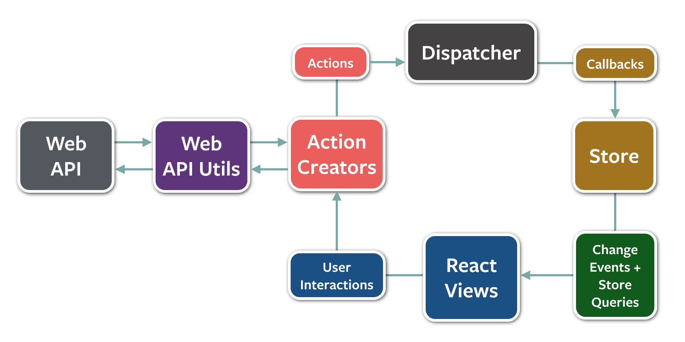

# ReactNative的架构设计
用RN最大的难题是设计思想的转变，以前的设计方法论已经不太适用了。而RN仅仅提供了view的框架，构建完整app的架构并没有直接提供。

如何解决组件间通信【父子、子父、兄弟等】，用state还是接口操作组件，组件状态放哪，业务逻辑放哪，数据放哪，因为太灵活了，怎么做都可以实现功能，但是怎么做才是最好的，才是最正确的呢？

`todo:RN还有个问题是，由于view是面向状态编程，相当于view只关注数据的最终状态，数据是怎么产生的并不关心，但是某些场景下，数据如何产生的是会影响到UI的一些行为的【比如一个增行的动画效果】，这在RN中很难描述。。。。这个问题加入tolist，会单独进行思考解答。`

RN架构就是为解决上述问题提供的指导和方法论，是通盘考虑整个开发、测试、运维的状况，做出的考虑最全面的抉择，或者为抉择提供依据。

目前为react服务的架构也有一些了，如Flux，Reflux，Redux，Relay，Marty。

##Flux
flux是官方提供的架构，目的是分层解耦，职责划分清晰，谁负责干啥很明确。具体描述可以参考官方文档，这里不详述。

1. action 封装请求
2. dispatcher 注册处理器、分发请求
3. store 是处理器，处理业务逻辑，保存数据
4. view 根据store提供的数据进行展现;接受用户的输入并发出action请求。

数据流动：
Action-> Dispatcher -> Store -> Component

但我觉得解耦的太细了，干一个事，要做太多太多的额外工作了。

光注册监听动作就2次，一次是store注册到dispatcher，一次是view注册到store中。

而且，注册到dispatcher的监听应该都不叫注册，架构完全没有提供任何封装，直接暴露一个统一的回调方法，里面自行if else路由不同的store。

##Reflux
结构上与flux架构基本一致，去掉了flux的冗余操作，架构更加简洁和紧凑，用到了一些约定大于配置的理念。

基本上将flux的架构冗余都简化了，可以说是flux的去冗余提升版，但是没有质的变化。

1. 更容易的监听。listenables和约定以on开头的方法。等。
2. 去掉了dispatcher。
3. action可以进行aop编程。
4. 去掉了waitfor。store可以监听store。
5. component提供了一系列mixin，方便注册\卸载到store的监听和与store交互等。

##Redux

##Relay
##Marty

## 理想情况是？

1. view组件负责展现，他有行为和外观。只通过暴露props来与外界交互。
2. view组件可以接受用户的操作，并转化为action。
3. action就启动了一次单向数据流。

### 按场景分析

