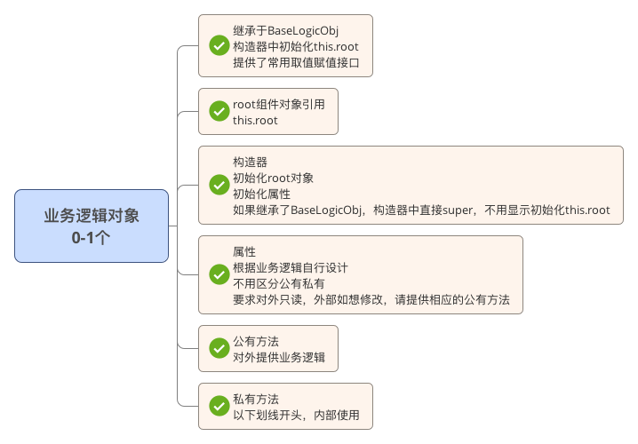

# ReactNative的组件架构设计

还有一篇较早的文章，也是分析的过程，可以对本篇文章进行一个补全：RN组件状态设计思考：http://segmentfault.com/a/1190000004180955 

请注意，本篇写的是react native的架构设计，如果你用react来开发web程序，本篇文章只能仅供参考，问题都没有在web上去考虑过。

本篇较长，前面是目前flux开源框架的一些分析，后面是架构设计过程。您可以直奔主题。

用RN最大的难题是设计思想的转变，以前的设计方法论已经不太适用了。而RN仅仅提供了view的框架，构建完整app的架构并没有直接提供。

考虑目前遇到的如下问题，希望架构给出解决方案。

1. **交互**：如何解决组件间通信【父子、子父、兄弟等，特别是跨层or反向数据流动等】；用state还是接口操作组件；
3. **职责**：组件状态放哪，业务逻辑放哪，数据放哪，因为太灵活了，怎么做都可以实现功能，但是怎么做才是最好的，才是最正确的呢？

*todo一个问题：由于react是面向状态编程，相当于react的组件只关注数据的最终状态，数据是怎么产生的并不关心，但是某些场景下，数据如何产生的是会影响到组件的一些行为的【比如一个新增行要求有动画效果，查询出的行就不需要等】，这在RN中很难描述。。。。。*

RN架构就是为解决上述问题提供的指导和方法论，是通盘考虑整个开发、测试、运维的状况，做出的考虑最全面的抉择，或者为抉择提供依据。

目前为react服务的架构也有一些了，如Flux，Reflux，Redux，Relay，Marty。

##Flux
flux是官方提供的架构，目的是分层解耦，职责划分清晰，谁负责干啥很明确。具体描述可以参考官方文档，这里不详述。

1. action 封装请求
2. dispatcher 注册处理器、分发请求
3. store 是处理器，处理业务逻辑，保存数据
4. view 根据store提供的数据进行展现;接受用户的输入并发出action请求。


数据流动：
Action-> Dispatcher -> Store -> Component

但我觉得解耦的太细了，干一个事，要做太多太多的额外工作了。

光注册监听动作就2次，一次是store注册到dispatcher，一次是view注册到store中。

而且，注册到dispatcher的监听应该都不叫注册，架构完全没有提供任何封装，直接暴露一个统一的回调方法，里面自行if else路由不同的store。


##Reflux
结构上与flux架构基本一致，去掉了flux的一些冗余操作【比如没有了dispatcher】，架构更加简洁和紧凑，用到了一些约定大于配置的理念。

基本上将flux的架构冗余都简化了，可以说是flux的去冗余提升版，但是没有本质的变化。

```
╔═════════╗       ╔════════╗       ╔═════════════════╗
║ Actions ║──────>║ Stores ║──────>║ View Components ║
╚═════════╝       ╚════════╝       ╚═════════════════╝
     ^                                      │
     └──────────────────────────────────────┘

```

1. 更容易的监听。listenables和约定以on开头的方法。等。
2. 去掉了dispatcher。
3. action可以进行aop编程。
4. 去掉了waitfor。store可以监听store。
5. component提供了一系列mixin，方便注册\卸载到store的监听和与store交互等。

##Redux

社区内比较受推崇，因为用起来相对比较简单


特性：

1. 分层设计，职责清晰。
2. 要求store reducer都是页面单例，易于管理。
2. action为请求dto对象，是请求类型，请求数据的载体。
3. reducer是处理请求的方法。不允许有状态，必须是纯方法。必须严格遵守输入输出，中间不允许有异步调用。不允许对state直接进行修改，要想修改必须返回新对象。
4. store
	5. 维持应用的state；
	1. 提供 getState() 方法获取 state；
	2. 提供 dispatch(action) 方法分发请求来更新 state；门面模式，要求所有的请求满足统一的格式【可以进行路由、监控、日志等】，统一的调用方式。
	1. 通过 subscribe(listener) 注册监听器监听state的变化。
1. 官方文档写的较为详细，从设计到开发都有，比flux要好

痛处如下，看能否接受或者解决：

1. redux的原则1：state不能被修改。 
	4. 其实这个用react的state也会有同样的问题，最好把state设计的没有冗余，尽量少出这种情况
	4. **解决方案：**参考官方：因为我们不能直接修改却要更新数组中指定的一项数据，这里需要先把前面和后面都切开。如果经常需要这类的操作，可以选择使用帮助类 React.addons.update，updeep，或者使用原生支持深度更新的库 Immutable。最后，时刻谨记永远不要在克隆 state 前修改它。
4. 单一的庞大的reducer的拆分
	5. 这块设计也不好做，会让人疑惑
	6. 官方给的demo中直接按state的内容区分，我觉得这样做不好，如果后期有跨内容的情况，就比较奇怪了。官方给的combineReducers方案，也只是减少代码量，本质没有变化，state还是拆分处理，路由还是业务逻辑自己来做。
	7. **解决方案**：还是处理一整个state，可以按照约定写reducer类而不是方法，类里按照actionType建方法，架构自动路由并调用。
	8. 以前做java架构，路由一定是架构来调用的，目前感觉各大flux框架都是解决问题不彻底。
1. 官方建议设计模式：顶层容器组件才对redux有依赖，组件间通过props来传递数据。按照这样设计还是没有解决组件间交互和数据传递的问题。官方react设计建议：react的设计建议：http://camsong.github.io/redux-in-chinese/docs/basics/UsageWithReact.htm
2. 使用connect将state绑定到component。此处有些黑盒了。
2. 异步action用来请求服务端数据,利用middleware增强createStore的dispatch后即支持。

##Relay
没有时间，没做研究
##Marty
没有时间，没做研究

##结论

开源架构封装的简单的flux会产生较多的冗余代码。

开源架构封装的复杂的redux，其和RN绑定封装了一些东西，是一个黑盒，不易理解和维护。

介于上述两者之间的开源架构reflux，文档较上述2个少，不知道其可持续性如何。如果一定要用开源架构的话，我觉得他稍加封装是一个较为推荐的选择。

不是特复杂的程序【一般spa的程序会更复杂一些，而RN并不是spa】，这些概念只会增加你的开发难度，并且对后面维护的人要求更高。

我们继续头脑风暴，继续抽象总结一下flux系列框架， flux系列框架干了什么，没干什么，针对开篇提出的问题。

2. 【解决职责】flux系列框架都做到了解耦，分层，谁该干什么就干什么，不许干别的，让代码读起来更有预测性和一致性，方便维护
3. 【解决通信】继续解耦，flux系列框架采用事件机制解决各层之间通信，采用props传递解决各组件之间通信。


####事件系统是关键

flux系列架构解决通信问题的方法是使用事件系统，事件系统中的回调函数是业务逻辑，redux是【store action reducer】，flux是【action dispacher store】。

我们真的需要事件系统吗？

事件系统的好处： 

1. 一个事件可以注册多个回调函数
2. 各回调函数间没有耦合。

关于1

需要注册多个的这种情况并不多见，不信你去翻看你已经写好的代码，是不是大部分都是注册一个。

关于2 

解耦确实很彻底，但是当我需要控制执行顺序，需要等a执行完在执行b，怎么办？ok你可以先注册a在注册b啊。那a要是一个fetch或ajax操作呢？这时候只能乖乖的在a的请求结束回调函数中进行调用b了。又变成a依赖b了。当然，你可以继续dispatch(b)，这就没有耦合了。但是你要知道注册一个事件是要有成本的，要写action，而且这种dispatch的方式，真的不太适合人类的阅读，dispatch一下，下一步都有谁来执行都不知道，这哪有直接调用来的爽快。


好吧说到这，最后的结论也出来了，不使用开源架构，借助其好的思想，替换其事件系统为面向对象结构，自行封装架构。


## 架构设计

再次强调：目前仅考虑如何应用于react native

###先扣题，针对开篇问题的解决方案如下

####交互
1. 组件对外发布：组件对外只允许使用props来暴露功能，不允许使用接口及其它一切方式
2. 父子组件间：组件的子组件通过父组件传递的接口来与父组件通信
3. 兄弟组件间:
	4. 方案1：假设a要调用b，参考第一条的话，其实就是a要改变b的props，那么a只要改b的props的来源即可，b的props的来源一般就是根组件的state。那么根组件就要有组织和协调的能力。
	5. 方案2：利用事件机制，基本同flux架构。略复杂，且我们并不需要事件的特性，本架构设计不推荐。	
#### 职责

1. root-存放state，组织子view组件，组织业务逻辑对象等
2. 子view组件-根据this.props渲染view。
3. 业务逻辑对象-提供业务逻辑方法


根据以上推导，我将其命名为面向对象的ReactNative组件架构设计，它与flux系列架构的最大的不同之处在于，用业务逻辑对象来代替了【store action dispatcher】or【store reducer】的事件系统。业务逻辑对象就是一组对象，用面向对象的设计理念设计出的n个对象，其负责处理整个页面的业务逻辑。

以上为推导过程，干货才开始。。。。

### 面向对象的ReactNative组件\页面架构设计

 一个独立完整的组件\页面一般由以下元素构成：
 
1. root组件，1个， 
	1. 负责初始化state
	2. 负责提供对外props列表
	2. 负责组合子view组件形成页面效果
	3. 负责注册业务逻辑对象提供的业务逻辑方法
	4. 负责管理业务逻辑对象
1. view子组件，0-n个，
	1. 根据props进行视图的渲染
1. 业务逻辑对象，0-n个，
	2. 提供业务逻辑方法 

		
####root组件
root组件由以下元素组成：

1. props-公有属性
2. state-RN体系的状态,必须使用Immutable对象
3. 私有属性
4. 业务逻辑对象的引用-在componentWillMount中初始化
4. 私有方法-以下划线开头，内部使用or传递给子组件使用
5. 公有方法【不推荐】，子组件和外部组件都可以用，但不推荐用公有方法来对外发布功能，破坏了面向状态编程，尽可能的使用props来发布功能


	

####子view组件

子view组件中包含：

1. props-公有属性
2. 私有属性-强烈不建议有，除非你能理解以下几点，建议放在父组件or业务逻辑对象中
	3. 绝对不允许和父组件的属性or状态有冗余。无论是显性冗余还是计算结果冗余，除非你能确定结算是性能的瓶颈。
	4. 此属性只有自己会用，父组件和兄弟组件不会使用，如果你不确定这点，请把这个组件放到父组件上，方便组件间通信
3. 私有方法-仅作为渲染view的使用，不许有业务逻辑
4. 公有方法【不推荐，理由同root组件】 

	

	

	
####业务逻辑对象
业务逻辑对象由以下元素组成：

3. root组件对象引用-this.root
2. 构造器-初始化root对象，初始化私有属性
2. 私有属性
3. 公有方法-对外提供业务逻辑
3. 私有方法-以下划线开头，内部使用

	



	 
#### ps1：通用型组件只要求尽量满足上述架构设计

通用型组件一般为不包含任何业务的纯技术组件，具有高复用价值、高定制性、通常不能直接使用需要代码定制等特点。

可以说是一个系统的各个基础零件，比如一个蒙板效果，或者一个模态弹出框。

架构的最终目的是保证系统整体结构良好，代码质量良好，易于维护。一般编写通用型组件的人也是经验较为丰富的工程师，代码质量会有保证。而且，作为零件的通用组件的使用场景和生命周期都和普通组件\页面不同，所以，仅要求通用组件编写尽量满足架构设计即可。


####ps2：view子组件复用问题
	
抛出一个问题，设计的过程中，子组件是否需要复用？子组件是否需要复用会影响到组件设计。
	
6. 需复用，只暴露props，可以内部自行管理state【尽量避免除非业务需要】
7. 不需复用，只暴露props，内部无state【因为不会单独使用，不需要setState来触发渲染】
 
其实， 一般按照不需复用的情况设计，除非复用很明确，但这时候应该抽出去，变成独立的组件存在就可以了，所以这个问题是不存在的。
	
	
	
##适用场景分析

###flux系列框架

flux系列框架的适用场景我觉得应具有以下特点：

**一个页面中组件较多，组件之间较为独立，但是重叠使用模型，模型的变化会影响很多组件的展现和行为。**

比如，开发一个类似qq的聊天页面，左侧是联系人列表，右侧是与某人的消息对话框，当收到一个消息之后，1要刷新左侧联系人列表的最近联系人，2要右侧的消息对话框中显示这个消息，3要页面title要提示新消息。这就是典型的一个新消息到来事件【消息模型发生了变化】触发三个无关联的组件都有行为和展现的变化。如果用事件系统来开发就做到了解耦的极致，未来如果还要加入第4种处理也不用修改原来的逻辑，就直接注册一下就可以了，满足了开闭原则。


###面向对象的RN组件架构

面向对象的RN组件架构的使用场景特点我没有总结出来，我觉得所有场景都可以用，只要你业务逻辑对象设计的好，都不是问题。

还拿上面聊天界面举例子，面向对象的RN组件架构其实也可以解耦的写出写上述场景，你完全可以将业务逻辑对象之间的交互设计成一个小的事件系统，只是架构没有直接约束这种解耦，flux系列架构直接在架构中就强制编码人员做到了解耦，但是如果我不需要解耦的时候就相当于增加了复杂度，得不偿失了。

所以面向对象的RN组件架构要更灵活，也更简单更容易让人理解，更容易预测代码的执行流向，但同时因为灵活对业务逻辑对象设计者的要求也较高，针对较为复杂or重要页面建议进行详细设计并leader检查来保证质量。


##如何做监控

因为面向对象的RN架构中去掉了统一的业务逻辑调用facade入口dispatch，那我们如何来做监控呢。

###方案1：在需要监控的地方人为加入监控点。
这个方案对业务代码和监控代码的耦合确实有点大，是最差的解决方案了。不推荐。
###方案2：在基类BaseLogicObj的构造器中对对象的所有方法进行代理-todo待验证
这个方案对业务代码透明，但是还只是个想法，未进行代码测试和验证。
###方案3.....还没有想出别的方案，有没有同学给点思路？


##架构之美

最后在分享demo代码之前，摘抄了天猫前端架构师团队对架构的认识，个人觉得十分认同。

简单：
简单的东西才能长久，HTML、CSS和JavaScript之所以能够活到现在，而其他类似的很牛的方案都死掉了，原因之一是简单，才有那么多人用它，所以我们需要把技术和产品方案朝着简单的思路发展，简单才是本质，复杂一定是临时的会过时的。天猫的前端技术架构为什么都基于Kissy，为什么是两层架构，就是朝着简单的方式去思考。看起来简单，用起来简单。

高效：
简单是高效的前提，复杂的高效都是临时的会过时的，技术架构一定要提高团队的工作效率，否则一定会被抛弃，因此把简单的规则自动化，把精确的重复的事情让机器去做，前端这么多年为什么开发环境不够成熟，就是自动化的工具太少，前端又很少能力驾驭编写工具的语言，而Nodejs的出现是一个前所未有的机会。

灵活：
高效往往和灵活是对立的，就像移动上Native和Web的关系，而我们就需要思考如何做到两者兼顾，既高效又灵活，所以要不断把事情做简单，思考本质、看到本质，基于本质去实现。比如Apple为什么敢于把鼠标和键盘去掉，是因为确信人直接和界面打交道比借助一个中间硬件更能够表达人机交互的本质。

新鲜：
面向未来，前端需要不停地更新自己，无论是思想还是技术。比如整个天猫基于Kissy，那么就使用最新的Kissy版本，基础设施能够升级是一种能力，如果有一天基础设施升不了啦，那么这套技术架构就老去了。比如发现Gulp比Grunt更能够代表未来，那么我们毫不犹豫地整个团队开始进行升级。

##完整demo代码

此demo仿照redux提供的todolist demo编写。

redux demo 地址：http://camsong.github.io/redux-in-chinese/docs/basics/ExampleTodoList.html

demo截图：


 

todolist页面：

```


'use strict'


let React=require('react-native');
let Immutable = require('immutable');
var BbtRN=require('../../../bbt-react-native');


var {
    BaseLogicObj,
    }=BbtRN;


let {
    AppRegistry,
    Component,
    StyleSheet,
    Text,
    View,
    Navigator,
    TouchableHighlight,
    TouchableOpacity,
    Platform,
    ListView,
    TextInput,
    ScrollView,
    }=React;

//root组件开始-----------------

let  Root =React.createClass({

    //初始化模拟数据，
    data:[{
        name:'aaaaa',
        completed:true,
    },{
        name:'bbbbb',
        completed:false,
    },{
        name:'ccccc',
        completed:false,
    }
    ,{
        name:'ddddd',
        completed:true,
    }],


    componentWillMount(){

        //初始化业务逻辑对象
        this.addTodoObj=new AddTodoObj(this);
        this.todoListObj=new TodoListObj(this);
        this.filterObj=new FilterObj(this);

        //下面可以继续做一些组件初始化动作，比如请求数据等.
        //当然了这些动作最好是业务逻辑对象提供的，这样root组件将非常干净.
        //例如这样：this.todoListObj.queryData();
    },


    //状态初始化
    getInitialState(){
      return {
          data:Immutable.fromJS(this.data),//模拟的初始化数据
          todoName:'',//新任务的text
          curFilter:'all',//过滤条件 all no ok
      }
    },


    //这里组合子view组件 并 注册业务逻辑对象提供的方法到各个子view组件上
    render(){

        return (
            <View style={{marginTop:40,flex:1}}>

                <AddTodo todoName={this.state.todoName}
                        changeText={this.addTodoObj.change.bind(this.addTodoObj)}
                         pressAdd={this.addTodoObj.press.bind(this.addTodoObj)} />

                <TodoList todos={this.state.data}
                          onTodoPress={this.todoListObj.pressTodo.bind(this.todoListObj)} />

                <Footer curFilter={this.state.curFilter}
                    onFilterPress={this.filterObj.filter.bind(this.filterObj)} />

            </View>
        );
    },


});


//业务逻辑对象开始-------------------------可以使用OO的设计方式设计成多个对象

//业务逻辑对象要符合命名规范：以Obj结尾
//BaseLogicObj是架构提供的基类，里面封装了构造器和一些常用取值函数
class AddTodoObj extends BaseLogicObj{

    press(){
        if(!this.getState().todoName)return;
        let list=this.getState().data;
        let todo=Immutable.fromJS({name:this.getState().todoName,completed:false,});
        this.setState({data:list.push(todo),todoName:''});
    }

    change(e){
        this.setState({todoName:e.nativeEvent.text});
    }

}


class TodoListObj extends BaseLogicObj {


    pressTodo(todo){

        let data=this.getState().data;

        let i=data.indexOf(todo);

        let todo2=todo.set('completed',!todo.get('completed'));

        this.setState({data:data.set(i,todo2)});
    }
}


class FilterObj extends BaseLogicObj {


    filter(type){

        let data=this.getState().data.toJS();
        if(type=='all'){
            data.map((todo)=>{
                todo.show=true;
            });
        }else if(type=='no'){
            data.map((todo)=>{
                if(todo.completed)todo.show=false;
                else todo.show=true;
             });
        }else if(type=='ok'){
            data.map((todo)=>{
                if(todo.completed)todo.show=true;
                else todo.show=false;
            });
        }


        this.setState({curFilter:type,data:Immutable.fromJS(data)});
    }


}


//view子组件开始---------------------------


//子view对象中仅仅关注：从this.props转化成view
let Footer=React.createClass({

    render(){

        return (


            <View style={{flexDirection:'row', justifyContent:'flex-end',marginBottom:10,}}>

                <FooterBtn {...this.props} title='全部' name='all'  cur={this.props.curFilter=='all'?true:false} />
                <FooterBtn {...this.props} title='未完成' name='no' cur={this.props.curFilter=='no'?true:false} />
                <FooterBtn {...this.props} title='已完成' name='ok' cur={this.props.curFilter=='ok'?true:false} />

            </View>


        );
    },


});


let FooterBtn=React.createClass({

    render(){

        return (

            <TouchableOpacity onPress={()=>this.props.onFilterPress(this.props.name)}
                              style={[{padding:10,marginRight:10},this.props.cur?{backgroundColor:'green'}:null]} >
                <Text style={[this.props.cur?{color:'fff'}:null]}>
                    {this.props.title}
                </Text>
            </TouchableOpacity>

        );
    },


});


let AddTodo=React.createClass({

    render(){

        return (


            <View style={{flexDirection:'row', alignItems:'center'}}>


                <TextInput value={this.props.todoName}
                    onChange={this.props.changeText}
                    style={{width:200,height:40,borderWidth:1,borderColor:'e5e5e5',margin:10,}}></TextInput>


                <TouchableOpacity onPress={this.props.pressAdd}
                    style={{backgroundColor:'green',padding:10}} >
                    <Text style={{color:'fff'}} >
                        添加任务
                    </Text>
                </TouchableOpacity>

            </View>


        );
    },


});


let Todo=React.createClass({

    render(){
        let todo=this.props.todo;
        return (
            todo.get("show")!=false?
            <TouchableOpacity  onPress={()=>this.props.onTodoPress(todo)}
                style={{padding:10,borderBottomWidth:1,borderBottomColor:'#e5e5e5'}}>
                <Text style={[todo.get('completed')==true?{textDecorationLine:'line-through',color:'#999'}:null]} >
                    {todo.get('completed')==true?'已完成   ':'未完成   '} {todo.get('name')}
                </Text>
            </TouchableOpacity>
             :null
        );
    },


});


let TodoList=React.createClass({
    render(){
        return (
            <ScrollView style={{flex:1}}>
                {this.props.todos.reverse().map((todo, index) => <Todo {...this.props} todo={todo} key={index}  />)}
            </ScrollView>
        );
    },
});


module.exports=Root;


```

业务逻辑对象基类BaseLogicObj:

```


'use strict'

class BaseLogicObj{


    constructor(root){
        if(!root){
            console.error('实例化BaseLogicObj必须传入root组件对象.');
        }
        this.root=root;
    }

    getState(){
        return this.root.state;
    }

    setState(s){
        this.root.setState(s);
    }

    getRefs(){
        return this.root.refs;
    }

    getProps(){
        return this.root.props;
    }

}

module.exports=BaseLogicObj;

```


