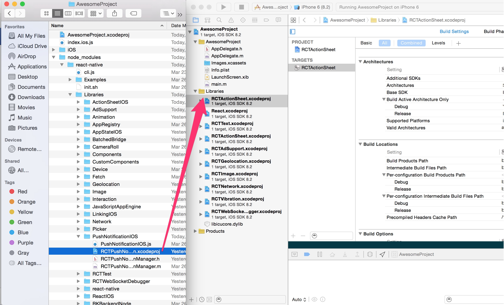
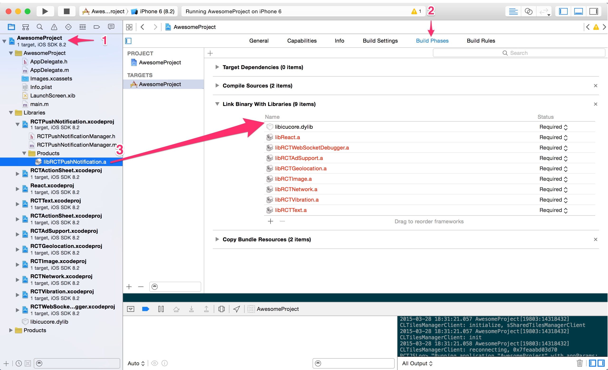
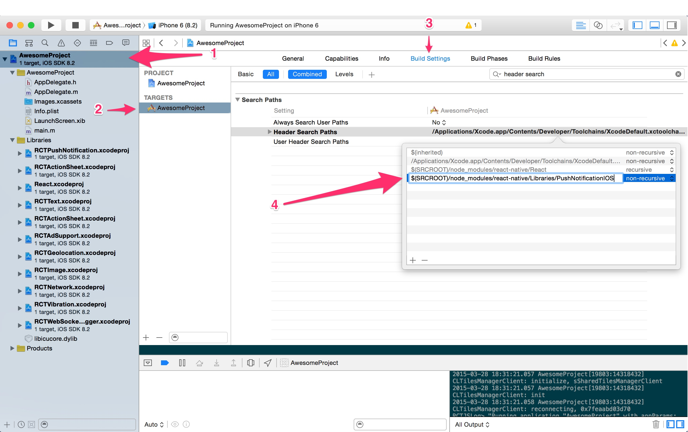
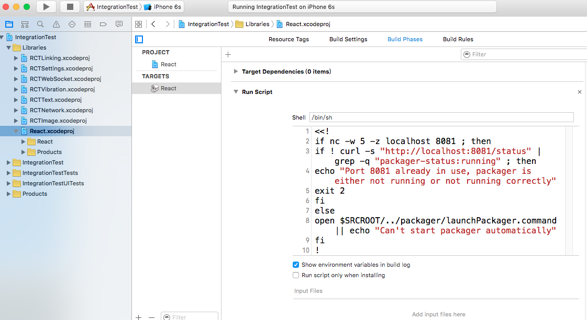

# 已有工程集成ReactNative-IOS

以下步骤为手动添加的方式，使用rnpm的方式请参考官方文档。

本文是对官方文档的一个补充，大部分内容来源于官网文档。

官方参考地址： http://facebook.github.io/react-native/docs/linking-libraries-ios.html#content

中文参考地址：http://reactnative.cn/docs/linking-libraries-ios.html#content

#第一步：添加.xcodeproj文件
把需要的.xcodeproj文件，拖到你的XCode工程下（通常拖到XCode的Libraries分组里）





react-native需要集成的.xcodeproj文件清单如下：

```
node_modules/react-native/React/React.xcodeproj
node_modules/react-native/Libraries/Image/RCTImage.xcodeproj
node_modules/react-native/Libraries/Network/RCTNetwork.xcodeproj
node_modules/react-native/Libraries/Text/RCTText.xcodeproj
node_modules/react-native/Libraries/Vibration/RCTVibration.xcodeproj
node_modules/react-native/Libraries/WebSocket/RCTWebSocket.xcodeproj
node_modules/react-native/Libraries/LinkingIOS/RCTLinking.xcodeproj
node_modules/react-native/Libraries/Settings/RCTSettings.xcodeproj

```

#第二步添加.a文件

点击你的主工程文件，选择Build Phases，然后把刚才所添加进去的.xcodeproj下的Products文件夹中的静态库文件（.a文件），拖到Link Binary With Libraries组内。





#第三步注册头文件路径-不是所有依赖都需要，注册React.xcodeproj即可

需要在原生代码中使用这个库，还是只需要通过JavaScript访问？
如果你只需要通过JavaScript访问这个库，你就可以跳过这步了。


打开你的工程文件，选择Build Settings，然后搜索Header Search Paths，然后添加库所在的目录（如果它还有像React这样的子目录需要包含，注意要选中recursive选项）




注意：React.xcodeproj是需要注册的。

$(SRCROOT)/RN/node_modules/react-native/React  

recursive


#报错： App Transport Security has blocked a cleartext HTTP (http://) resource load since it is insecure

报错原因是需要开启内网http的访问权限。

1. 在Info.plist中添加 NSAppTransportSecurity 类型 Dictionary ;
1. 在 NSAppTransportSecurity 下添加 NSAllowsArbitraryLoads 类型Boolean ,值设为 YES;

参考地址：

http://www.cnblogs.com/chglog/p/4746683.html


#报错：unrecognized selector sent to instance

解决方案：

Build Settings -> other linker flags -> -ObjC


参考地址1：https://github.com/facebook/react-native/issues/2396

参考地址2：http://stackoverflow.com/questions/32775481/rctbatchedbridge-perfstats-unrecognized-selector-sent-to-instance


#报错：RCTStatusBarManager module requires that the UIViewControllerBasedStatusBarAppearance key in the Info.plist is set to NO

错误信息说的很清楚了。

在Info.plist中添加View controller-based status bar appearance为NO。


#关闭自动启动调试服务器

在React.xcodeproj的Build Phases中的第一个（有8081那个）Run Script。用    <<!   代码代码代码  ！  注释掉即可。




