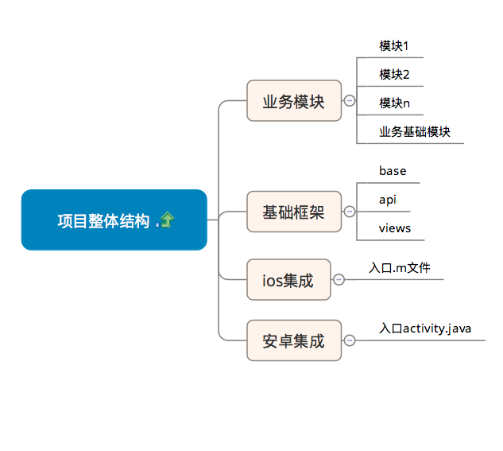
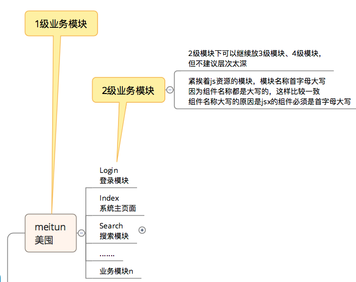
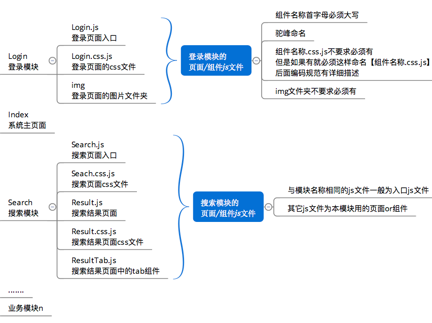
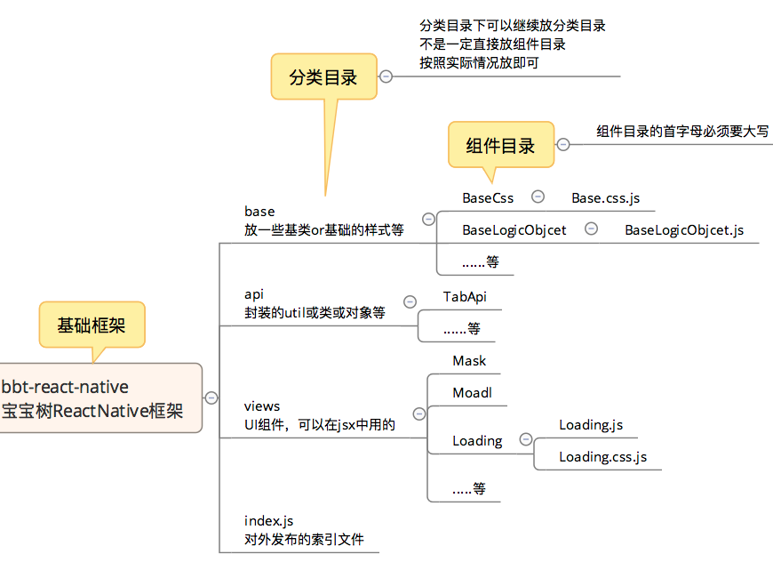

#ReactNative目录与命名规范 

##RN项目结构规划如下：

##业务模块目录与命名规范

###业务模块目录规范

###业务模块文件规范

##基础框架目录与命名规范

##总结

1. 扩展名统一为.js
1. 样式文件要如下格式：组件名称.css.js
1. 紧挨着文件的文件夹名，直接使用组件/页面名称命名
1. 组件or页面的首字母要大写,驼峰命名
2. 如果同一个文件夹下有同名而不同作用的js文件，则通过中缀（小写）进一步区分，例如：HomeView.component.js,HomeView.css.js,HomeView.action.js等
1. img文件夹可选

