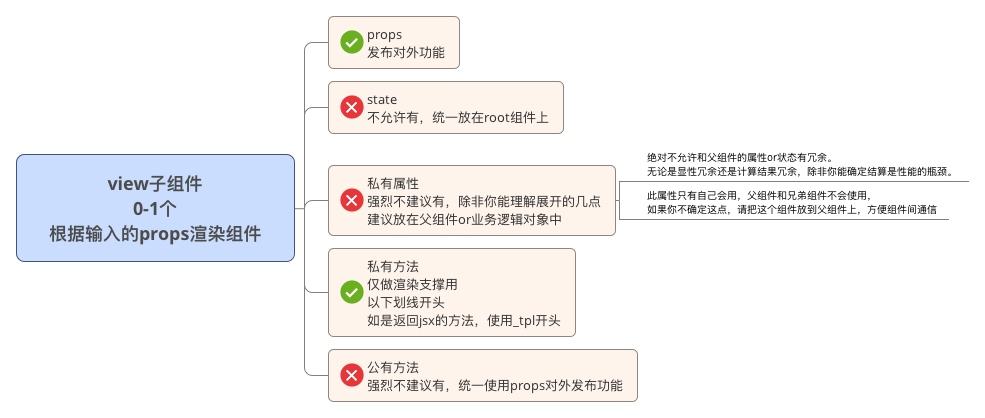

#ReactNative组件/页面结构规范

## 业务页面/组件结构规范

 一个独立完整的组件\页面一般由以下元素构成：
 
1. root组件，1个， 
	1. 负责初始化state
	2. 负责提供对外props列表
	2. 负责组合子view组件形成页面效果
	3. 负责注册业务逻辑对象提供的业务逻辑方法
	4. 负责管理业务逻辑对象
1. view子组件，0-n个，
	1. 根据props进行视图的渲染
1. 业务逻辑对象，0-n个，
	2. 提供业务逻辑方法 

		
##root组件结构
root组件由以下元素组成：

1. props-公有属性
2. state-RN体系的状态,必须使用Immutable对象
3. 私有属性
4. 业务逻辑对象的引用-在componentWillMount中初始化
4. 私有方法-以下划线开头，内部使用or传递给子组件使用
5. 公有方法【不推荐】，子组件和外部组件都可以用，但不推荐用公有方法来对外发布功能，破坏了面向状态编程，尽可能的使用props来发布功能


##子view组件结构

子view组件中包含：

1. props-公有属性
2. 私有属性-强烈不建议有，除非你能理解以下几点，建议放在父组件or业务逻辑对象中
	3. 绝对不允许和父组件的属性or状态有冗余。无论是显性冗余还是计算结果冗余，除非你能确定结算是性能的瓶颈。
	4. 此属性只有自己会用，父组件和兄弟组件不会使用，如果你不确定这点，请把这个组件放到父组件上，方便组件间通信
3. 私有方法-仅作为渲染view的使用，不许有业务逻辑
4. 公有方法【不推荐，理由同root组件】 



	

	
##业务逻辑对象结构
业务逻辑对象由以下元素组成：

3. root组件对象引用-this.root
2. 构造器-初始化root对象，初始化私有属性
2. 私有属性
3. 公有方法-对外提供业务逻辑
3. 私有方法-以下划线开头，内部使用

	


####注意：定义root组件的state的时候，如果使用es6的方式，要把state的初始化放到componentWillMount中，如果在构造器中this.props为空。
	
	
##通用组件结构
	
参考业务组件结构，尽量遵守，灵活调整。
	
PropTypes ，必须要有且必须要写注释。

公用方法不推荐有，理由同业务开发规范，如果有，要求写注释。


## 组件方法声明的顺序

  - 原则上按如下顺序排列React组件的各个方法（生命周期）：
  
  1. constructor
  1. 静态方法（static methods)
  1. 生命周期事件
  1. render

## 按如下方式定义propTypes, defaultProps, contextTypes等  

  ```javascript
  import React, { Component, PropTypes } from 'react';
  
  const propTypes = {
    id: PropTypes.number.isRequired,
    url: PropTypes.string.isRequired,
    text: PropTypes.string,
  };
  
  const defaultProps = {
    text: 'Hello World',
  };
  
  class Link extends Component {
    static methodsAreOk() {
      return true;
    }
  
    render() {
      return <a href={this.props.url} data-id={this.props.id}>{this.props.text}</a>
    }
  }
  
  Link.propTypes = propTypes;
  Link.defaultProps = defaultProps;
  
  export default Link;
  ```


##相关参考地址

https://github.com/cnsnake11/blog/blob/master/ReactNative开发指导/ReactNative的架构设计.md

https://github.com/cnsnake11/blog/blob/master/ReactNative开发指导/ReactNative组件状态设计思考.md

