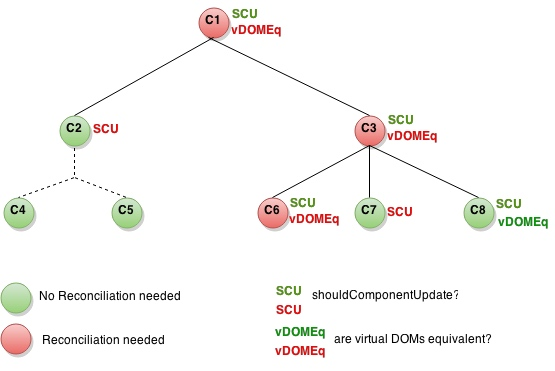

# React Advanced Performance 性能进阶 - 未翻译完

英文原文地址：https://facebook.github.io/react/docs/advanced-performance.html

One of the first questions people ask when considering React for a project is whether their application will be as fast and responsive as an equivalent non-React version. The idea of re-rendering an entire subtree of components in response to every state change makes people wonder whether this process negatively impacts performance. React uses several clever techniques to minimize the number of costly DOM operations required to update the UI.

是否选择使用react，最常考虑的一点就是react的性能。每一次state的改变都会触发整个组件树的渲染，这种机制对性能的影响一定存在。react提供了几种办法来最小化这种影响。

#Use the production build 使用生产模式

If you're benchmarking or experiencing performance problems in your React apps, make sure you're testing with the minified production build. The development build includes extra warnings that are helpful when building your apps, but it is slower due to the extra bookkeeping it does.

如果你遇到了性能瓶颈，首先确保你使用了压缩过的生产模式版本。开发模式版本提供了更多的警告和提示信息，这会耗费一定的性能。

#Avoiding reconciling the DOM 避免dom重绘

React makes use of a virtual DOM, which is a descriptor of a DOM subtree rendered in the browser. This parallel representation allows React to avoid creating DOM nodes and accessing existing ones, which is slower than operations on JavaScript objects. When a component's props or state change, React decides whether an actual DOM update is necessary by constructing a new virtual DOM and comparing it to the old one. Only in the case they are not equal, will React reconcile the DOM, applying as few mutations as possible.

react使用了虚拟dom，它就是浏览器中dom树的一个镜像。所以，react可以避免直接操作真实dom，提升了速度。当组件的props或state发生了变化，react会去比对虚拟dom和真实dom的差异。当他们不一致，react才会去修改真实dom，并且只针对不一致的地方进行增量修改。【译者注：虚拟dom比较和真实dom的修改都属于react重绘的过程】

On top of this, React provides a component lifecycle function, shouldComponentUpdate, which is triggered before the re-rendering process starts (virtual DOM comparison and possible eventual DOM reconciliation), giving the developer the ability to short circuit this process. The default implementation of this function returns true, leaving React to perform the update:

基于上述原理，react提供了一个组件生命周期事件，shouldComponentUpdate，当重绘开始之前会触发（包括虚拟dom比较和真实dom修改之前），使得开发者可以精确的控制是否需要执行重绘。此事件的默认实现返回true，所以，默认情况下，react每次都会执行重绘的算法。

```
shouldComponentUpdate: function(nextProps, nextState) { // 默认实现
  return true;
}
```

Keep in mind that React will invoke this function pretty often, so the implementation has to be fast.

注意，react会非常频繁的执行这个事件，所以要保证你的实现性能极佳。

Say you have a messaging application with several chat threads. Suppose only one of the threads has changed. If we implement shouldComponentUpdate on the ChatThread component, React can skip the rendering step for the other threads:

假如你开发了一个聊天程序，里面会有很多的对话线程。当其中一个对话线程发生了变化。如果对话线程实现了shouldComponentUpdate，react可以取消掉其余没有改变的对话线程的重绘。

```
shouldComponentUpdate: function(nextProps, nextState) {
  // TODO: return whether or not current chat thread is
  // different to former one.
  
  // todo: 当前对话线程如果发生了改变返回true，否则返回false
}
```

So, in summary, React avoids carrying out expensive DOM operations required to reconcile subtrees of the DOM by allowing the user to short circuit the process using shouldComponentUpdate, and, for those which should update, by comparing virtual DOMs.

总结，react利用开发者实现的shouldComponentUpdate事件来避免不必要的重绘过程，当需要真实dom变化的时候，通过与虚拟dom的比对，对真实dom进行增量修改。

#shouldComponentUpdate in action 如何使用shouldComponentUpdate

Here's a subtree of components. For each one is indicated what shouldComponentUpdate returned and whether or not the virtual DOMs were equivalent. Finally, the circle's color indicates whether the component had to be reconciled or not.

下图是一个组件树。每一个组件都标识出了shouldComponentUpdate的返回值、虚拟dom是否相等2个状态。节点的颜色表明了是否需要修改真实dom。



绿色scu - shouldComponentUpdate返回true

红色scu - shouldComponentUpdate返回false

绿色vDOMEq - 虚拟dom和真实dom一致

红色vDOMEq - 虚拟dom和真实dom不一致

绿色节点 - 无需修改真实dom

红色节点 - 需修改真实dom

In the example above, since shouldComponentUpdate returned false for the subtree rooted at C2, React had no need to generate the new virtual DOM, and therefore, it neither needed to reconcile the DOM. Note that React didn't even have to invoke shouldComponentUpdate on C4 and C5.

上面的例子中，如果shouldComponentUpdate返回false就像c2，react连c2及其子节点的虚拟dom都不会生成，当然，他们的真实dom节点也不会被修改。同时，c2的子节点c4和c5的shouldComponentUpdate都不会被触发。

For C1 and C3 shouldComponentUpdate returned true, so React had to go down to the leaves and check them. For C6 it returned true; since the virtual DOMs weren't equivalent it had to reconcile the DOM. The last interesting case is C8. For this node React had to compute the virtual DOM, but since it was equal to the old one, it didn't have to reconcile it's DOM.

当shouldComponentUpdate返回true就像c1和c3，react会继续询问他们的子组件的shouldComponentUpdate。c6返回了true，同时c6的虚拟dom和真实dom不一致，所以c6执行了真实dom增量修改操作。c8比较有趣，它的真实dom和虚拟dom节点是相等的，所以他不会执行真实dom增量修改动作。

Note that React only had to do DOM mutations for C6, which was inevitable. For C8, it bailed out by comparing the virtual DOMs, and for C2's subtree and C7, it didn't even have to compute the virtual DOM as we bailed out on shouldComponentUpdate.

上述例子中，真正执行了真实dom修改动作的只有c6；c8执行了真实dom和虚拟dom比较的动作；c2和c7因为他们shouldComponentUpdate返回了false，他们甚至都没有进行虚拟dom的计算。

So, how should we implement shouldComponentUpdate? Say that you have a component that just renders a string value:

综上，该如何实现shouldComponentUpdate方法呢？假如写一个显示一个字符串的组件。

```
React.createClass({
  propTypes: {
    value: React.PropTypes.string.isRequired
  },

  render: function() {
    return <div>{this.props.value}</div>;
  }
});
```

We could easily implement shouldComponentUpdate as follows:
shouldComponentUpdate如下：

```
shouldComponentUpdate: function(nextProps, nextState) {
  return this.props.value !== nextProps.value;
}
```

So far so good, dealing with such simple props/state structures is easy. We could even generalize an implementation based on shallow equality and mix it into components. In fact, React already provides such implementation: PureRenderMixin.

针对简单数据结构的props/state很容易。我们可以实现一个通用的方法来针对简单数据类型进行比对工作。并且react已经实现好了：PureRenderMixin。

But what if your components' props or state are mutable data structures? Say the prop the component receives, instead of being a string like 'bar', is a JavaScript object that contains a string such as, { foo: 'bar' }:

当props和state是复杂数据类型该如何处理呢?假如上个组件要显示的字符串使用了一个js对象中的一个属性，例如{ foo: 'bar' }。

```
React.createClass({
  propTypes: {
    value: React.PropTypes.object.isRequired
  },

  render: function() {
    return <div>{this.props.value.foo}</div>;
  }
});
```

The implementation of shouldComponentUpdate we had before wouldn't always work as expected:

我们之前实现的shouldComponentUpdate将不会发生作用。

```
// assume this.props.value is { foo: 'bar' }
// assume nextProps.value is { foo: 'bar' },
// but this reference is different to this.props.value 因为引用不同，所以不相等
this.props.value !== nextProps.value; // true
```

The problem is shouldComponentUpdate will return true when the prop actually didn't change. To fix this, we could come up with this alternative implementation:

上面例子里props没有改变shouldComponentUpdate也返回了true，我们换一种实现方式如下：

```
shouldComponentUpdate: function(nextProps, nextState) {
  return this.props.value.foo !== nextProps.value.foo;
}
```

Basically, we ended up doing a deep comparison to make sure we properly track changes. In terms of performance, this approach is pretty expensive. It doesn't scale as we would have to write different deep equality code for each model. On top of that, it might not even work if we don't carefully manage object references. Say this component is used by a parent:

原则上来讲，为了保证判断的准确性，必须要进行深比对。从性能的角度考虑，这种方式的损耗较大。而且可能会根据不同的模型写不同的深比对代码，具体的损耗不太好估量。更重要的是，如果对象引用关系处理的不好，会产生bug。比如下面这个父子组件通信的例子：

```
React.createClass({
  getInitialState: function() {
    return { value: { foo: 'bar' } };
  },

  onClick: function() {
    var value = this.state.value;
    value.foo += 'bar'; // ANTI-PATTERN! 反模式！
    this.setState({ value: value });
  },

  render: function() {
    return (
      <div>
        <InnerComponent value={this.state.value} />
        <a onClick={this.onClick}>Click me</a>
      </div>
    );
  }
});
```

The first time the inner component gets rendered, it will have { foo: 'bar' } as the value prop. If the user clicks on the anchor, the parent component's state will get updated to { value: { foo: 'barbar' } }, triggering the re-rendering process of the inner component, which will receive { foo: 'barbar' } as the new value for the prop.

子组件第一次渲染的时候，属性value的值是{ foo: 'bar'}。如果用户点击了锚点，父组件的state会变成{ value: { foo: 'barbar' } }，同时会触发子组件的渲染过程，子组件会的属性value也会同时变成{ foo: 'barbar' }。

The problem is that since the parent and inner components share a reference to the same object, when the object gets mutated on line 2 of the onClick function, the prop the inner component had will change. So, when the re-rendering process starts, and shouldComponentUpdate gets invoked, this.props.value.foo will be equal to nextProps.value.foo, because in fact, this.props.value references the same object as nextProps.value.

现在的问题是，因为父组件和子组件都依赖了同一个对象引用，当这个对象在click方法中的第二行被改变了的时候，此时还没有setState，子组件依赖的对象也就立刻发生了变化，因为是同一个对象引用。所以，当渲染过程开始的时候，shouldComponentUpdate先被触发，this.props.value.foo和nextProps.value.foo是相等的，因为，实际上this.props.value和nextProps.value都引用了同一个对象。

Consequently, since we'll miss the change on the prop and short circuit the re-rendering process, the UI won't get updated from 'bar' to 'barbar'.

所以，我们就错过了属性值的改变和重新渲染的过程，页面也就不会从bar变成barbar。

#Immutable-js to the rescue 不可变数据类型的解决方案

Immutable-js is a JavaScript collections library written by Lee Byron, which Facebook recently open-sourced. It provides immutable persistent collections via structural sharing. Let's see what these properties mean:

Immutable-js是一个开源的js的集合库，作者是facebook的Lee Byron。他提供了可以通过结构共享的不可变、持久化集合类型。具体描述如下：

1. Immutable: once created, a collection cannot be altered at another point in time.
2. Persistent: new collections can be created from a previous collection and a mutation such as set. The original collection is still valid after the new collection is created.
3. Structural Sharing: new collections are created using as much of the same structure as the original collection as possible, reducing copying to a minimum to achieve space efficiency and acceptable performance. If the new collection is equal to the original, the original is often returned.

1. 不可变：集合类型一旦创建，就不会改变。
2. 持久化：新的集合可以通过老的集合或者通过老的集合的set方法来创建。此时老的集合仍然是可用的。
3. 结构共享：新创建的集合的结构和原始集合的保持一致，在创建过程中会尽可能的提升性能和降低内存损耗。如果新集合和原始集合是一模一样的，就不会创建新集合，而是直接返回原始集合。

Immutability makes tracking changes cheap; a change will always result in a new object so we only need to check if the reference to the object has changed. For example, in this regular JavaScript code:

不可变的特性可以使判断对象是否发生了变化变得很简单；因为发生了改变就会使用新的对象，所以只要判断对象的引用是否发生了改变就可以了。看下面这个例子，首先是正常的js代码：

```
var x = { foo: "bar" };
var y = x;
y.foo = "baz";
x === y; // true
```

Although y was edited, since it's a reference to the same object as x, this comparison returns true. However, this code could be written using immutable-js as follows:

尽管y被修改了，但是对象x的引用和y的引用还是同一个对象，并没有发生变化，所以y===x仍会返回true。下面是用immutable-js实现的代码示例：

```
var SomeRecord = Immutable.Record({ foo: null });
var x = new SomeRecord({ foo: 'bar'  });
var y = x.set('foo', 'baz');
x === y; // false
```

In this case, since a new reference is returned when mutating x, we can safely assume that x has changed.

在此示例中，当x被调用了set方法同时确实发生了变化，就会返回一个新的对象，所以x和y不是同一个对象的引用了，x===y是false，我们就可以方便的通过x和y是否相等来判断x是否发生了变化。

Another possible way to track changes could be doing dirty checking by having a flag set by setters. A problem with this approach is that it forces you to use setters and, either write a lot of additional code, or somehow instrument your classes. Alternatively, you could deep copy the object just before the mutations and deep compare to determine whether there was a change or not. A problem with this approach is both deepCopy and deepCompare are expensive operations.

侦测对象变化还有另外的办法，比如在对象的setter方法中加一个标识。这个方法的问题是你必须使用setter方法，并且还要添加很多额外的代码和使用说明。或者，你可以在对象变化的时候使用深拷贝，也或者，在判断对象变化的时候直接使用深比对。这2种方法的问题都是性能损耗过大。

So, Immutable data structures provides you a cheap and less verbose way to track changes on objects, which is all we need to implement shouldComponentUpdate. Therefore, if we model props and state attributes using the abstractions provided by immutable-js we'll be able to use PureRenderMixin and get a nice boost in perf.

所以，使用不可变数据类型的方案来侦测对象改变是性能最好效率最高的方式，我们只需要直接实现shouldComponentUpdate方法就好了。并且，如果model的props和state都是不可变数据类型，我们只需直接引入PureRenderMixin就可以得到性能的提升。

#Immutable-js and Flux 不可变数据类型和flux

If you're using Flux, you should start writing your stores using immutable-js. Take a look at the full API.

如果使用flux的话，可以使用immutable-js来编写store。

Let's see one possible way to model the thread example using Immutable data structures. First, we need to define a Record for each of the entities we're trying to model. Records are just immutable containers that hold values for a specific set of fields:

我们来看一看用不可变数据结构对the thread 例子的建模。首先，我们定义一个记录对象。记录对象是不可变数据容器，一般会有下面这些字段：

```
var User = Immutable.Record({
  id: undefined,
  name: undefined,
  email: undefined
});

var Message = Immutable.Record({
  timestamp: new Date(),
  sender: undefined,
  text: ''
});
```

The Record function receives an object that defines the fields the object has and its default values.

Record方法的输入参数是定义字段和字段默认值的对象。

The messages store could keep track of the users and messages using two lists:

消息store由users和messages组成：

```
this.users = Immutable.List();
this.messages = Immutable.List();
```

It should be pretty straightforward to implement functions to process each payload type. For instance, when the store sees a payload representing a new message, we can just create a new record and append it to the messages list:

处理这个数据结构很简单。例如，当收到一个新消息，我只需要新创建一个record并将其放入message list中：

```
this.messages = this.messages.push(new Message({
  timestamp: payload.timestamp,
  sender: payload.sender,
  text: payload.text
});
```

Note that since the data structures are immutable, we need to assign the result of the push function to this.messages.

注意，因为数据类型是不可变类型，我们需要将push的返回值从新赋给this.messages。

On the React side, if we also use immutable-js data structures to hold the components' state, we could mix PureRenderMixin into all our components and short circuit the re-rendering process.

在和react结合使用的时候，如果使用不可变数据类型作为组件的state，直接将PureRenderMixin应用到组件中，就能在渲染的过程中享用到极高的性能。


