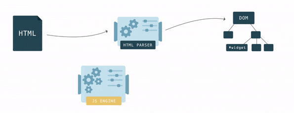
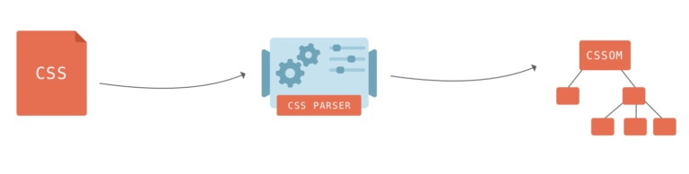
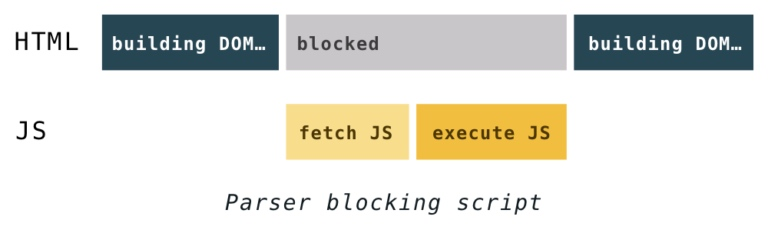
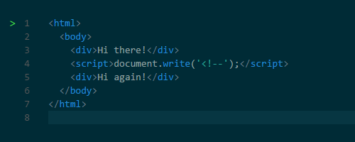
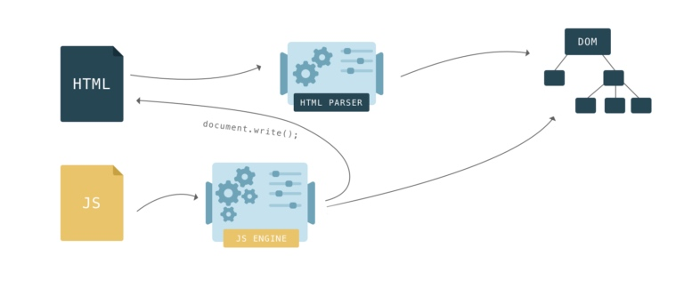

# 【翻译】Building the DOM faster: speculative parsing, async, defer and preload (part 1)

# 更快的dom渲染：预解析，异步，延迟和提前加载 ~ 第一部分

原文地址：https://hacks.mozilla.org/2017/09/building-the-dom-faster-speculative-parsing-async-defer-and-preload/

In 2017, the toolbox for making sure your web page loads fast includes everything from minification and asset optimization to caching, CDNs, code splitting and tree shaking. However, you can get big performance boosts with just a few keywords and mindful code structuring, even if you’re not yet familiar with the concepts above and you’re not sure how to get started.

优化网页打开速度的办法有很多，比如，压缩静态资源文件，使用缓存，使用cdn，代码拆分等。然而，尽管你可能不了解上述的办法，你也可以通过一些少量的代码和特定的代码结构来大幅提升网页的性能。

The fresh web standard ``` <link rel="preload"> ```, that allows you to load critical resources faster, is coming to Firefox later this month. You can already try it out in Firefox Nightly or Developer Edition, and in the meantime, this is a great chance to review some fundamentals and dive deeper into performance associated with parsing the DOM.

最新的web标准提供了``` <link rel="preload"> ```的写法，可以更快的加载特定的资源，这个特性在FIrefox中即将支持。现在，可以在firefox的nightly版本或者开发者版本中试用，同时在试用的时候，我们可以深入研究一下浏览器解析dom的细节。

Understanding what goes on inside a browser is the most powerful tool for every web developer. We’ll look at how browsers interpret your code and how they help you load pages faster with speculative parsing. We’ll break down how defer and async work and how you can leverage the new keyword preload.

其实，对浏览器渲染原理的深入理解才是web开发者最强大的武器。在这篇文章中，将会介绍浏览器是如何解析代码，并且是如何使用预解析来提升页面的加载速度的。还会对defer和async的工作原理进行说明，并且会介绍最新的属性preload。

# Building blocks

HTML describes the structure of a web page. To make any sense of the HTML, browsers first have to convert it into a format they understand – the Document Object Model, or DOM. Browser engines have a special piece of code called a parser that’s used to convert data from one format to another. An HTML parser converts data from HTML into the DOM.

HTML语言描述了网页的结构。为了解析html，浏览器首先会将其转换为文档对象模型（Document Object Model），简称DOM。浏览器引擎有一个专门的模块来处理这种转换，这个模块称为html解析器。

In HTML, nesting defines the parent-child relationships between different tags. In the DOM, objects are linked in a tree data structure capturing those relationships. Each HTML tag is represented by a node of the tree (a DOM node).

html语言可以描述出不同标签之间的父子关系。在dom中，使用树形结构来描述这种父子关系。每一个html标签都会被映射到dom树中的一个节点上。

The browser builds up the DOM bit by bit. As soon as the first chunks of code come in, it starts parsing the HTML, adding nodes to the tree structure.

浏览器会一点一点的增量构建dom。只要html的代码一抵达浏览器，就会立刻开始一点一点的构建dom树，而无需等待html代码全部下载完。


The DOM has two roles: it is the object representation of the HTML document, and it acts as an interface connecting the page to the outside world, like JavaScript. When you call document.getElementById(), the element that is returned is a DOM node. Each DOM node has many functions you can use to access and change it, and what the user sees changes accordingly.

DOM树有2个主要的职责：他是html文档的对象结构，并且，他是页面与外界交互的桥梁。当你使用document.getELementById()方法，返回的就是一个dom节点。每一个dom节点都有很多操作接口，可以对其进行更改。



CSS styles found on a web page are mapped onto the CSSOM – the CSS Object Model. It is much like the DOM, but for the CSS rather than the HTML. Unlike the DOM, it cannot be built incrementally. Because CSS rules can override each other, the browser engine has to do complex calculations to figure out how the CSS code applies to the DOM.

css样式表会被映射为CSSOM---css对象模型（CSS Object Model）。他与DOM类似，但是，cssom不能被一点点的增量构建。因为，css规则存在互相覆盖的可能性，所以，浏览器引擎会进行复杂的计算来分析出最后生效的css代码。



# The history of the ```<script>``` tag. ```<script>```标签的历史

As the browser is constructing the DOM, if it comes across a ```<script>```...```</script>``` tag in the HTML, it must execute it right away. If the script is external, it has to download the script first.

当浏览器构建dom的过程中，如果遇到了```<script>```...```</script>```标签段，必须要将其中的js代码先执行完。如果是引用的方式的js，还必须要将其先下载下来。

Back in the old days, in order to execute a script, parsing had to be paused. It would only start up again after the JavaScript engine had executed code from a script.

为了执行script代码，html解析dom的工作必须要暂停，当js的代码执行完之后才会继续解析dom。



Why did the parsing have to stop? Well, scripts can change both the HTML and its product―the DOM. Scripts can change the DOM structure by adding nodes with document.createElement(). To change the HTML, scripts can add content with the notorious document.write() function. It’s notorious because it can change the HTML in ways that can affect further parsing. For example, the function could insert an opening comment tag making the rest of the HTML invalid.

这里解释一下执行js的时候为啥要停止dom的解析。因为js是可以改变html同时也是可以改变dom的。比如，js可以通过添加节点来更改dom树结构的改变。比如，js可以通过document.write()方法来改变html，虽然这个方法是不建议使用的。不建议使用的原因是，这个方法有可能会影响未来的dom解析。比如，使用document.write()插入一个html注释符的左半边来让后面的html都失效。



Scripts can also query something about the DOM, and if that happens while the DOM is still being constructed, it could return unexpected results.

js脚本也可以对dom节点进行查询，如果在查询的过程中进行dom构建，很可能会返回异常的结果。




document.write() is a legacy function that can break your page in unexpected ways and you shouldn’t use it, even though browsers still support it. For these reasons, browsers have developed sophisticated techniques to get around the performance issues caused by script blocking that I will explain shortly.

document.write()已经是很老旧的方法了，同时这个方法会对页面带来不好的影响，是不推荐使用的，尽管目前的浏览器还支持这个方法。因而，浏览器规范的制定者们也在探索更佳的解决方案来解决这种由于js脚本带来的对dom渲染的阻塞，后边就会介绍这些方案。


