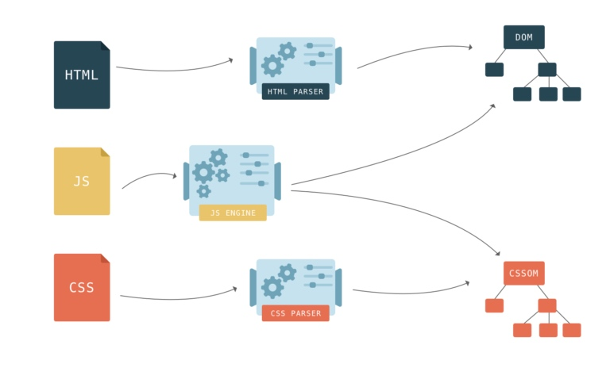
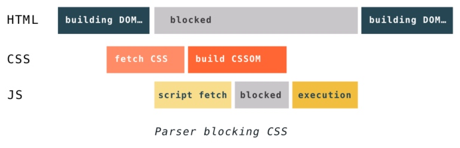
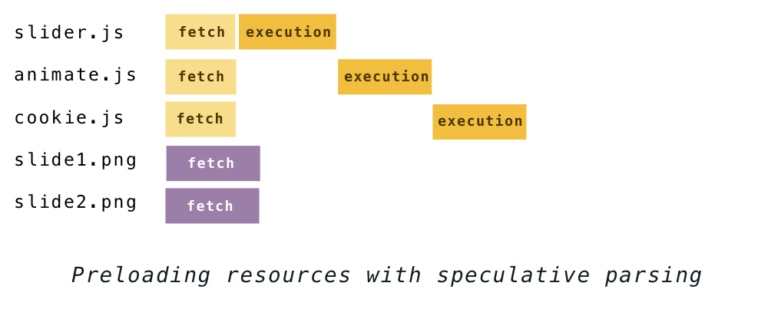

# 【翻译】Building the DOM faster: speculative parsing, async, defer and preload (part 2)

# 更快的dom构建：预解析，异步，延迟和提前加载 ~ 第二部分

原文地址：https://hacks.mozilla.org/2017/09/building-the-dom-faster-speculative-parsing-async-defer-and-preload/

# What about CSS? css的情况如何呢？

JavaScript blocks parsing because it can modify the document. CSS can’t modify the document, so it seems like there is no reason for it to block parsing, right?

js会阻断页面的dom构建是因为js可以修改html和dom。那么，css不能修改html和dom，所以理论上css应该不会阻断页面dom的构建，对吗？

However, what if a script asks for style information that hasn’t been parsed yet? The browser doesn’t know what the script is about to execute—it may ask for something like the DOM node’s background-color which depends on the style sheet, or it may expect to access the CSSOM directly.

然而，当js需要css的信息但是css还未解析完怎么办呢？浏览器并不知道js在执行的过程中是否需要访问到类似节点背景色这种依赖css的信息。



Because of this, CSS may block parsing depending on the order of external style sheets and scripts in the document. If there are external style sheets placed before scripts in the document, the construction of DOM and CSSOM objects can interfere with each other. When the parser gets to a script tag, DOM construction cannot proceed until the JavaScript finishes executing, and the JavaScript cannot be executed until the CSS is downloaded, parsed, and the CSSOM is available.

所以，css是否会阻塞dom的构建要看引入css和js的顺序。如果，css是在js之前被引入的，dom的构建和cssom的构建互不影响。当解析到script标签，dom构建就会停下来直到js下载并执行完毕，同时，如果cssom还没有解析完成，js的执行也会被阻塞。下图很清楚的说明了这种关系：



Another thing to keep in mind is that even if the CSS doesn’t block DOM construction, it blocks rendering. The browser won’t display anything until it has both the DOM and the CSSOM. This is because pages without CSS are often unusable. If a browser showed you a messy page without CSS, then a few moments later snapped into a styled page, the shifting content and sudden visual changes would make a turbulent user experience.

另外一个需要注意的点是尽管css不会阻断DOM的构建，但是却会阻断页面的渲染。直到dom和cssom都准备完毕了，页面才会显示出来。这是因为，未加载完css的页面是不稳定的。如果浏览器一开始加载了一个没有css的页面，然后很快样式又加载了，这个页面样子转换的过程给用户的体验很不好。

That poor user experience has a name – Flash of Unstyled Content or FOUC

这种不佳的用户体验有一个名字 --- 无样式闪屏 或者 FOUC

To get around these issues, you should aim to deliver the CSS as soon as possible. Recall the popular “styles at the top, scripts at the bottom” best practice? Now you know why it was there!

所以，为了让页面更快的展现出来，需要尽快的让css加载完成。还记得网页优化军规中的“将css放在页面上面，script放在页面下面”吗？以上就是这样做的原因。

# Back to the future – speculative parsing 更先进的算法--预解析

Pausing the parser whenever a script is encountered means that every script you load delays the discovery of the rest of the resources that were linked in the HTML.

遇到script标签就停止解析html的算法会延迟页面其它资源文件的下载。

If you have a few scripts and images to load, for example–

如果有如下的代码：

```
<script src="slider.js"></script>
<script src="animate.js"></script>
<script src="cookie.js"></script>


```

–the process used to go like this:

会有如下的过程：


That changed around 2008 when IE introduced something they called “the lookahead downloader”. It was a way to keep downloading the files that were needed while the synchronous script was being executed. Firefox, Chrome and Safari soon followed, and today most browsers use this technique under different names. Chrome and Safari have “the preload scanner” and Firefox – the speculative parser.

在2008年的时候，ie首先提出了一个预先下载的算法。在解析到srcipt的标签的时候仍然继续下载页面的其它资源。firefox和chrome还有safari很快也使用了这个算法。不同的浏览器给他们起了不同的名字，chrome和safari称其为the preload scanner【提前加载扫描器】，firefox称其为speculative parser【预解析】。

The idea is: even though it’s not safe to build the DOM while executing a script, you can still parse the HTML to see what other resources need to be retrieved. Discovered files are added to a list and start downloading in the background on parallel connections. By the time the script finishes executing, the files may have already been downloaded.

这个思路很简单：虽然在执行js的过程中构建dom不安全，但是，可以继续解析html来下载其它的资源。这些资源会在后台并行的进行下载，当js执行完后，这些资源的下载可能已经完成。

The waterfall chart for the example above now looks more like this:

这个算法的图如下：



The download requests triggered this way are called “speculative” because it is still possible that the script could change the HTML structure (remember document.write ?), resulting in wasted guesswork. While this is possible, it is not common, and that’s why speculative parsing still gives big performance improvements.

这个算法被称为预解析的原因是，因为js可能会改变html的结构（比如使用document.write），所以被下载的资源有可能是浪费的。虽然可能会存在浪费，但是这种情况并不常见，所以这个预解析的算法可以极大的提升页面加载性能。

While other browsers only preload linked resources this way, in Firefox the HTML parser also runs the DOM tree construction algorithm speculatively. The upside is that when a speculation succeeds, there’s no need to re-parse a part of the file to actually compose the DOM. The downside is that there’s more work lost if and when the speculation fails.

在这个算法中，其它的浏览器都仅仅是执行下载，而firefox同时也会继续执行dom的构建。这样做的优势很明显，当预解析成功，dom的构建会更快的完成。但是，劣势也存在，当预解析失败，浏览器执行了很多无效的工作。


