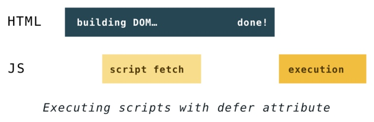
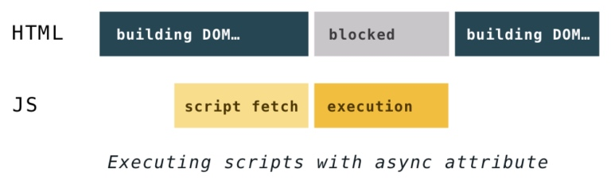

# 【翻译】Building the DOM faster: speculative parsing, async, defer and preload (part 3)

# 更快的dom构建：预解析，异步，延迟和提前加载 ~ 第三部分

原文地址：https://hacks.mozilla.org/2017/09/building-the-dom-faster-speculative-parsing-async-defer-and-preload/

# (Pre)loading stuff 预解析的内容

This manner of resource loading delivers a significant performance boost, and you don’t need to do anything special to take advantage of it. However, as a web developer, knowing how speculative parsing works can help you get the most out of it.

预解析算法提升了浏览器加载页面的性能，并且，无需开发者做什么特殊的工作就可以享用到这个算法带来的性能提升。但是，作为web开发者来说，能深刻理解预解析算法的原理和工作过程才能更好的利用这个算法。

The set of things that can be preloaded varies between browsers. All major browsers preload:

1. scripts
1. external CSS
1. and images from the `````` tag

不同的浏览器会预解析不同的内容。所有主流浏览器都预解析如下内容：

1. scripts
1. 外部CSS
1. 使用`````` 标签定义的图片


Firefox also preloads the poster attribute of video elements, while Chrome and Safari preload @import rules from inlined styles.

firefox也会预解析vidoe标签上定义的poster，而chrome和safari会预解析通过@import引入的css。

There are limits to how many files a browser can download in parallel. The limits vary between browsers and depend on many factors, like whether you’re downloading all files from one or from several different servers and whether you are using HTTP/1.1 or HTTP/2 protocol. To render the page as quickly as possible, browsers optimize downloads by assigning priority to each file. To figure out these priorities, they follow complex schemes based on resource type, position in the markup, and progress of the page rendering.

预解析内容的同时并行下载数量是有限制的。这个限制不同浏览器不同，在不同的情况下也会不同，比如说，下载的资源是同一个域名还是多个域名，或者使用的是HTTP/1.1还是HTTP/2的协议。浏览器会对预加载内容的下载顺序进行优化来保证更快的页面加载速度。为了计算内容的下载优先级顺序，浏览器会通过资源的类型位置和当前页面的状态来进行计算。

While doing speculative parsing, the browser does not execute inline JavaScript blocks. This means that it won’t discover any script-injected resources, and those will likely be last in line in the fetching queue.

当执行预加载算法的时候，浏览器将不会执行页面上的行内js。这意味着如果在页面的行内js中有js注入的下载资源，他们将会在执行完预加载后才会执行加载。比如下面的这种代码：

```
var script = document.createElement('script');
script.src = "//somehost.com/widget.js";
document.getElementsByTagName('head')[0].appendChild(script);
```

You should make it easy for the browser to access important resources as soon as possible. You can either put them in HTML tags or include the loading script inline and early in the document. However, sometimes you want some resources to load later because they are less important. In that case, you can hide them from the speculative parser by loading them with JavaScript late in the document.

如果需要让浏览器立即下载某些主要的资源，你可以将其放在页面的最顶部。如果某些资源并不重要，并不影响页面的展现，你可以将其通过行内js来加载，并将这段行内js放到页面的最底部。

# defer and async

Still, synchronous scripts blocking the parser remains an issue. And not all scripts are equally important for the user experience, such as those for tracking and analytics. Solution? Make it possible to load these less important scripts asynchronously.

通过预解析js对文件下载的阻断已经解决了，但是js阻断dom构建还仍然是个问题。其实，并不是所有的js都在页面加载过程是必须的，比如说一些记录日志的js。我们可以让其不阻断页面dom的构建。

The defer and async attributes were introduced to give developers a way to tell the browser which scripts to handle asynchronously.

defer和async属性可以设置script标签进行异步的加载，而不影响页面dom的构建。

Both of these attributes tell the browser that it may go on parsing the HTML while loading the script “in background”, and then execute the script after it loads. This way, script downloads don’t block DOM construction and page rendering. Result: the user can see the page before all scripts have finished loading.

这2个属性都会使浏览器在遇到script标签后不停止对dom的构建和对页面的渲染。所以，用户看到页面的时候，设置了这2个属性的js可能还没有执行完成。

The difference between defer and async is which moment they start executing the scripts.

这2个属性的区别是js执行的时机。

defer was introduced before async. Its execution starts after parsing is completely finished, but before the DOMContentLoaded event. It guarantees scripts will be executed in the order they appear in the HTML and will not block the parser.

一般更推荐使用defer属性，而不是async属性。defer属性的js会在页面完全的解析渲染完成的时候执行，并且是在DOMContentLoaded事件之前执行。同时，defer属性会保证按照在页面中定义的顺序执行，而且也保证绝对不会阻断页面的渲染。如图：



async scripts execute at the first opportunity after they finish downloading and before the window’s load event. This means it’s possible (and likely) that async scripts are not executed in the order in which they appear in the HTML. It also means they can interrupt DOM building.

async属性的js仅仅是下载不阻断dom构建，执行仍会阻断dom构建，它执行的时机是当js一下载完成就立即执行，这时会阻断dom的构建，而且也不保证会按照js在页面中定义的顺序执行。

Wherever they are specified, async scripts load at a low priority. They often load after all other scripts, without blocking DOM building. However, if an async script finishes downloading sooner, its execution can block DOM building and all synchronous scripts that finish downloading afterwards.

定义了async属性的script标签的加载优先级很低，无论他们定义在页面的什么位置。他们经常会在所有其他不阻断dom构建的js加载完后才被加载。然而，一旦一个async的js下载完，他的执行仍然会阻断dom的构建，也会阻断页面上之后其他同步js的下载。



Note: Attributes async and defer work only for external scripts. They are ignored if there’s no src.

注意：async和defer属性都只对外部js生效，如果script标签上没定义src，将会忽略这2个属性。

# preload

async and defer are great if you want to put off handling some scripts, but what about stuff on your web page that’s critical for user experience? Speculative parsers are handy, but they preload only a handful of resource types and follow their own logic. The general goal is to deliver CSS first because it blocks rendering. Synchronous scripts will always have higher priority than asynchronous. Images visible within the viewport should be downloaded before those below the fold. And there are also fonts, videos, SVGs… In short – it’s complicated.

async和defer可以处理掉那些页面初始化过程中不重要的scripts，那么那些重要的资源还有更好的处理办法吗？浏览器的预解析引擎虽然用起来简单，但是他只能解析小部分的资源类型，而且算法也较为固定。我们的目标是让css尽早下载解析完成，同步的脚本的优先级高于异步脚本，在视区内的图片应该尽早下载，而且还有像字体文件，视频，svg等等资源需要考虑，总之，情况很复杂。

As an author, you know which resources are the most important for rendering your page. Some of them are often buried in CSS or scripts and it can take the browser quite a while before it even discovers them. For those important resources you can now use ```<link rel="preload">``` to communicate to the browser that you want to load them as soon as possible.

只有开发者才能知道哪些资源对页面初始化过程是最重要的。这些资源很可能是通过css或者js来引入的，浏览器对他们的下载时机是很晚的。那么现在，你可以使用```<link rel="preload">```来加载这类资源，浏览器会在第一时间加载这些资源。

All you need to write is:

你可以这样写：

```
<link rel="preload" href="very_important.js" as="script">
```

You can link pretty much anything and the as attribute tells the browser what it will be downloading. Some of the possible values are:

这中preload的写法支持很多种资源类型，比如：

1. script
1. style
1. image
1. font
1. audio
1. video

You can check out the rest of the content types on MDN.

你可以查看MDN的官方文档：https://developer.mozilla.org/en-US/docs/Web/HTML/Preloading_content#What_types_of_content_can_be_preloaded

Fonts are probably the most important thing that gets hidden in the CSS. They are critical for rendering the text on the page, but they don’t get loaded until browser is sure that they are going to be used. That check happens only after CSS has been parsed, and applied, and the browser has matched CSS rules to the DOM nodes. This happens fairly late in the page loading process and it often results in an unnecessary delay in text rendering. You can avoid it by using the preload attribute when you link fonts.

字体文件就是被隐藏在css文件中并且页面初始化过程很重要的资源。但是，加载字体文件的时机一般都比较晚，因为需要等css先加载完成，并且应用到dom节点上之后，字体文件才会被加载。所以，文本的渲染可能会有延迟的感觉。现在，可以通过使用preload来尽早加载字体文件了。

One thing to pay attention to when preloading fonts is that you also have to set the crossorigin attribute even if the font is on the same domain:

加载字体文件的时候，通常要加一个crossorigin的属性，这是固定写法。

```
<link rel="preload" href="font.woff" as="font" crossorigin>
```

The preload feature has limited support at the moment as the browsers are still rolling it out, but you can check the progress here.

目前preload属性只有少部分的浏览器支持，可以通过 https://caniuse.com/#search=preload 查看。

# Conclusion 总结

Browsers are complex beasts that have been evolving since the 90s. We’ve covered some of the quirks from that legacy and some of the newest standards in web development. Writing your code with these guidelines will help you pick the best strategies for delivering a smooth browsing experience.

浏览器重90年代发展到现在已经越来越复杂了。很多遗留的特性和未来的标准混杂在一起。通过这篇文章，你可以理解如何让页面的渲染更快速的原理。


