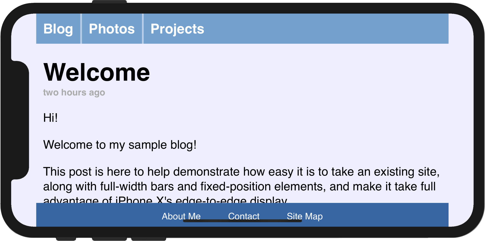
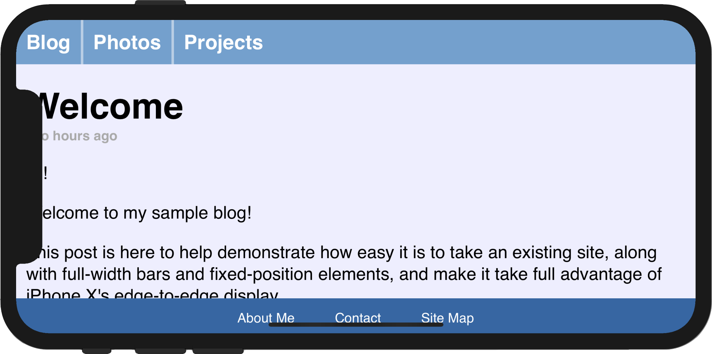
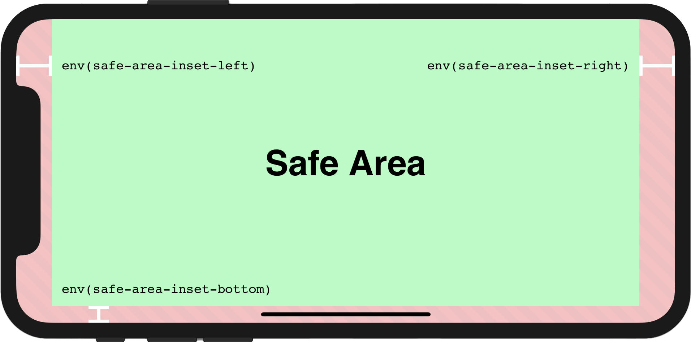
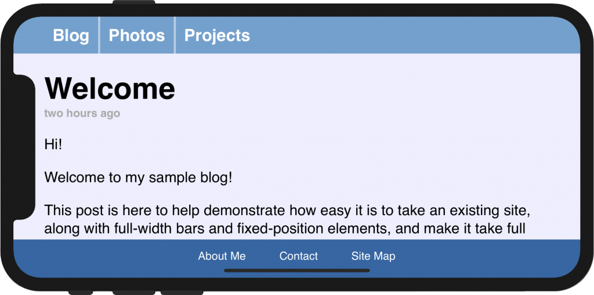
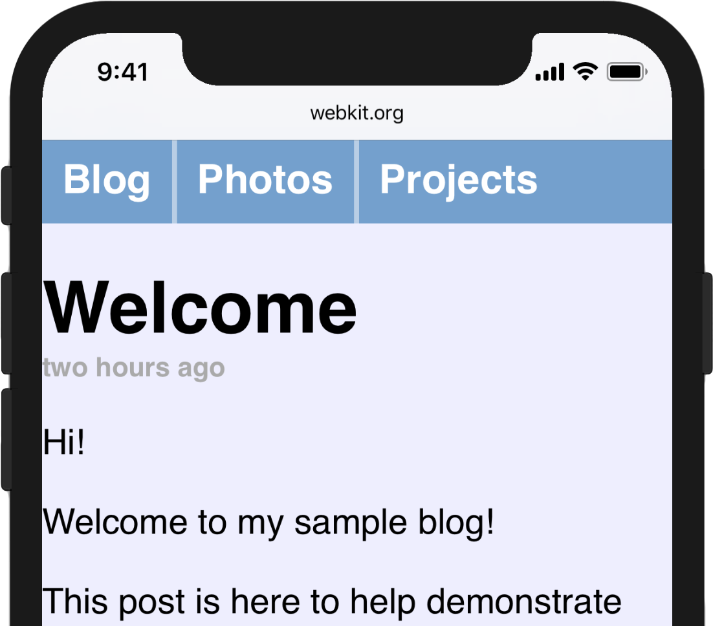
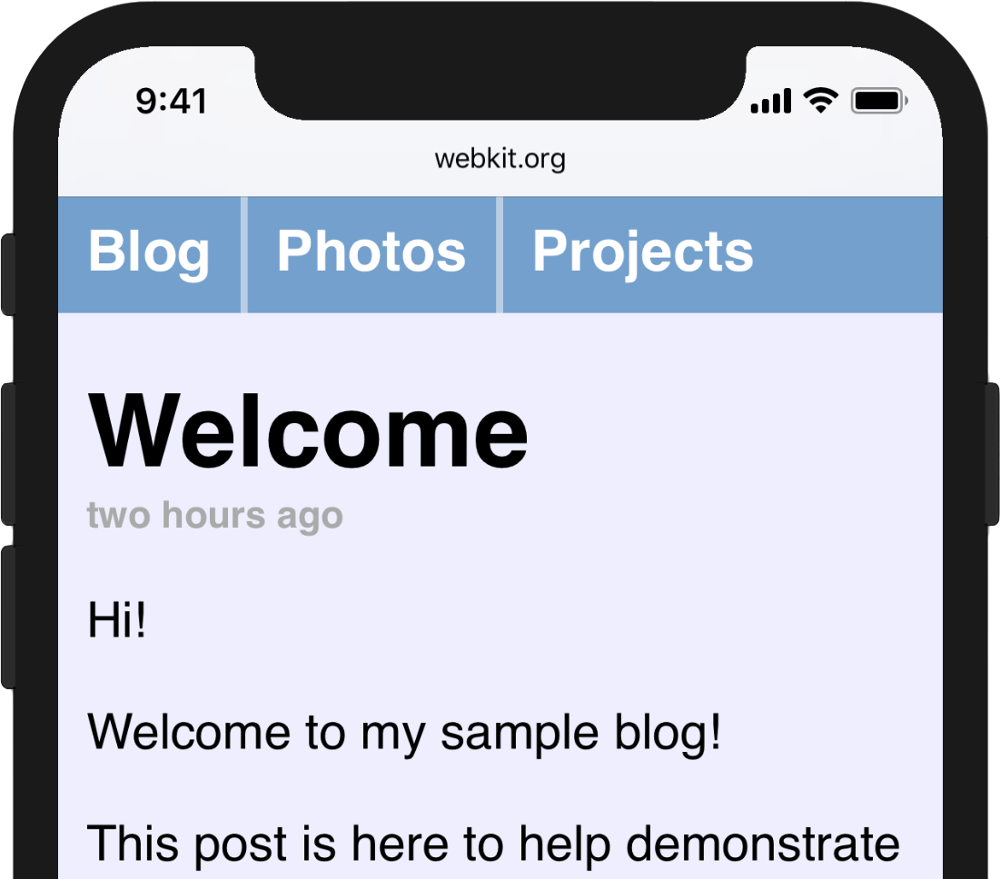

# 【翻译】Designing Websites for iPhone X 

# 让网站适配 iphone X 

原文地址： https://webkit.org/blog/7929/designing-websites-for-iphone-x/

The section below about safe area insets was updated on Oct 31, 2017 to reflect changes in the iOS 11.2 beta.

以下关于safe area insets的内容已经在20171031的时候进行了修改，会在ios 11.2beta中表现出来。

Out of the box, Safari displays your existing websites beautifully on the edge-to-edge display of the new iPhone X. Content is automatically inset within the display’s safe area so it is not obscured by the rounded corners, or the device’s sensor housing.

无需任何修改，在ihponeX中safari可以将网页显示的很美观。网页的内容，会在safe area中显示出来，所以，网页的内容不会被圆角和设备的传感器条挡住。

The inset area is filled with the page’s background-color (as specified on the <body>or <html> elements) to blend in with the rest of the page. For many websites, this is enough. If your page has only text and images above a solid background color, the default insets will look great.

安全区域以外的地方（也就是屏幕上下奇形怪状的地方），会自动被填充背景色（在body或者html元素上定义的背景色）。在大多数情况下，这样进行兼容就足够了。只要你的页面是固定背景色的，这种默认的填充方式就足够用了。

Other pages — especially those designed with full-width horizontal navigation bars, like the page below — can optionally go a little further to take full advantage of the features of the new display. The iPhone X Human Interface Guidelines detail a few of the general design principles to keep in mind, and the UIKit documentation discusses specific mechanisms native apps can adopt to ensure that they look good. Your website can make use of a few similar new pieces of WebKit API introduced in iOS 11 to take full advantage of the edge-to-edge nature of the display.

另外的一些页面，特别是那种有导航条的-可以有选择的进行更深层次的优化来利用新的显示特性。在ios11中，你的网站可以使用新的webkit api来适配显示。

While reading this post you can tap on any of the images to visit a corresponding live demo page and take a peek at the source code.

本篇文章的图片都可以点击到对应的demo页面。【注：请点击原文中的图片】



图：safari默认的兼容行为。


# Using the Whole Screen 使用全部的屏幕


The first new feature is an extension to the existing viewport meta tag called viewport-fit, which provides control over the insetting behavior. viewport-fit is available in iOS 11.

viewport标签有一个新属性viewport-fit，这个属性可以控制视图的显示行为。viewport-fit在ios11上可以使用。

The default value of viewport-fit is auto, which results in the automatic insetting behavior seen above. In order to disable that behavior and cause the page to lay out to the full size of the screen, you can set viewport-fit to cover. After doing so, ourviewport meta tag now looks like this:

viewport-fit的默认值是auto，这个值的行为就像上面的截图那些，页面不会撑到屏幕边缘。设置这个值为cover就会让页面覆盖整个页面，包括屏幕边缘。示例代码：

```
<meta name='viewport' content='initial-scale=1, viewport-fit=cover’>
```

After reloading, the navigation bar looks much better, running from edge to edge. However, it is immediately clear why it is important to respect the system’s safe area insets: some of the page’s content is obscured by the device’s sensor housing, and the bottom navigation bar is very hard to use.

页面刷新之后，导航条已经可以撑满屏幕边缘了。同时，问题也很明显：内容被传感器条挡住了，并且，底部的导航条和虚拟按键也重叠了。


图：Use `viewport-fit=cover` to fill the whole screen.使用viewport-fit=cover来铺满整个屏幕。

# Respecting the Safe Areas 安全区域

The next step towards making our page usable again after adopting viewport-fit=cover is to selectively apply padding to elements that contain important content, in order to ensure that they are not obscured by the shape of the screen. This will result in a page that takes full advantage of the increased screen real estate on iPhone X while adjusting dynamically to avoid the corners, sensor housing, and indicator for accessing the Home screen.

在使用了viewport-fit=cover之后，需要在一些地方加padding来避免被遮挡。如果你能动态的适配iPhone X屏幕的圆角，顶部传感器条，底部虚拟按键，那么就可以完全的享用到iPhone X的大屏幕。


图：The safe and unsafe areas on iPhone X in the landscape orientation, with insets indicated.iPhone X的横屏安全区域，及几个固定变量的示意图。

To achieve this, WebKit in iOS 11 includes a new CSS function, env(), and a set of four pre-defined environment variables, safe-area-inset-left, safe-area-inset-right, safe-area-inset-top, and safe-area-inset-bottom. When combined, these allow style declarations to reference the current size of the safe area insets on each side.

为了达成动态自适应的目的，ios 11 的webkit提供了一个新的css方法:env(),和有四个预先定义的环境变量，safe-area-inset-left, safe-area-inset-right, safe-area-inset-top, and safe-area-inset-bottom。使用这些变量，就可以获得屏幕的安全区域距离屏幕边缘的距离。

The env() function shipped in iOS 11 with the name constant(). Beginning with Safari Technology Preview 41 and the iOS 11.2 beta, constant() has been removed and replaced with env(). You can use the CSS fallback mechanism to support both versions, if necessary, but should prefer env() going forward.

env()方法是在ios11中被支持的，一开始他被命名为constant()。在Safari Technology Preview 41 and the iOS 11.2 beta的版本中，constant()已经被重命名为env()。你可以使用css的权重机制来适配所有的版本，如果不是必须的话，使用env()来适配最新的版本即可。

env() works anywhere var() does — for example, inside the padding properties:

env()使用的方式和var()基本一致，例如，在定义padding的时候：

```
.post {
    padding: 12px;
    padding-left: env(safe-area-inset-left);
    padding-right: env(safe-area-inset-right);
}

```

For browsers that do not support env(), the style rule that includes it will be ignored; for this reason, it is important to continue to separately specify fallback rules for any declarations using env().

当浏览器不支持env()的时候，这条样式会失效；所以，要将这种使用env()的样式，独自定义。


图：Respect safe area insets so that important content is visible.使用了环境变量的适配效果。

# Bringing It All Together, With min() and max() 使用min()和max()

This section covers features that are available starting in Safari Technology Preview 41 and the iOS 11.2 beta.

本节讲的内容在 Safari Technology Preview 41 and the iOS 11.2 beta中开始支持。

If you adopt safe area insets in your website design, you might notice that it is somewhat difficult to specify that you want a minimum padding in addition to the safe area inset. In the page above, where we replaced our 12px left padding with env(safe-area-inset-left), when we rotate back to portrait, the left safe area inset becomes 0px, and the text sits immediately adjacent to the screen edge.

当使用了安全区域变量，并不能解决所有的问题。比如，上面的页面，当横屏的时候， env(safe-area-inset-left)是有值的，当竖屏的时候，env(safe-area-inset-left)=0px，此时，文本就会挤到屏幕的边缘了。


图：Safe area insets are not a replacement for margins.使用Safe area insets带来的问题。

To solve this, we want to specify that our padding should be the default padding or the safe area inset, whichever is greater. This can be achieved with the brand-new CSS functions min() and max() which will be available in a future Safari Technology Preview release. Both functions take an arbitrary number of arguments and return the minimum or maximum. They can be used inside of calc(), or nested inside each other, and both functions allow calc()-like math inside of them.

解决这个问题，其实是需要给padding设置一个默认值，当safe-area-inset-left有值的时候，设置成safe-area-inset-left，没值的时候使用默认值。我们可以使用一组新的css函数min() and max()来解决这个问题。这2个函数可以接受任意个数的参数，并返回最大或者最小的那个。他们也可以用到calc()中，也可以相互嵌套使用。

For this case, we want to use max():

解决上述问题的示例：

```
@supports(padding: max(0px)) {
    .post {
        padding-left: max(12px, env(safe-area-inset-left));
        padding-right: max(12px, env(safe-area-inset-right));
    }
}
```

It is important to use @supports to feature-detect min and max, because they are not supported everywhere, and due to CSS’s treatment of invalid variables, to not specify a variable inside your @supports query.

注意：@supports语句可以检查是否支持max，但不要在其中使用变量，例如：@supports(padding: max(env(safe-area-inset-left)))，因为css对待无效的变量是返回默认值，也就是这个例子中的padding的初始值。【此处具体的细节可以参考：https://drafts.csswg.org/css-variables/#invalid-variables，本文最后也翻译了一下这块。】

In our example page, in portrait orientation, env(safe-area-inset-left) resolves to 0px, so the max() function resolves to 12px. In landscape, when env(safe-area-inset-left) is larger due to the sensor housing, the max() function will resolve to that size instead, ensuring that the important content within is always visible.

在上述的示例中，当竖屏时， env(safe-area-inset-left)是0，所以max函数返回了12px。当横屏时，env(safe-area-inset-left)的值会大于12，所以，max函数会返回env(safe-area-inset-left)的值。这就保证了页面的动态适应性。


图：Use max() to combine safe area insets with traditional margins.使用max函数来保证竖屏的兼容。

Experienced web developers might have previously encountered the “CSS locks” mechanism, commonly used to clamp CSS properties to a particular range of values. Using min() and max() together makes this much easier, and will be very helpful in implementing effective responsive designs in the future.

min() and max()函数可以使用到更多的场景中，他们可以帮助开发者更容易的创建兼容性更好的页面。

# 参考：无效变量的说明

原文地址：https://drafts.csswg.org/css-variables/#invalid-variables

直接翻译了3.1节中的例子，比较直观

For example, in the following code:

例如，如下的代码：

```
:root { --not-a-color: 20px; }
p { background-color: red; }
p { background-color: var(--not-a-color); }

```

the <p> elements will have transparent backgrounds (the initial value for background-color), rather than red backgrounds. The same would happen if the custom property itself was unset, or contained an invalid var() function.

p元素的背景将是transparent（也就是background-color的初始值），而不是红色。这种变量值无效的情况和没写background-color的表现是一致的。

Note the difference between this and what happens if the author had just written background-color: 20px directly in their stylesheet - that would be a normal syntax error, which would cause the rule to be discarded, so the background-color: red rule would be used instead.

注意这种情况和直接写错background-color: 20px的区别，如果直接写错成ackground-color: 20px，会导致错误的这条样式失效，background-color: red仍会生效。

Note: The invalid at computed-value time concept exists because variables can’t "fail early" like other syntax errors can, so by the time the user agent realizes a property value is invalid, it’s already thrown away the other cascaded values.

说明：不合法的变量值问题是因为变量的出错时机是比较晚的，所以，当浏览器识别到变量值无效的时候，已经将其它的有效的之前定义的值抛弃了。


