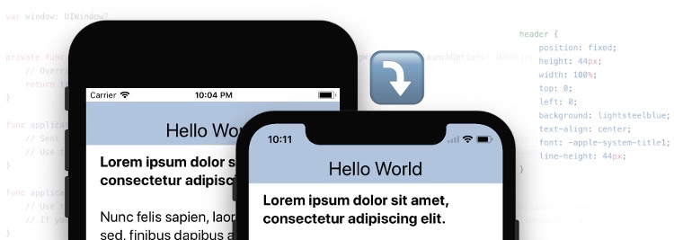
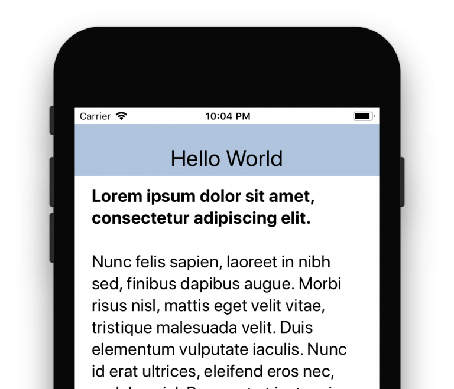

# 【翻译】Understanding the WebView Viewport in iOS 11（part 1）

# 理解ios11中的webview viewport（第一部分）

原文地址：http://ayogo.com/blog/ios11-viewport/

iOS 11 brings some new, perhaps unintuitive, behaviour around the status bar area which will be particularly important for developers using tools like Apache Cordova or Ionic. In particular, this change in behaviour affects any web-based apps that use fixed position header bars when they are built for iOS 11. This post helps you understand the Webview Viewport in iOS 11.

关于顶部状态栏，ios11带来了一些新的但是并不直观的变化，这些变化对于使用类似Apache Cordova or Ionic框架的开发者来说非常重要【其实，对于原生中嵌入webview的混合开发模式都会造成影响】。当html中使用了fixed定位的头，并且使用了xcode9打包目标为ios11的时候，会有明显的影响。本篇文章会帮你理解ios11中的Webview Viewport。

Note: Existing apps will continue working as they always have with no changes to their viewport behaviour. This only affects apps that are compiled with Xcode 9 and a target of iOS 11.

注意：现存的app不会有任何影响。影响只发生在使用xcode9并且编译目标为ios11的时候打出的包。

To understand the change, we need to look at the context for it.

首先，要了解下ios状态栏的发展历程。

# Status Bars & Safe Areas 状态栏和安全区域

On the early versions of iOS, the status bar was a constant black bar across the top of the screen that was largely untouchable. It was a piece of system UI and your app ran in the space underneath it.

在最开始的时候，ios的状态栏在最上面是黑色的。它是系统UI的一部分，app运行在他的下面。

That changed with the introduction of iOS 7, which had a transparent status bar that took the colour of the app’s navigation bar. For apps showing in a webview like Cordova, this often meant detecting the iOS version and adding 20px of padding to the top of your fixed header so that it would fill the space correctly.

ios7的时候将状态栏调整成了透明的，并且覆盖了app的上面，所以在webview中，需要为fixed的header设置一个paddingTop=20px来进行正确的显示。

Newer versions of iOS introduced some minor revisions, including features where an additional banner could be shown in the status bar when on a call or when an app was using geolocation in the background.

最新的ios中又进行了调整并同时加入了一些新特性，比如，来电话的显示和定位信息的显示等。

On the native side, a lot of this was handled automatically by UINavigationBar and autolayout guides. There were layout guides for the top and bottom of the screen that automatically adjusted to the correct height of the status bar(s), ensuring that the app content was in a “safe area” where the status bar would not obscure it. If you had a UINavigationBar aligned to the top layout guide, iOS would also automatically extend its colour behind the status bar. For web, there was unfortunately no equivalent.

在原生端，这些改动带来的影响都会被自动的处理掉。但对于webview中的代码，就没有这种机制了。

# iOS 11 Changes ios11的改变

图：The default viewport behaviour in iOS 11 on an iPhone 8。ios11的默认显示情况。

Where iOS 11 differs from earlier versions is that the webview content now respects the safe areas. This means that if you have a header bar that is a fixed position element with top: 0, it will initially render 20px below the top of the screen: aligned to the bottom of the status bar. As you scroll down, it will move up behind the status bar. As you scroll up, it will again fall down below the status bar (leaving an awkward gap where content shows through in the 20px gap).

默认情况下，ios11中的webview中的内容会显示在安全区域内。也就说，如果你的header是paddingTop=0的话，他却会显示在距离屏幕顶部20px的地方，避开了状态栏的位置（这与ios7-ios10的情况完全相反了，原来是会被状态栏盖住的）。而且，当你向上滚动的时候，webview的内容又会跑到stats bar的后面去（此时和ios7-ios10的情况一致）。当你向下滚动的时候，webview的内容又跑到了status bar的下面去（此时和ios11默认不滚动的情况一致），同时，webview的一些内容会透过status bar显示出来。

You can see just how bad it is in this video clip:

看视频体验一下这是多糟糕的改动吧：

视频地址：http://ayogo.com/wp-content/uploads/2017/09/ios11-viewport.mp4?_=1

# Why on earth would Apple make this change? 如此改动的原因

If you’ve seen the iPhone X design, it makes sense: The iPhone X features an irregular screen shape with an inset “cut out” at the top for the phone speaker and camera. If fixed position elements aligned to the real top of the screen, they would end up being inaccessible behind that speaker cutout.

其实苹果是考虑到了iPhone X的情况：iPhone X 是一个不规则的显示屏，尤其是顶部，突出了一块。如果是fixed定位的元素基于真正的屏幕顶部定位，那么他们有可能被顶部的突出部分挡住。【笔者补充：因为大部分的混合开发的应用，webview中的header都会避开顶部20px，而iPhone X 的顶部突出部分却有 44px ，所以，如果按照原来的方式不做调整，就会有24px的部分被挡住】

By aligning to the bottom of the status bar, it ensures that whatever is in the header will be accessible.

所以，在ios11中，苹果将webview内容的默认渲染位置调整到了安全区域，也就是基于状态栏之下，或者基于iPhone X 的突出部分之下作为起点。

Cool… except now the app looks terrible with the awkward header moving up and down and content visibly scrolling behind the status bar.

虽然可以理解苹果的苦心，但是，这个默认的行为实在是太low了，特别是页面滚动过程中那些透过状态栏显示出来的页面内容。

未完待续。

