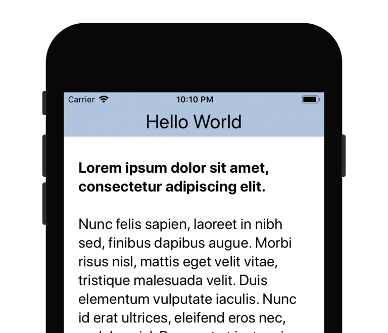
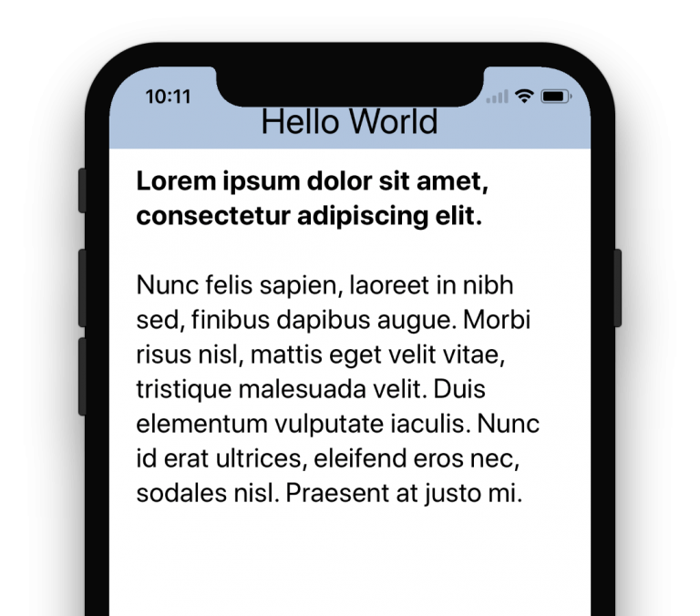
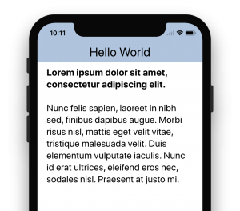

# 【翻译】Understanding the WebView Viewport in iOS 11（part 2）

# 理解ios11中的webview viewport（第二部分）

原文地址：http://ayogo.com/blog/ios11-viewport/

书接上回。在第一部分中，主要描述了不同ios版本下，webview的不同显示方式。本篇主要介绍解决方案。

# iOS 11 Fixes 如何修改呢

Luckily, Apple gave us a way to control this behaviour via the viewport meta tag. Even more luckily, they even backported this new viewport behaviour fix to the older, deprecated UIWebView!

苹果在viewport的meta标签上提供了新的属性来解决上述的问题。并且，在已经不推荐使用的UIWebView上也支持了这个新的属性。

The viewport option you’ll be looking for is viewport-fit. It has three possible values:

1. contain: The viewport should fully contain the web content. This means position fixed elements will be contained within the safe area on iOS 11.
2. cover: The web content should fully cover the viewport. This means position fixed elements will be fixed to the viewport, even if that means they will be obscured. This restores the behaviour we had on iOS 10.
3. auto: The default value, in this case it behaves the same as contain.

具体来说就是在viewport标签中使用viewport-fit属性，这个属性可以设置三个值：

1. contain：视窗会将内容显示全。也就是说，fixed元素会基于安全区域定位。【译者注：也就是会基于状态栏的下边框定位，在非iphoneX上会距离屏幕顶部20px，ihponeX下距离屏幕顶部44px】
2. cover：内容会尽量的铺满整个视窗。此种情况，fixed元素会基于屏幕边缘定位，内容会被屏幕的状态栏或者iphoneX的感应条挡住。ios7~ios10其实就是这种模式。
3. auto：默认值，与contain的行为一致。

So to restore your header bar to the very top of the screen, behind the status bar like it was in iOS 10, you’ll want to add viewport-fit=cover to your viewport meta tag.

所以，如果想让header bar充满屏幕的最上面，就像在ios10那样，只需要在viewport的标签中加入viewport-fit=cover。


图：Looking good with viewport-fit set to cover in iOS 11 on an iPhone 8。设置viewport-fit=cover后，iphone8的显示就正常了。

# iPhone X

But what about the iPhone X with its irregular shape? The status bar is no longer 20px tall, and with the inset for the camera and speaker, your header bars contents will be entirely inaccessible to users. It’s important to note that this also applies to footer bars pinned to the bottom of the screen, which will be obstructed by the microphone.

iPhone X这种不规则屏幕该如何处理呢？iphone x 下状态栏不再是20px，并且还有突出的感应条，只有paddingTop=20px的fixed头部一定会被挡住。同样的，对应定位在底部的footer，也会被底部的虚拟按键挡住一些。

Note: Your app will only use the full screen space on the iPhone X if you have a launch storyboard. Existing apps will be shown in a view box with black space at the top and bottom.

注意：只有当你使用launch storyboard的时候，你的app才会使用iPhone X的全部屏幕。现有的app默认会运行在安全区域内，也就是距离屏幕上边和下边会有一定距离。


图：iPhone X brings some new challenges, even with viewport-fit set to cover.尽管设置了viewport-fit=cover，iPhone X仍会存在一些需要解决的问题。

Luckily, Apple added a way to expose the safe area layout guides to CSS. They added a concept similar to CSS variables, originally called CSS constants. Think of these like CSS variables that are set by the system and cannot be overridden. They were proposed to the CSS Working Group for standardization, and accepted with one change: instead of using a function called constant() to access these variables, they’ll use a function called env().

苹果给出了在css中声明安全区域的办法。加入了一类新的css变量，用constants()命名。这些变量是系统来声明和赋值的，开发者无法对其进行声明和赋值。并且，苹果已经将这类变量提交到了css的规范管理组中，管理组已经接受了这组变量，但是，将其重命名为env()。

Note: iOS 11.0 uses the constant() syntax, but future versions will only support env()!

说明：ios11.0使用constant()，在之后的版本中，使用env()。

The 4 layout guide constants are:

1. env(safe-area-inset-top): The safe area inset amount (in CSS pixels) from the top of the viewport.
2. env(safe-area-inset-bottom): The safe area inset amount (in CSS pixels) from the bottom of the viewport.
3. env(safe-area-inset-left): The safe area inset amount (in CSS pixels) from the left of the viewport.
4. env(safe-area-inset-right): The safe area inset amount (in CSS pixels) from the right of the viewport.

这组变量共有四个值：

1. env(safe-area-inset-top): 安全区域距离屏幕顶部的距离。
2. env(safe-area-inset-bottom): 安全区域距离屏幕底部的距离。
3. env(safe-area-inset-left): 安全区域距离屏幕左侧的距离。
4. env(safe-area-inset-right): 安全区域距离屏幕右侧的距离。

Apple’s final gift to us is that these variables have also been backported to UIWebView.

在已经不推荐使用的UIWebView中也支持这些变量。

# Example with CSS constants 示例代码

Let’s say you have a fixed position header bar, and your CSS for iOS 10 currently looks like this:

一般在ios10中，定义的fixed header会用用到如下的样式：

```
header {
    position: fixed;
    top: 0;
    left: 0;
    right: 0;
    height: 44px;

    padding-top: 20px; /* Status bar height */
}

```

To make that adjust automatically for iPhone X and other iOS 11 devices, you would add a viewport-fit=cover option to your viewport meta tag, and change the CSS to reference the constant:

为了适配ios11和iPhone X首先要在viewport标签上设置viewport-fit=cover，同时，在css中要如下处理：

```
header {
    /* ... */

    /* Status bar height on iOS 10 */
    padding-top: 20px;

    /* Status bar height on iOS 11.0 */
    padding-top: constant(safe-area-inset-top);

    /* Status bar height on iOS 11+ */
    padding-top: env(safe-area-inset-top);
}
```

It’s important to keep the fallback value there for older devices that won’t know how to interpret the constant() or env() syntax. You can also use constants in CSS calc() expressions.

要注意老版本系统的兼容性，老系统不支持constant() 和 env()。上述的变量也可以被用在css的calc()函数中。


图：iPhone X fixed with automatic device padding added。兼容了iPhone X的效果。

You would also want to remember to do this for bottom navigation bars as well.

如果需要处理的底部的话，原理也基本一致。

