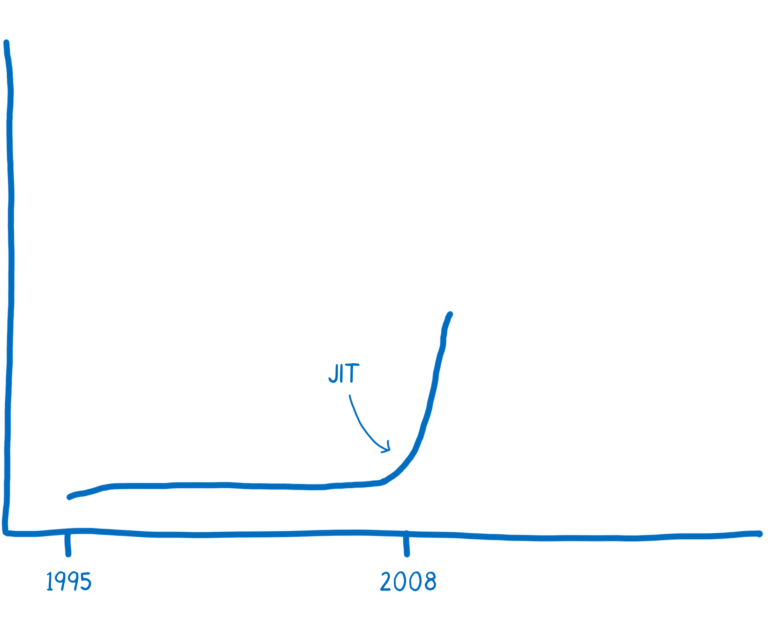

# [翻译] WebAssembly(1) A cartoon intro to WebAssembly 看卡通，入门WebAssembly

原文地址： https://hacks.mozilla.org/2017/02/a-cartoon-intro-to-webassembly/

WebAssembly is fast. You’ve probably heard this. But what is it that makes WebAssembly fast?

WebAssembly执行很快。你可能已经听说了。但是原理你可能还不清楚。

In this series, I want to explain to you why WebAssembly is fast.

在这个系列文章中，我们来解释一下为什么WebAssembly会执行这么快。

# Wait, so what is WebAssembly? WebAssembly是什么东东

WebAssembly is a way of taking code written in programming languages other than JavaScript and running that code in the browser. So when people say that WebAssembly is fast, what they are comparing it to is JavaScript.

WebAssembly是一门可以运行在浏览器中的编程语言。所以，说WebAssembly执行很快一般都是和JavaScript进行比较。

Now, I don’t want to imply that it’s an either/or situation — that you’re either using WebAssembly or using JavaScript. In fact, we expect that developers will use both WebAssembly and JavaScript in the same application.

首先，我的意图不是去做出用JavaScript还是WebAssembly技术的选择。实际上，我希望开发者能同时使用JavaScript和WebAssembly。

But it is useful to compare the two, so you can understand the potential impact that WebAssembly will have.

不过，做出他们的比较也有一定的价值，可以让你认识到WebAssembly未来可能带来的潜力。

# A little performance history 性能简史

JavaScript was created in 1995. It wasn’t designed to be fast, and for the first decade, it wasn’t fast.

JavaScript是1995年诞生的。当时的设计并没有考虑到性能的问题，在前十年中，js的性能一直很差。

Then the browsers started getting more competitive.

然后，浏览器大战爆发了。

In 2008, a period that people call the performance wars began. Multiple browsers added just-in-time compilers, also called JITs. As JavaScript was running, the JIT could see patterns and make the code run faster based on those patterns.

在2008年，浏览器的性能大战开始了。很多浏览器都加入了即时编译机制，也就是JIT。当js执行的同时，JIT可以进行各种模式的优化，使js运行更快。

The introduction of these JITs led to an inflection point in the performance of JavaScript. Execution of JS was 10x faster.

JIT的引入使得js的性能曲线图出现了拐点。提升了10倍。

With this improved performance, JavaScript started being used for things no one ever expected it to be used for, like server-side programming with Node.js. The performance improvement made it feasible to use JavaScript on a whole new class of problems.

由于性能的大幅提升，JavaScript被用在更广泛的领域中，比如利用node.js进行服务端的开发等。由于性能的大幅提示，JavaScript可以被用来解决更多类型的问题。

We may be at another one of those inflection points now, with WebAssembly.

现在，WebAssembly的出现，可能又是一个新的性能拐点。

So, let’s dive into the details to understand what makes WebAssembly fast.

好了，下一期我们开始研究WebAssembly执行快的原因和原理。

译者：第一篇没啥干货~~~/(ㄒoㄒ)/~~~还请期待下一篇。

