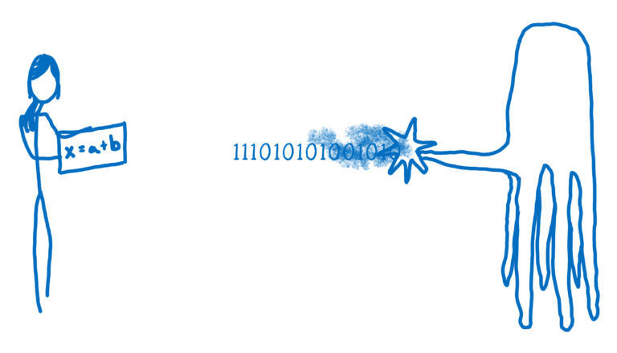
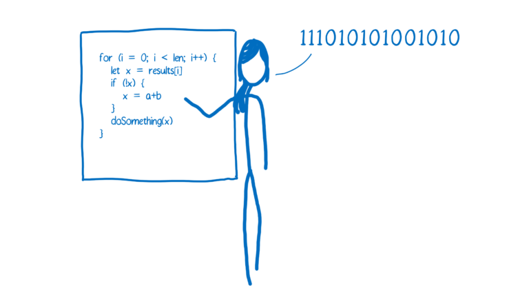
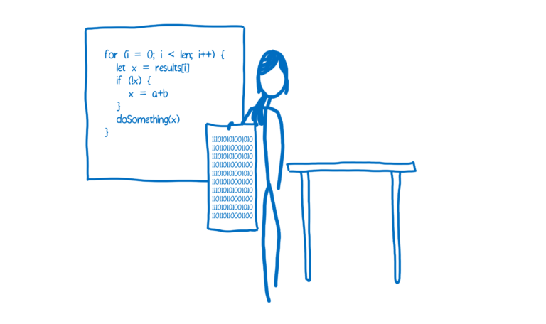
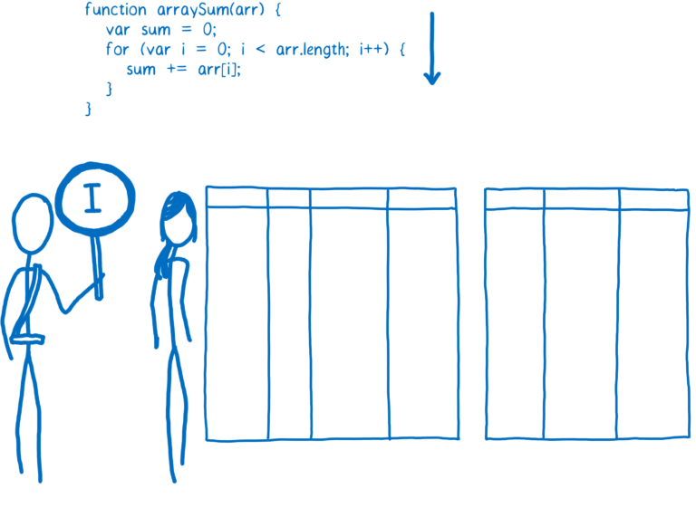
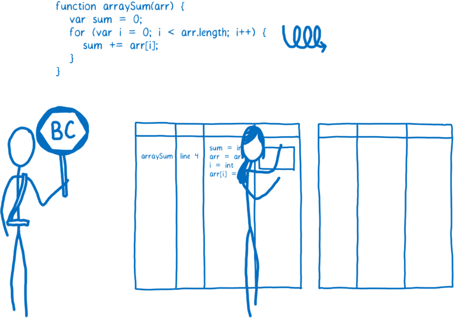
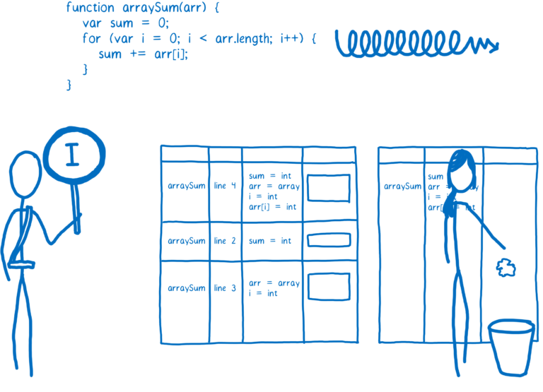

# [翻译] WebAssembly(2-1) A crash course in just-in-time (JIT) compilers JIT编译原理速成

原文地址：https://hacks.mozilla.org/2017/02/a-crash-course-in-just-in-time-jit-compilers/

JavaScript started out slow, but then got faster thanks to something called the JIT. But how does the JIT work?

JavaScript起初是很慢的，后来由于JIT的出现效率大幅提升。这是怎么做到的呢？

# How JavaScript is run in the browser JavaScript的浏览器运行原理

When you as a developer add JavaScript to the page, you have a goal and a problem.

开发者编写JavaScript的时候，会有一个目的和一个问题。

Goal: you want to tell the computer what to do.

目的：告诉计算机你的意图。

Problem: you and the computer speak different languages.

问题：你和计算机使用不同的语言。

You speak a human language, and the computer speaks a machine language. Even if you don’t think about JavaScript or other high-level programming languages as human languages, they really are. They’ve been designed for human cognition, not for machine cognition.

你使用的是人类的语言，而计算机使用的是机器语言。尽管，你可能不认为JavaScript是人类语言，但实际情况并非如此。JavaScript是被设计成人类易懂的，而不是机器易懂的。

So the job of the JavaScript engine is to take your human language and turn it into something the machine understands.

所以，JavaScript引擎要做的第一件事就是把人类语言翻译成机器语言。

I think of this like the movie Arrival, where you have humans and aliens who are trying to talk to each other.

这就像Arrival电影中，人类和外星人试图去交流。

In that movie, the humans and aliens don’t just do word-for-word translations. The two groups have different ways of thinking about the world. And that’s true of humans and machines too (I’ll explain this more in the next post).

在这个电影中，人类和外星人无法进行逐个单词的翻译。因为他们的思维方式和对世界的认识是完全不同的。人和机器其实也是这样的（后面会详细解释）。

So how does the translation happen?

那该怎么进行翻译呢？

In programming, there are generally two ways of translating to machine language. You can use an interpreter or a compiler.

一般会有两种方法进行机器语言的翻译。解释器或者编译器。

With an interpreter, this translation happens pretty much line-by-line, on the fly.

解释器，会在程序执行的过程中进行时时的翻译。

A compiler on the other hand doesn’t translate on the fly. It works ahead of time to create that translation and write it down.

编译器，不会进行实时的翻译。他会预先进行翻译，并将其保存下来。

There are pros and cons to each of these ways of handling the translation.

他们各有优缺点。

# Interpreter pros and cons 解释器的优缺点

Interpreters are quick to get up and running. You don’t have to go through that whole compilation step before you can start running your code. You just start translating that first line and running it.

解释器的启动和执行是很迅速的。你在执行代码之前不用等待整个编译过程结束。当第一行被编译之后就可以立即执行你的代码。

Because of this, an interpreter seems like a natural fit for something like JavaScript. It’s important for a web developer to be able to get going and run their code quickly.

因为这样，解释器是很适合来进行翻译JavaScript的。对web开发者来说，迅速的执行代码是很重要的。

And that’s why browsers used JavaScript interpreters in the beginning.
But the con of using an interpreter comes when you’re running the same code more than once. For example, if you’re in a loop. Then you have to do the same translation over and over and over again.

这就是浏览器在一开始使用JavaScript解释器的原因。但是当执行相同代码的时候，缺点也随之而来。比如说，当你执行一个循环，解释器也会一遍又一遍的执行翻译的工作。

# Compiler pros and cons 编译器的优缺点

The compiler has the opposite trade-offs.

编译器的取舍正相反。

It takes a little bit more time to start up because it has to go through that compilation step at the beginning. But then code in loops runs faster, because it doesn’t need to repeat the translation for each pass through that loop.

因为编译器要执行整个的编译过程，所以程序要先等编译完才能执行。但是，循环的代码执行会很快速，因为不需要再进行翻译工作了。

Another difference is that the compiler has more time to look at the code and make edits to it so that it will run faster. These edits are called optimizations.

还有一点不同，编译器会在编译的过程中进行代码的修改，这些修改会使代码执行的更快。修改的过程我们叫做优化。

The interpreter is doing its work during runtime, so it can’t take much time during the translation phase to figure out these optimizations.

而解释器是在运行时工作的，它没有什么时间去进行代码优化的工作。

# Just-in-time compilers: the best of both worlds JIT编译器：更佳的办法

As a way of getting rid of the interpreter’s inefficiency—where the interpreter has to keep retranslating the code every time they go through the loop—browsers started mixing compilers in.

浏览器用来解决解释器在执行循环过程中重复进行翻译工作所带来的低效问题的办法，是将编译器混合进来。

Different browsers do this in slightly different ways, but the basic idea is the same. They added a new part to the JavaScript engine, called a monitor (aka a profiler). That monitor watches the code as it runs, and makes a note of how many times it is run and what types are used.

不同的浏览器的处理可能会有细微的差别，但原理是相同的。他们为JavaScript引擎新增了一个监控器，也叫分析器。监控器观察代码的执行，并将代码的执行次数和执行类型都记录了下来。

At first, the monitor just runs everything through the interpreter.

首先，监控器允许解释器执行所有的代码。

If the same lines of code are run a few times, that segment of code is called warm. If it’s run a lot, then it’s called hot.

如果同一行代码被执行了几次，这段代码会被标记为温热。如果执行了很多次，它会被标记为炎热。

### Baseline compiler 基线编译器

When a function starts getting warm, the JIT will send it off to be compiled. Then it will store that compilation.

当一个方法变为温热，JIT就会将其单独编译，并将其保存。

Each line of the function is compiled to a “stub”. The stubs are indexed by line number and variable type (I’ll explain why that’s important later). If the monitor sees that execution is hitting the same code again with the same variable types, it will just pull out its compiled version.

方法的每一行都没编译成一个存根。这些存根被通过行号和变量类型来进行索引（后面会详细解释）。如果监控器发现有相同的代码被执行，他就会使用已经被编译的版本来执行。

That helps speed things up. But like I said, there’s more a compiler can do. It can take some time to figure out the most efficient way to do things… to make optimizations.

这会提升一定的执行速度。但是，编译器还能做更多。他可以花费一些时间来分析出更有效率的执行办法，来进行优化。

The baseline compiler will make some of these optimizations (I give an example of one below). It doesn’t want to take too much time, though, because it doesn’t want to hold up execution too long.

基线编译器会做一些优化（后面有例子）。但不会占用太长时间，因为他不想占用执行过程太久。

However, if the code is really hot—if it’s being run a whole bunch of times—then it’s worth taking the extra time to make more optimizations.

然而，如果代码已经被执行了很多遍，已经是炎热的级别了，这就值得去花费更多的时间来进行分析优化。

### Optimizing compiler 优化编译器

When a part of the code is very hot, the monitor will send it off to the optimizing compiler. This will create another, even faster, version of the function that will also be stored.

当一段代码的热度很高，监控器就会将其发送给优化编译器。他会将其编译成一个执行速度更快的版本，并将其保存起来。

In order to make a faster version of the code, the optimizing compiler has to make some assumptions.

为了保证编译结果的执行效率，优化编译器会做几个假设。

For example, if it can assume that all objects created by a particular constructor have the same shape—that is, that they always have the same property names, and that those properties were added in the same order— then it can cut some corners based on that.

比如，如果可以假设所有对象都是被具有相同结构的特定构造器创建的，他们都具有相同的属性名，并且他们的属性也是按照同一顺序添加，这就可以在代码中简化一部分内容。

The optimizing compiler uses the information the monitor has gathered by watching code execution to make these judgments. If something has been true for all previous passes through a loop, it assumes it will continue to be true.

监控器会将代码执行过程中收集到的信息传给优化编译器，优化编译器根据这些信息作出决策。如果某个值在之前的循环处理中一直是true，那么，就假设他在未来的执行中仍然是true。

But of course with JavaScript, there are never any guarantees. You could have 99 objects that all have the same shape, but then the 100th might be missing a property.

但是，在JavaScript的执行中，不能保证上述的假设是正确的。你可能前99个对象都是相同结构，但第一百个就可能少了一个属性。

So the compiled code needs to check before it runs to see whether the assumptions are valid. If they are, then the compiled code runs. But if not, the JIT assumes that it made the wrong assumptions and trashes the optimized code.

所以，编译结果必须要在执行前进行检验其是否是正确的。如果是，就可以用这个编译结果。但如果不正确，JIT就会丢弃掉这个编译结果。

Then execution goes back to the interpreter or baseline compiled version. This process is called deoptimization (or bailing out).

然后程序就会仍然使用解释器或者基线编译器的编译结果。这个过程叫做反优化（或bailing out）。

Usually optimizing compilers make code faster, but sometimes they can cause unexpected performance problems. If you have code that keeps getting optimized and then deoptimized, it ends up being slower than just executing the baseline compiled version.

通常，优化编译器会让代码执行变快，但有时候，却会造成性能问题。如果代码不停的被反优化，这就会比只执行基线编译器的时候要更慢。

Most browsers have added limits to break out of these optimization/deoptimization cycles when they happen. If the JIT has made more than, say, 10 attempts at optimizing and keeps having to throw it out, it will just stop trying.

大部分浏览器都会有一个反优化次数的上限。比如，当进行了十次的反优化，JIT就会停止尝试优化动作。

未完待续....

