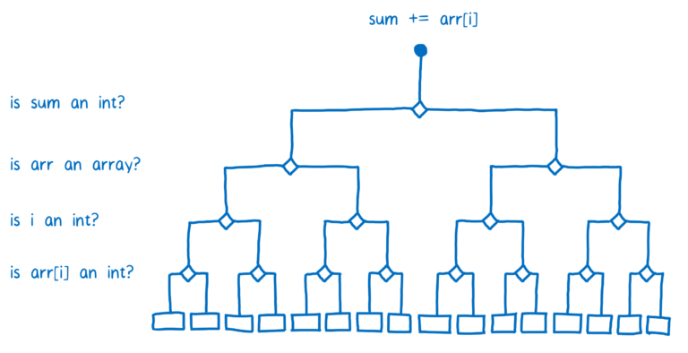
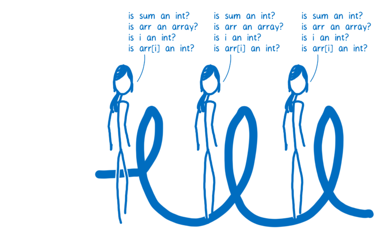
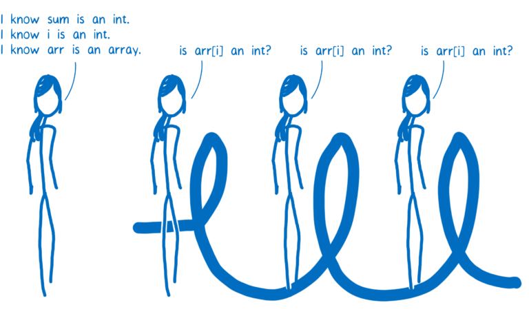

# [翻译] WebAssembly(2-2) A crash course in just-in-time (JIT) compilers JIT编译原理速成

原文地址：https://hacks.mozilla.org/2017/02/a-crash-course-in-just-in-time-jit-compilers/

书接上回....

### An example optimization: Type specialization

There are a lot of different kinds of optimizations, but I want to take a look at one type so you can get a feel for how optimization happens. One of the biggest wins in optimizing compilers comes from something called type specialization.

The dynamic type system that JavaScript uses requires a little bit of extra work at runtime. For example, consider this code:

```
function arraySum(arr) {
  var sum = 0;
  for (var i = 0; i < arr.length; i++) {
    sum += arr[i];
  }
}
```

The += step in the loop may seem simple. It may seem like you can compute this in one step, but because of dynamic typing, it takes more steps than you would expect.

Let’s assume that arr is an array of 100 integers. Once the code warms up, the baseline compiler will create a stub for each operation in the function. So there will be a stub for sum += arr[i], which will handle the+= operation as integer addition.

However,sum and arr[i] aren’t guaranteed to be integers. Because types are dynamic in JavaScript, there’s a chance that in a later iteration of the loop, arr[i] will be a string. Integer addition and string concatenation are two very different operations, so they would compile to very different machine code.

The way the JIT handles this is by compiling multiple baseline stubs. If a piece of code is monomorphic (that is, always called with the same types) it will get one stub. If it is polymorphic (called with different types from one pass through the code to another), then it will get a stub for each combination of types that has come through that operation.

This means that the JIT has to ask a lot of questions before it chooses a stub.



Because each line of code has its own set of stubs in the baseline compiler, the JIT needs to keep checking the types each time the line of code is executed. So for each iteration through the loop, it will have to ask the same questions.



The code would execute a lot faster if the JIT didn’t need to repeat those checks. And that’s one of the things the optimizing compiler does.

In the optimizing compiler, the whole function is compiled together. The type checks are moved so that they happen before the loop.



Some JITs optimize this even further. For example, in Firefox there’s a special classification for arrays that only contain integers. If arr is one of these arrays, then the JIT doesn’t need to check if arr[i] is an integer. This means that the JIT can do all of the type checks before it enters the loop.

# Conclusion

That is the JIT in a nutshell. It makes JavaScript run faster by monitoring the code as it’s running it and sending hot code paths to be optimized. This has resulted in many-fold performance improvements for most JavaScript applications.

Even with these improvements, though, the performance of JavaScript can be unpredictable. And to make things faster, the JIT has added some overhead during runtime, including:

1. optimization and deoptimization
2. memory used for the monitor’s bookkeeping and recovery information for when bailouts happen
3. memory used to store baseline and optimized versions of a function

There’s room for improvement here: that overhead could be removed, making performance more predictable. And that’s one of the things that WebAssembly does.

In the next article, I’ll explain more about assembly and how compilers work with it.


