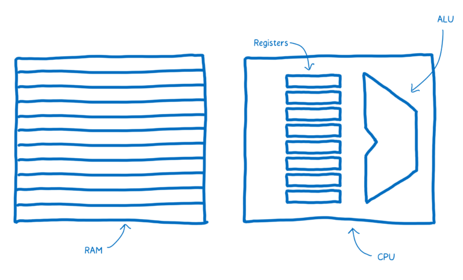
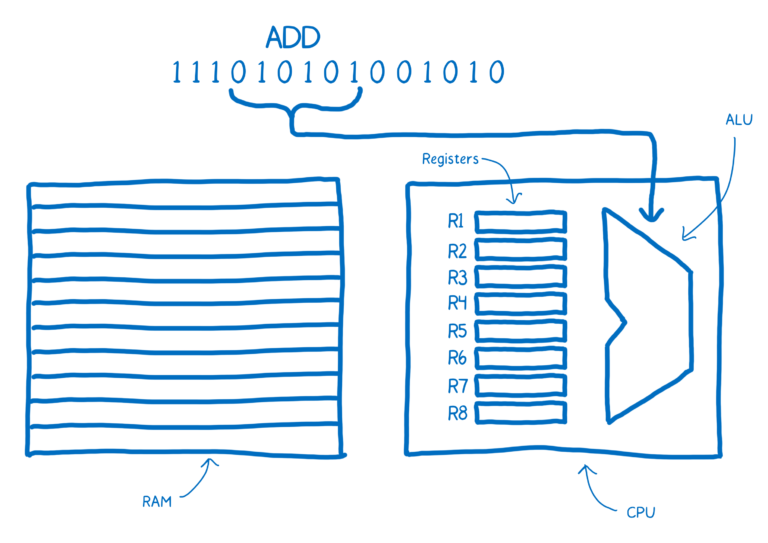
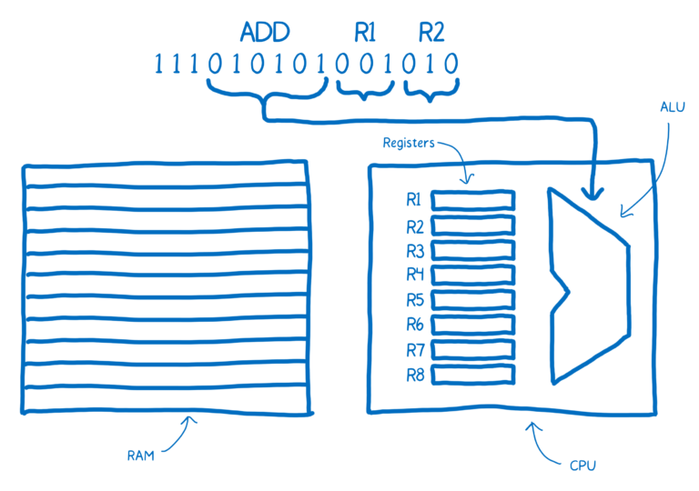
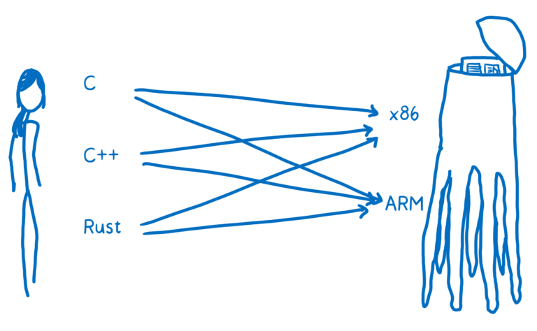
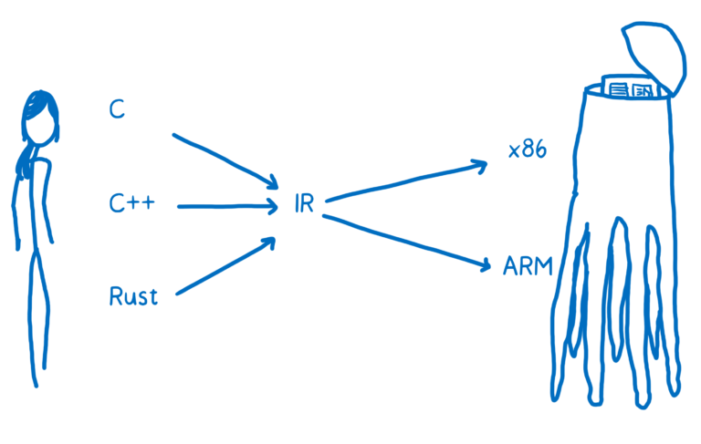
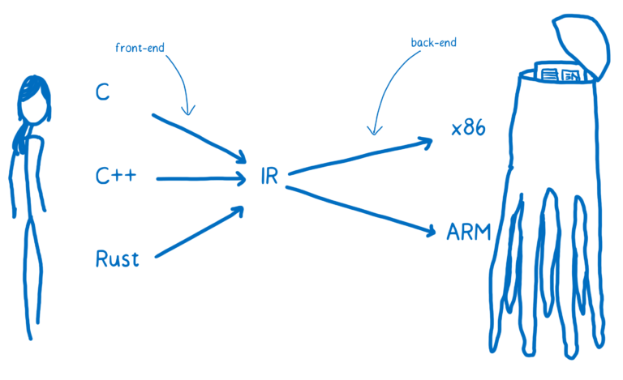

# [翻译] WebAssembly(3) A crash course in assembly 汇编原理速成

原文地址：https://hacks.mozilla.org/2017/02/a-crash-course-in-assembly/

To understand how WebAssembly works, it helps to understand what assembly is and how compilers produce it.

理解汇编和编译器如何生成它有助于你后续理解 WebAssembly 的工作原理，。

In the article on the JIT, I talked about how communicating with the machine is like communicating with an alien.

在jit的文章中已经提到过，与计算机沟通就像与外星人沟通一样。

I want to take a look now at how that alien brain works—how the machine’s brain parses and understands the communication coming in to it.

让我们来看看机器的大脑是如何进行分析并理解沟通的内容的。

There’s a part of this brain that’s dedicated to the thinking—things like adding and subtracting, or logical operations. There’s also a part of the brain near that which provides short-term memory, and another part that provides longer-term memory.

这个大脑中有一部分是负责思考的，比如加减法或者其它逻辑计算。还有一部分是用作短时间的记忆，另外一部分是负责长时间的记忆。

These different parts have names.

1. The part that does the thinking is the Arithmetic-logic Unit (ALU).
2. The short term memory is provided by registers.
3. The longer term memory is the Random Access Memory (or RAM).

这些部分都有自己的名字。

1. 负责思考的部分叫算法逻辑单元 (ALU).
2. 负责短时记忆的部分叫暂存器。
3. 负责长时记忆的部分叫随机存取存储器也叫RAM。

The sentences in machine code are called instructions.

我们将机器语言称作指令。

What happens when one of these instructions comes into the brain? It gets split up into different parts that mean different things.
The way that this instruction is split up is specific to the wiring of this brain.

当指令发给大脑后会发生什么？首先会将其分解成不同的部分。分解的方式是根据大脑特定的结构进行的。

For example, a brain that is wired like this might always take the first six bits and pipe that in to the ALU. The ALU will figure out, based on the location of ones and zeros, that it needs to add two things together.

比如，有一种电脑会将前面的六个字节传送给ALU。ALU 根据接收到的序列中 1 和 0 的排列，就会明白需要将两个东西加在一起。

This chunk is called the “opcode”, or operation code, because it tells the ALU what operation to perform.

这个字段称为操作码(opcode)，它的作用是告诉 ALU 要执行的操作。

Then this brain would take the next two chunks of three bits each to determine which two numbers it should add. These would be addresses of the registers.

接下来大脑会取后续两个三字节的字段来确定要相加的两个数。这两个数会存储在寄存器中。

Note the annotations above the machine code here, which make it easier for us humans to understand what’s going on. This is what assembly is. It’s called symbolic machine code. It’s a way for humans to make sense of the machine code.

注意这里机器码上方的注释，有助于我们理解这个过程。这就叫做汇编。这段代码称为符号机器码。符号机器码是人类理解机器码的一种方式。

You can see here there is a pretty direct relationship between the assembly and the machine code for this machine. Because of this, there are different kinds of assembly for the different kinds of machine architectures that you can have. When you have a different architecture inside of a machine, it is likely to require its own dialect of assembly.

你会发现汇编和这台机器的机器码有很直接的关系。因此不同的机器架构对应有不同的汇编方式。当你遇到使用不同架构的机器时，可能就得按它们自己的方式进行汇编。

So we don’t just have one target for our translation. It’s not just one language called machine code. It’s many different kinds of machine code. Just as we speak different languages as people, machines speak different languages.

所以，翻译的过程会有很多种。并不是只有一种机器码。有很多种机器码。就像人类有很多语言一样，机器也有很多语言。

With human to alien translation, you may be going from English, or Russian, or Mandarin to Alien Language A or Alien language B. In programming terms, this is like going from C, or C++, or Rust to x86 or to ARM.

比如说从人类语言翻译到外星语言的过程，你可以将英语、俄罗斯语等翻译成外星语A或者外星语B。在编程语言中，就是讲C或者C++或者Rust翻译成X86或者ARM。

You want to be able to translate any one of these high-level programming languages down to any one of these assembly languages (which corresponds to the different architectures). One way to do this would be to create a whole bunch of different translators that can go from each language to each assembly.

你希望能将任何高级编程语言反义词任何一种汇编语言（不同架构的）。一种方法是创建一整套不同语言到不同汇编的转化器。

That’s going to be pretty inefficient. To solve this, most compilers put at least one layer in between. The compiler will take this high-level programming language and translate it into something that’s not quite as high level, but also isn’t working at the level of machine code. And that’s called an intermediate representation (IR).

但这样的做法非常低效。大部分编译器会在中间放置至少一个中间层。编译器接收高级编程语言并将其转化成相对底层的形式，转化结果也不能和机器码一样直接运行。这类形式称为中间表示(IR)。

This means the compiler can take any one of these higher-level languages and translate it to the one IR language. From there, another part of the compiler can take that IR and compile it down to something specific to the target architecture.

这意味着编译器可以将任意一种高级编程语言翻译成一种 IR 语言。编译器的另一部分将得到的 IR 内容编译成特定于目标架构的语言。

The compiler’s front-end translates the higher-level programming language to the IR. The compiler’s backend goes from IR to the target architecture’s assembly code.

编译器的前端部分将高级编程语言翻译成 IR 语言，再由后端将它们从 IR 语言编译成目标架构的汇编代码。

# Conclusion 结论

That’s what assembly is and how compilers translate higher-level programming languages to assembly. In the next article, we’ll see how WebAssembly fits in to this.

以上就是汇编的简要说明，以及编译器将高级程序语言转成汇编的过程。在下一篇文章里，我们将会看到 WebAssembly 是如何实现的。

