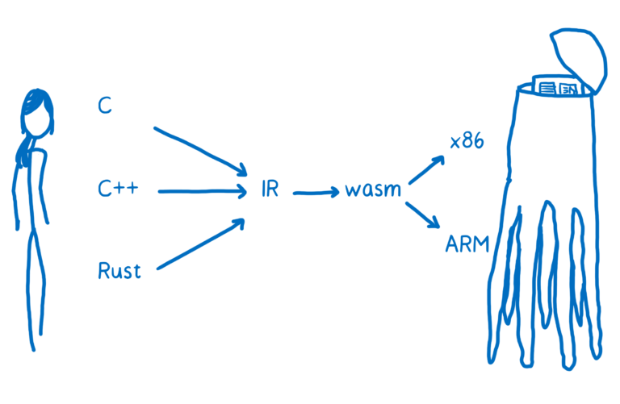
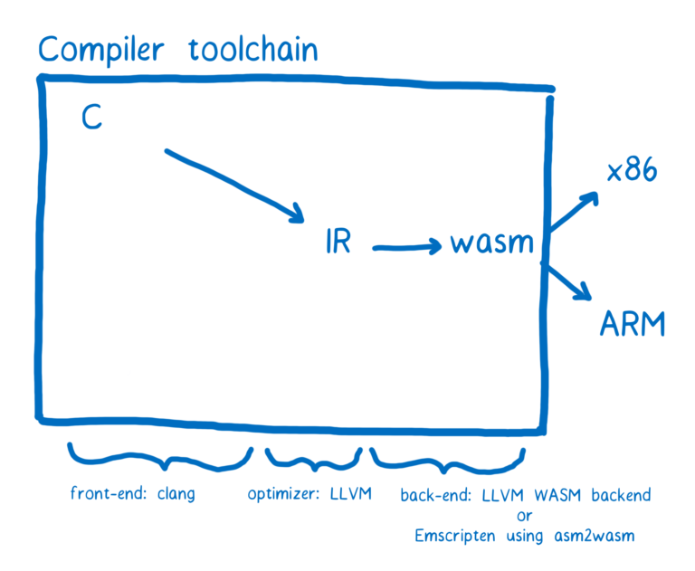

# [翻译] WebAssembly(4-1) Creating and working with WebAssembly modules

原文地址：https://hacks.mozilla.org/2017/02/creating-and-working-with-webassembly-modules/

WebAssembly is a way to run programming languages other than JavaScript on web pages. In the past when you wanted to run code in the browser to interact with the different parts of the web page, your only option was JavaScript.

除了JavaScript，WebAssembly是在浏览器中运行程序的另外一种方式。在过去，只能用JavaScript。

So when people talk about WebAssembly being fast, the apples to apples comparison is to JavaScript. But that doesn’t mean that it’s an either/or situation—that you are either using WebAssembly, or you’re using JavaScript.

所以，当说道WebAssembly的性能更快时，都是和JavaScript进行比较。但这并不意味着你就要从JavaScript和WebAssembly二选一了。

In fact, we expect that developers are going to use both WebAssembly and JavaScript in the same application. Even if you don’t write WebAssembly yourself, you can take advantage of it.

实际上，我们希望开发者能够在同一个应用中同时使用WebAssembly和JavaScript。即使你自己不会做WebAssembly的编程，你也可以应用到他。

WebAssembly modules define functions that can be used from JavaScript. So just like you download a module like lodash from npm today and call functions that are part of its API, you will be able to download WebAssembly modules in the future.

WebAssembly模块定义的方法可以被JavaScript调用。就像你使用npm下载安装loadsh并使用它的api一样，未来你也可以下载WebAssembly模块并使用。

So let’s see how we can create WebAssembly modules, and then how we can use them from JavaScript.

现在，我们来看看如何来创建一个WebAssembly模块，和如何在JavaScript中来使用他。

# Where does WebAssembly fit? WebAssembly的定位

In the article about assembly, I talked about how compilers take high-level programming languages and translate them to machine code.

在讲解汇编的文章中，我们提到了如何将高级语言转换成机器码。

Where does WebAssembly fit into this picture?

那么WebAssembly是处于图中的哪一个部分呢。

You might think it is just another one of the target assembly languages. That is kind of true, except that each one of those languages (x86, ARM ) corresponds to a particular machine architecture.

你可能会认为WebAssembly是另外一种的汇编语言。这确实是对的，除了传统汇编语言会有不同机器架构（x86，arm）的区分。

When you’re delivering code to be executed on the user’s machine across the web, you don’t know what your target architecture the code will be running on.

当你在浏览器中运行你的代码的时候，你不用清楚你的机器架构是什么。

So WebAssembly is a little bit different than other kinds of assembly. It’s a machine language for a conceptual machine, not an actual, physical machine.

所以，WebAssembly和传统汇编语言还是有一点区别。他是一种用于虚拟机的汇编语言，并不是实际的，物理上存在的机器。

Because of this, WebAssembly instructions are sometimes called virtual instructions. They have a much more direct mapping to machine code than JavaScript source code. They represent a sort of intersection of what can be done efficiently across common popular hardware. But they aren’t direct mappings to the particular machine code of one specific hardware.

因为如此，WebAssembly指令也被称为虚拟指令。它比 JavaScript 代码更直接地映射到机器码，它也能在通用的硬件上更有效地执行代码。所以它并不直接映射成特定硬件的机器码。

The browser downloads the WebAssembly. Then, it can make the short hop from WebAssembly to that target machine’s assembly code.

浏览器下载完WebAssembly后，会先经过WebAssembly的处理，然后再到目标机器的汇编语言。

# Compiling to .wasm

The compiler tool chain that currently has the most support for WebAssembly is called LLVM. There are a number of different front-ends and back-ends that can be plugged into LLVM.

目前对于 WebAssembly 支持情况最好的编译器工具链是 LLVM。有很多不同的前端和后端插件可以用在 LLVM 上。

Note: Most WebAssembly module developers will code in languages like C and Rust and then compile to WebAssembly, but there are other ways to create a WebAssembly module. For example, there is an experimental tool that helps you build a WebAssembly module using TypeScript, or you cancode in the text representation of WebAssembly directly.

注意：很多 WebAssembly 开发者用 C 语言或者 Rust 开发，再编译成 WebAssembly。其实还有其他的方式来开发 WebAssembly 模块。例如利用 TypeScript 开发 WebAssembly 模块，或者直接用 WebAssembly 文本也可以。

Let’s say that we wanted to go from C to WebAssembly. We could use the clang front-end to go from C to the LLVM intermediate representation. Once it’s in LLVM’s IR, LLVM understands it, so LLVM can perform some optimizations.

假设想从 C 语言到 WebAssembly，我们就需要 clang 前端来把 C 代码变成 LLVM 中间代码。当变换成了 LLVM IR 时，说明 LLVM 已经理解了代码，它会对代码自动地做一些优化。

To go from LLVM’s IR (intermediate representation) to WebAssembly, we need a back-end. There is one that’s currently in progress in the LLVM project. That back-end is most of the way there and should be finalized soon. However, it can be tricky to get it working today.

为了从 LLVM IR 生成 WebAssembly，还需要后端编译器。在 LLVM 的工程中有正在开发中的后端，而且应该很快就开发完成了，现在这个时间节点，暂时还看不到它是如何起作用的。

There’s another tool called Emscripten which is a bit easier to use at the moment. It has its own back-end that can produce WebAssembly by compiling to another target (called asm.js) and then converting that to WebAssembly. It uses LLVM under the hood, though, so you can switch between the two back-ends from Emscripten.

还有一个易用的工具，叫做 Emscripten。它通过自己的后端先把代码转换成自己的中间代码（叫做 asm.js），然后再转化成 WebAssembly。实际上它背后也是使用的 LLVM。

Emscripten includes many additional tools and libraries to allow porting whole C/C++ codebases, so it’s more of a software developer kit (SDK) than a compiler. For example, systems developers are used to having a filesystem that they can read from and write to, so Emscripten can simulate a file system using IndexedDB.

Emscripten 还包含了许多额外的工具和库来包容整个 C/C++ 代码库，所以它更像是一个软件开发者工具包（SDK）而不是编译器。例如系统开发者需要文件系统以对文件进行读写，Emscripten 就有一个 IndexedDB 来模拟文件系统。

Regardless of the toolchain you’ve used, the end result is a file that ends in .wasm. I’ll explain more about the structure of the .wasm file below. First, let’s look at how you can use it in JS.

不考虑太多的这些工具链，只要知道最终生成了 .wasm 文件就可以了。后面我会介绍 .wasm 文件的结构，在这之前先一起了解一下在 JS 中如何使用它。

未完待续。

