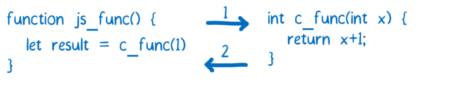
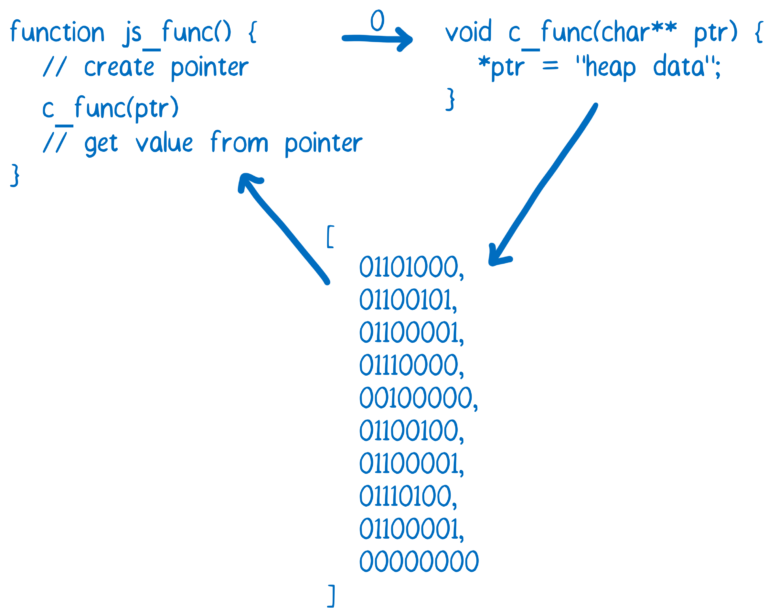
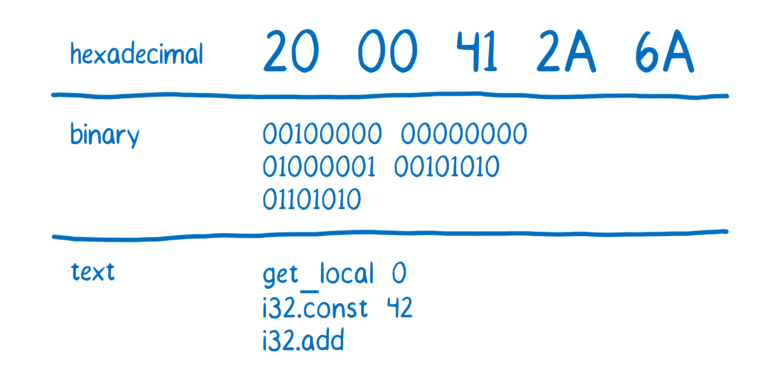
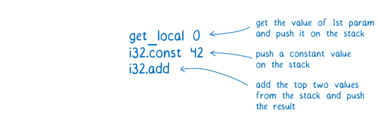

# [翻译] WebAssembly(4-2) Creating and working with WebAssembly modules

原文地址：https://hacks.mozilla.org/2017/02/creating-and-working-with-webassembly-modules/

# Loading a .wasm module in JavaScript

The .wasm file is the WebAssembly module, and it can be loaded in JavaScript. As of this moment, the loading process is a little bit complicated.

```
function fetchAndInstantiate(url, importObject) {
  return fetch(url).then(response =>
    response.arrayBuffer()
  ).then(bytes =>
    WebAssembly.instantiate(bytes, importObject)
  ).then(results =>
    results.instance
  );
}

```

You can see this in more depth in our docs.

We’re working on making this process easier. We expect to make improvements to the toolchain and integrate with existing module bundlers like webpack or loaders like SystemJS. We believe that loading WebAssembly modules can be as easy as as loading JavaScript ones.

There is a major difference between WebAssembly modules and JS modules, though. Currently, functions in WebAssembly can only use numbers (integers or floating point numbers) as parameters or return values.



For any data types that are more complex, like strings, you have to use the WebAssembly module’s memory.

If you’ve mostly worked with JavaScript, having direct access to memory isn’t so familiar. More performant languages like C, C++, and Rust, tend to have manual memory management. The WebAssembly module’s memory simulates the heap that you would find in those languages.

To do this, it uses something in JavaScript called an ArrayBuffer. The array buffer is an array of bytes. So the indexes of the array serve as memory addresses.

If you want to pass a string between the JavaScript and the WebAssembly, you convert the characters to their character code equivalent. Then you write that into the memory array. Since indexes are integers, an index can be passed in to the WebAssembly function. Thus, the index of the first character of the string can be used as a pointer.



It’s likely that anybody who’s developing a WebAssembly module to be used by web developers is going to create a wrapper around that module. That way, you as a consumer of the module don’t need to know about memory management.

If you want to learn more, check out our docs on working with WebAssembly’s memory.


# The structure of a .wasm file

If you are writing code in a higher level language and then compiling it to WebAssembly, you don’t need to know how the WebAssembly module is structured. But it can help to understand the basics.

If you haven’t already, we suggest reading the article on assembly (part 3 of the series).

Here’s a C function that we’ll turn into WebAssembly:

```
int add42(int num) {
  return num + 42;
}

```

You can try using the WASM Explorer to compile this function.

If you open up the .wasm file (and if your editor supports displaying it), you’ll see something like this.

```
00 61 73 6D 0D 00 00 00 01 86 80 80 80 00 01 60
01 7F 01 7F 03 82 80 80 80 00 01 00 04 84 80 80
80 00 01 70 00 00 05 83 80 80 80 00 01 00 01 06
81 80 80 80 00 00 07 96 80 80 80 00 02 06 6D 65
6D 6F 72 79 02 00 09 5F 5A 35 61 64 64 34 32 69
00 00 0A 8D 80 80 80 00 01 87 80 80 80 00 00 20
00 41 2A 6A 0B
```

That is the module in its “binary” representation. I put quotes around binary because it’s usually displayed in hexadecimal notation, but that can be easily converted to binary notation, or to a human readable format.

For example, here’s what num + 42 looks like.




# How the code works: a stack machine

In case you’re wondering, here’s what those instructions would do.



You might have noticed that the add operation didn’t say where its values should come from. This is because WebAssembly is an example of something called a stack machine. This means that all of the values an operation needs are queued up on the stack before the operation is performed.

Operations like add know how many values they need. Since add needs two, it will take two values from the top of the stack. This means that theadd instruction can be short (a single byte), because the instruction doesn’t need to specify source or destination registers. This reduces the size of the .wasm file, which means it takes less time to download.

Even though WebAssembly is specified in terms of a stack machine, that’s not how it works on the physical machine. When the browser translates WebAssembly to the machine code for the machine the browser is running on, it will use registers. Since the WebAssembly code doesn’t specify registers, it gives the browser more flexibility to use the best register allocation for that machine.

# Sections of the module

Besides the add42 function itself, there are other parts in the .wasm file. These are called sections. Some of the sections are required for any module, and some are optional.

Required:

	1.	Type. Contains the function signatures for functions defined in this module and any imported functions.
	2.	Function. Gives an index to each function defined in this module.
	3.	Code. The actual function bodies for each function in this module.

Optional:

	1.	Export. Makes functions, memories, tables, and globals available to other WebAssembly modules and JavaScript. This allows separately-compiled modules to be dynamically linked together. This is WebAssembly’s version of a .dll.
	2.	Import. Specifies functions, memories, tables, and globals to import from other WebAssembly modules or JavaScript.
	3.	Start. A function that will automatically run when the WebAssembly module is loaded (basically like a main function).
	4.	Global. Declares global variables for the module.
	5.	Memory. Defines the memory this module will use.
	6.	Table. Makes it possible to map to values outside of the WebAssembly module, such as JavaScript objects. This is especially useful for allowing indirect function calls.
	7.	Data. Initializes imported or local memory.
	8.	Element. Initializes an imported or local table.


For more on sections, here’s a great in-depth explanation of how these sections work.

# Coming up next

Now that you know how to work with WebAssembly modules, let’s look atwhy WebAssembly is fast.


