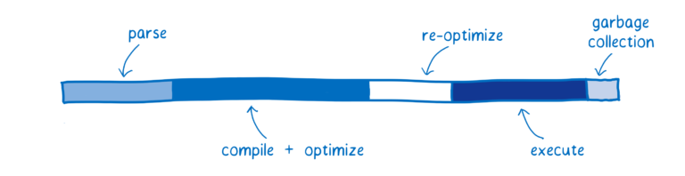
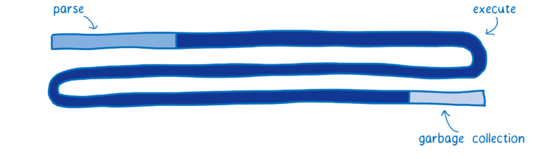
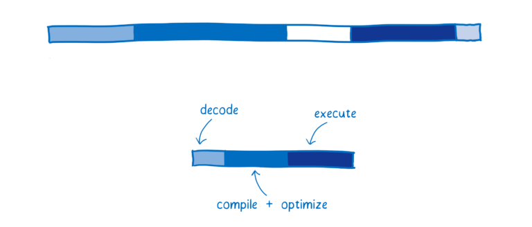
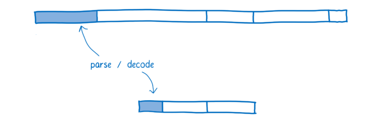

# [翻译]WebAssembly(5-1) What makes WebAssembly fast? WebAssembly运行快速的原理

In the last article, I explained that programming with WebAssembly or JavaScript is not an either/or choice. We don’t expect that too many developers will be writing full WebAssembly code bases.

在前面的文章里，说明了WebAssembly和JavaScript是可以同时使用的。并不需要太多的开发者来只编写WebAssembly的代码。

So developers don’t need to choose between WebAssembly and JavaScript for their applications. However, we do expect that developers will swap out parts of their JavaScript code for WebAssembly.

开发者不必为他们的应有只选择一种开发语言。并且，我们推荐开发者将一部分js实现的功能用WebAssembly来实现。

For example, the team working on React could replace their reconciler code (aka the virtual DOM) with a WebAssembly version. People who use React wouldn’t have to do anything… their apps would work exactly as before, except they’d get the benefits of WebAssembly.

举个例子，react的团队可以将其虚拟dom这层用WebAssembly重写。这对使用react的用户是完全透明的，使用react开发的应用什么都不用改，就能获得WebAssembly带来的收益。

The reason developers like those on the React team would make this swap is because WebAssembly is faster. But what makes it faster?

开发者对WebAssembly版本的react肯定会更加支持，因为这会让react运行的更快。但运行的更快的原理是什么呢？

# What does JavaScript performance look like today? 现阶段js的性能情况

Before we can understand the differences in performance between JavaScript and WebAssembly, we need to understand the work that the JS engine does.

在我们理解WebAssembly的高性能原理之前，先了解一些js引擎的工作机制。

This diagram gives a rough picture of what the start-up performance of an application might look like today.

下面这个图描述了js引擎在执行过程中的性能情况草图。

The time that the JS engine spends doing any one of these tasks depends on the JavaScript the page uses. This diagram isn’t meant to represent precise performance numbers. Instead, it’s meant to provide a high-level model of how performance for the same functionality would be different in JS vs WebAssembly.

js引擎执行任务的时间是和具体的js代码有关的。这个图并不能表明精确的时间。他只是为了说明在执行同样功能的代码时，js和WebAssembly的区别。

Each bar shows the time spent doing a particular task.

图中的每一段都是一个具体的任务。

	•	Parsing ： the time it takes to process the source code into something that the interpreter can run.
	•	Compiling + optimizing ： the time that is spent in the baseline compiler and optimizing compiler. Some of the optimizing compiler’s work is not on the main thread, so it is not included here.
	•	Re-optimizing ： the time the JIT spends readjusting when its assumptions have failed, both re-optimizing code and bailing out of optimized code back to the baseline code.
	•	Execution ： the time it takes to run the code.
	•	Garbage collection ： the time spent cleaning up memory.

	1. parse：将代码转换成解释器能够执行的格式的时间
	2. compile+optimize：基线编译器和优化编译器花费的时间。一些优化编译器会在主线程之外的线程中执行，所以也可以不包含他。
	3. re-optimize：当 JIT 发现优化假设错误，丢弃优化代码所花的时间。包括重优化的时间、抛弃并返回到基线编译器的时间。
	4. execute：代码执行的时间
	5. Garbage collection：内存回收的时间

One important thing to note: these tasks don’t happen in discrete chunks or in a particular sequence. Instead, they will be interleaved. A little bit of parsing will happen, then some execution, then some compiling, then some more parsing, then some more execution, etc.

一个重要的点：这些任务并不会按照特定的顺序执行的。他们是交叉执行的。比如正在执行了一parse，同时执行了一部分代码执行，然后执行了一部分编译，同时又执行了一部分的parse，一部分代码执行，等等。

The performance this breakdown brings is a big improvement from the early days of JavaScript, which would have looked more like this:

这种交叉的执行比早期的JavaScript引擎执行的快了很多，如下图是早期的js引擎的执行方式：

In the beginning, when it was just an interpreter running the JavaScript, execution was pretty slow. When JITs were introduced, it drastically sped up execution time.

早期使用解释器来执行js，执行的非常慢。JIT编译器的出现极大的提升了js的执行速度。

The tradeoff is the overhead of monitoring and compiling the code. If JavaScript developers kept writing JavaScript in the same way that they did then, the parse and compile times would be tiny. But the improved performance led developers to create larger JavaScript applications.

JIT要权衡和取舍的主要是代码监控和优化的损耗。如果JavaScript开发者仍然像之前那样来使用JavaScript，这些损耗是很小的。但是，因为性能的提升，使得开发者去开发设计更大型更复杂的JavaScript应用。

This means there’s still room for improvement.

这意味着性能优化永无止境。

# How does WebAssembly compare? WebAssembly是怎么做的？

Here’s an approximation of how WebAssembly would compare for a typical web application.

下面是一个WebAssembly处理一个web应用的近似图。

There are slight variations between browsers in how they handle all of these phases. I’m using SpiderMonkey as my model here.

不同的浏览器处理这些阶段会有细微的不同，这里使用SpiderMonkey模型。

# Fetching 下载

This isn’t shown in the diagram, but one thing that takes up time is simply fetching the file from the server.

在图中并没有这个阶段，但是从服务器上下载文件仍然会占用一定的时间。

Because WebAssembly is more compact than JavaScript, fetching it is faster. Even though compaction algorithms can significantly reduce the size of a JavaScript bundle, the compressed binary representation of WebAssembly is still smaller.

因为WebAssembly会比JavaScript更小，所以下载的也会更快。尽管压缩算法可以极大的缩小js的体积，但是WebAssembly是压缩的二进制文件，会更小。

This means it takes less time to transfer it between the server and the client. This is especially true over slow networks.

这就意味着WebAssembly下载文件会更快，特别是在网络差的情况下。

# Parsing 解析

Once it reaches the browser, JavaScript source gets parsed into an Abstract Syntax Tree.

当文件下载到浏览器后，JavaScript就会被转换成抽象语法树。

Browsers often do this lazily, only parsing what they really need to at first and just creating stubs for functions which haven’t been called yet.

浏览器通常是在使用懒解析的方式，就是只在真正需要解析之前才会调用解析。

From there, the AST is converted to an intermediate representation (called bytecode) that is specific to that JS engine.

解析完成后，抽象语法树就被转换成字节码提供给js引擎。

In contrast, WebAssembly doesn’t need to go through this transformation because it is already an intermediate representation. It just needs to be decoded and validated to make sure there aren’t any errors in it.

WebAssembly并不需要有这个转换的过程，因为他已经是字节码了。他仅仅需要被解码和校验通过就可以被执行了。

未完待续

