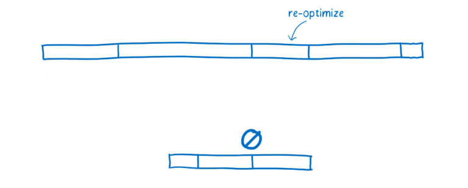
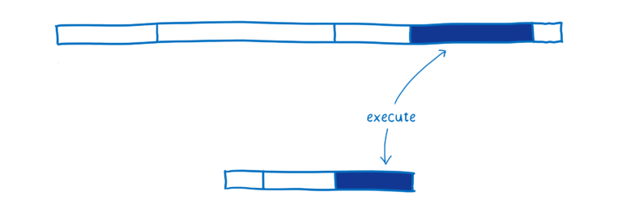
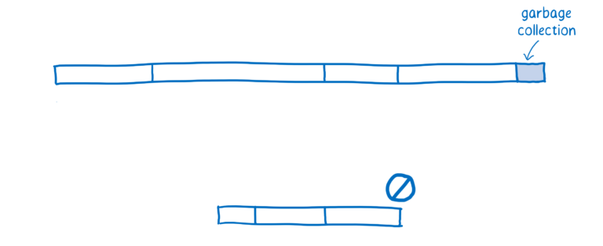

# [翻译]WebAssembly(5-2) What makes WebAssembly fast? WebAssembly运行快速的原理

# Compiling + optimizing 编译+优化

As I explained in the article about the JIT, JavaScript is compiled during the execution of the code. Depending on what types are used at runtime, multiple versions of the same code may need to be compiled.

在jit的文章里已经说过，JavaScript是在运行时候被编译的。根据运行时的类型使用情况，相同的代码段会被编译。

Different browsers handle compiling WebAssembly differently. Some browsers do a baseline compilation of WebAssembly before starting to execute it, and others use a JIT.

不同的浏览器处理WebAssembly的编译不太相同。有的浏览器会会在运行WebAssembly之前进行一个基线的编译，有的浏览器会使用即时编译jit。

Either way, the WebAssembly starts off much closer to machine code. For example, the types are part of the program. This is faster for a few reasons:

无论哪种方式，WebAssembly在开始的时候都更接近机器码。比如，程序的部分类型。运行的更快有如下的原因：

	1.	The compiler doesn’t have to spend time running the code to observe what types are being used before it starts compiling optimized code.
	2.	The compiler doesn’t have to compile different versions of the same code based on those different types it observes.
	3.	More optimizations have already been done ahead of time in LLVM. So less work is needed to compile and optimize it.

	1. 编译器在编译优化之前，不需要再花费时间去监控代码的运行
	2. 编译器无需再为相同代码的不同类型编译出不同的版本
	3. 更多的优化工作已经提前完成。只剩下很少的工作。

# Reoptimizing 再优化

Sometimes the JIT has to throw out an optimized version of the code and retry it.

有时JIT会重新优化已经优化过的部分代码。

This happens when assumptions that the JIT makes based on running code turn out to be incorrect. For example, deoptimization happens when the variables coming into a loop are different than they were in previous iterations, or when a new function is inserted in the prototype chain.

这在jit发现运行的代码有优化错误的时候会发生。比如，在循环中，如果某次的类型与之前的循环不同，就会取消优化，或者，在原型链中加入一个新的方法。

There are two costs to deoptimization. First, it takes some time to bail out of the optimized code and go back to the baseline version. Second, if that function is still being called a lot, the JIT may decide to send it through the optimizing compiler again, so there’s the cost of compiling it a second time.

这种反优化会有两个损耗。第一，回退代码的损耗。第二，如果这个方法还会被大量的调用，jit还会将其发送给优化编译器进行优化，所以，就会增加一次编译的时间。

In WebAssembly, things like types are explicit, so the JIT doesn’t need to make assumptions about types based on data it gathers during runtime. This means it doesn’t have to go through reoptimization cycles.

在WebAssembly中，类型是明确定义好的，所以jit无需去假设类型。这就意味着也无需有反优化的过程。

# Executing 执行

It is possible to write JavaScript that executes performantly. To do it, you need to know about the optimizations that the JIT makes. For example, you need to know how to write code so that the compiler can type specialize it, as explained in the article on the JIT.

要写出执行效率很高的JavaScript代码。你需要了解JIT的优化机制，例如你要知道什么样的代码编译器会对其进行特殊处理。

However, most developers don’t know about JIT internals. Even for those developers who do know about JIT internals, it can be hard to hit the sweet spot. Many coding patterns that people use to make their code more readable (such as abstracting common tasks into functions that work across types) get in the way of the compiler when it’s trying to optimize the code.

然而大多数的开发者是不知道JIT内部的实现机制。即使开发者知道JIT的内部机制，也很难写出符合JIT标准的代码，因为人们通常为了代码可读性更好而使用的编码模式，恰恰不合适编译器对代码的优化。

Plus, the optimizations a JIT uses are different between browsers, so coding to the internals of one browser can make your code less performant in another.
Because of this, executing code in WebAssembly is generally faster. Many of the optimizations that JITs make to JavaScript (such as type specialization) just aren’t necessary with WebAssembly.

加之 JIT 会针对不同的浏览器做不同的优化，所以对于一个浏览器优化的比较好，很可能在另外一个浏览器上执行效率就比较差。

In addition, WebAssembly was designed as a compiler target. This means it was designed for compilers to generate, and not for human programmers to write.Since human programmers don’t need to program it directly, WebAssembly can provide a set of instructions that are more ideal for machines. 

正是因为这样，执行WebAssembly通常会比较快，很多JIT为JavaScript所做的优化在WebAssembly并不需要。另外，WebAssembly就是为了编译器而设计的，开发人员不直接对其进行编程，这样就使得 WebAssembly专注于提供更加理想的指令（执行效率更高的指令）给机器就好了。

Depending on what kind of work your code is doing, these instructions run anywhere from 10% to 800% faster.

执行效率方面，不同的代码功能有不同的效果，一般来讲执行效率会提高 10% - 800%。

# Garbage collection 垃圾回收

In JavaScript, the developer doesn’t have to worry about clearing out old variables from memory when they aren’t needed anymore. Instead, the JS engine does that automatically using something called a garbage collector.

JavaScript 中，开发者不需要手动清理内存中不用的变量。JS 引擎会自动地做这件事情，这个过程叫做垃圾回收。

This can be a problem if you want predictable performance, though. You don’t control when the garbage collector does its work, so it may come at an inconvenient time. Most browsers have gotten pretty good at scheduling it, but it’s still overhead that can get in the way of your code’s execution.

可是，当你想要实现性能可控，垃圾回收可能就是个问题了。垃圾回收器会自动开始，这是不受你控制的，所以很有可能它会在一个不合适的时机启动。目前的大多数浏览器已经能给垃圾回收安排一个合理的启动时间，不过这还是会增加代码执行的开销。

At least for now, WebAssembly does not support garbage collection at all. Memory is managed manually (as it is in languages like C and C++). While this can make programming more difficult for the developer, it does also make performance more consistent.

目前为止，WebAssembly 不支持垃圾回收。内存操作都是手动控制的（像 C、C++一样）。这对于开发者来讲确实增加了些开发成本，不过这也使代码的执行效率更高。

# Conclusion 结论

WebAssembly is faster than JavaScript in many cases because:

	•	fetching WebAssembly takes less time because it is more compact than JavaScript, even when compressed.
	•	decoding WebAssembly takes less time than parsing JavaScript.
	•	compiling and optimizing takes less time because WebAssembly is closer to machine code than JavaScript and already has gone through optimization on the server side.
	•	reoptimizing doesn’t need to happen because WebAssembly has types and other information built in, so the JS engine doesn’t need to speculate when it optimizes the way it does with JavaScript.
	•	executing often takes less time because there are fewer compiler tricks and gotchas that the developer needs to know to write consistently performant code, plus WebAssembly’s set of instructions are more ideal for machines.
	•	garbage collection is not required since the memory is managed manually.
	
WebAssembly 比 JavaScript 执行更快是因为：

1. 文件加载，WebAssembly 比 JavaScript 加载文件更快。即使 JavaScript 进行了压缩，WebAssembly 文件的体积也比 JavaScript 更小；
2. 解码，WebAssembly 的解码时间比 JavaScript 的解析时间更短；
3. 编译和优化，WebAssembly 更具优势，因为 WebAssembly 的代码更接近机器码，并且大部分优化工作已经事先做好了。
4. 再优化，WebAssembly 不会发生再优化。而 JS 引擎的优化假设则可能会发生“抛弃优化代码<->再优化”现象。
5. 执行，WebAssembly 更快是因为开发人员不需要懂太多的编译器技巧，而这在 JavaScript 中是需要的。WebAssembly 代码也更适合生成机器执行效率更高的指令。
6. 垃圾回收，WebAssembly 垃圾回收都是手动控制的，效率比自动回收更高。

This is why, in many cases, WebAssembly will outperform JavaScript when doing the same task.

这就是为什么在大多数情况下，同一个任务 WebAssembly 比 JavaScript 性能更好的原因。

There are some cases where WebAssembly doesn’t perform as well as expected, and there are also some changes on the horizon that will make it faster. I’ll cover those in the next article.

但是，还有一些情况 WebAssembly 表现的会不如预期；同时 WebAssembly 的未来也会朝着使 WebAssembly 执行效率更高的方向发展。这些我会在下一篇文章中介绍。

