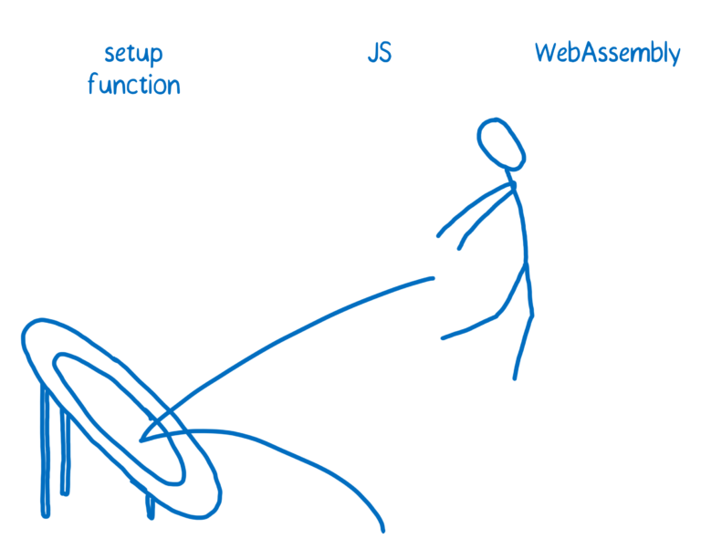

# [翻译]WebAssembly(6-1) Where is WebAssembly now and what’s next? WebAssembly的现在和未来

On February 28, the four major browsers announced their consensus that the MVP of WebAssembly is complete. This provides a stable initial version that browsers can start shipping.

2月28号，四大主流浏览器宣布WebAssembly的最小可用产品已经完成。这意味着浏览器已经提供WebAssembly的稳定初始版本了。

This provides a stable core that browsers can ship. This core doesn’t contain all of the features that the community group is planning, but it does provide enough to make WebAssembly fast and usable.

浏览器提供了一个稳定的内核。内核并没有包含社区计划的所有功能，仅提供了一个快速的可用版本。

With this, developers can start shipping WebAssembly code. For earlier versions of browsers, developers can send down an asm.js version of the code. Because asm.js is a subset of JavaScript, any JS engine can run it. With Emscripten, you can compile the same app to both WebAssembly and asm.js.

所以，开发者已经可以开始编写WebAssembly的代码了。在老版本的浏览器中，开发者可以使用asm.js来向下兼容。因为asm.js是JavaScript的一个子集，所有的js引擎都可以运行它。

Even in the initial release, WebAssembly will be fast. But it should get even faster in the future, through a combination of fixes and new features.

尽管刚刚发版，WebAssembly仍然很快。在未来他会更快，并且会有很多新的特性。

# Improving WebAssembly performance in browsers 在浏览器中提升WebAssembly的性能

Some speed improvements will come as browsers improve WebAssembly support in their engines. The browser vendors are working on these issues independently.

随着浏览器引擎不断优化WebAssembly的支持，运行WebAssembly也会越来越快。浏览器厂商目前都在解决下述的问题。

### Faster function calls between JS and WebAssembly js和WebAssembly之间更快的调用方式

Currently, calling a WebAssembly function in JS code is slower than it needs to be. That’s because it has to do something called “trampolining”. The JIT doesn’t know how to deal directly with WebAssembly, so it has to route the WebAssembly to something that does. This is a slow piece of code in the engine itself, which does setup to run the optimized WebAssembly code.

目前，js调用WebAssembly方法还是比预期的要慢。因为需要称之为跳板的过程。jit还无法直接调用WebAssembly，所以他需要先将WebAssembly进行一些预处理。预处理的过程是比较慢的，他会为WebAssembly的运行做准备工作。

This can be up to 100x slower than it would be if the JIT knew how to handle it directly.

这个过程会比jit直接调用WebAssembly慢100倍。

You won’t notice this overhead if you’re passing a single large task off to the WebAssembly module. But if you have lots of back-and-forth between WebAssembly and JS (as you do with smaller tasks), then this overhead is noticeable.

如果你调用一个WebAssembly的大型任务你并不会对预处理有感知。但是，如果你不停的调用WebAssembly（好多小任务），这个损耗就会被感知到了。

### Faster load time 更快的加载时间

JITs have to manage the tradeoff between faster load times and faster execution times. If you spend more time compiling and optimizing ahead of time, that speeds up execution, but it slows down start up.

jit需求权衡更快的加载速度还是更快的执行速度。如果你花费更多的编译和优化时间，那么执行时间就会快，但是程序启动的加载时间就会变慢。

There’s a lot of ongoing work to balance up-front compilation (which ensures there is no jank once the code starts running) and the basic fact that most parts of the code won’t be run enough times to make optimization worth it.

目前有大量的工作正在研究，如何使预编译时间和程序真正执行时间两者平衡。

Since WebAssembly doesn’t need to speculate what types will be used, the engines don’t have to worry about monitoring the types at runtime. This gives them more options, for example parallelizing compilation work with execution.

WebAssembly 不需要对变量类型做优化假设，所以引擎也不关心在运行时的变量类型。这就给效率的提升提供了更多的可能性，比如可以使编译和执行这两个过程并行。

Plus, recent additions to the JavaScript API will allow streaming compilation of WebAssembly. This means that the engine can start compiling while bytes are still being downloaded.

加之最新增加的 JavaScript API 允许 WebAssembly 的流编译，这就使得在字节流还在下载的时候就启动编译。

In Firefox we’re working on a two-compiler system. One compiler will run ahead of time and do a pretty good job at optimizing the code. While that’s running code, another compiler will do a full optimization in the background. The fully-optimized version of the code will be swapped in when it’s ready.

FireFox 目前正在开发两个编译器系统。一个编译器先启动，对代码进行部分优化。在代码已经开始运行时，第二个编译器会在后台对代码进行全优化，当全优化过程完毕，就会将代码替换成全优化版本继续执行。

未完待续。

