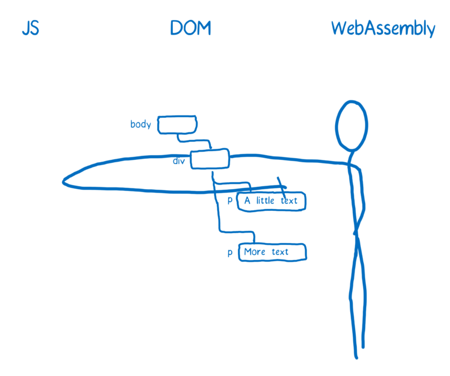

# [翻译]WebAssembly(6-2) Where is WebAssembly now and what’s next? WebAssembly的现在和未来

# Adding post-MVP features to the spec 将要支持的特性

One of the goals of WebAssembly is to specify in small chunks and test along the way, rather than designing everything up front.

WebAssembly使用迭代的方式研发，而不是事先设计出一切。

This means there are lots of features that are expected, but haven’t been 100% thought-through yet. They will have to go through the specification process, which all of the browser vendors are active in.

这就意味着还有很多的特性还在酝酿之中。这些特性会逐步的被加入到标准中来，这个过程所有的浏览器厂商都会加入进来。

These features are called future features. Here are just a few.

这些特性叫做未来的特性，这里介绍一些。

### Working directly with the DOM dom的直接操作

Currently, there’s no way to interact with the DOM. This means you can’t do something like element.innerHTML to update a node from WebAssembly.

目前，WebAssembly没有办法去直接操作dom。就是说WebAssembly不能使用element.innerHTML的方式来更新一个节点。

Instead, you have to go through JS to set the value. This can mean passing a value back to the JavaScript caller. On the other hand, it can mean calling a JavaScript function from within WebAssembly—both JavaScript and WebAssembly functions can be used as imports in a WebAssembly module.

所以，你需要通过js来完成这个操作。这就要在WebAssembly中调用JavaScript函数。

Either way, it is likely that going through JavaScript is slower than direct access would be. Some applications of WebAssembly may be held up until this is resolved.

无论如何，通过JavaScript的调用是比直接操作要慢的。如果WebAssembly想应用起来，这个问题务必是要解决的。

### Shared memory concurrency 共享内存并发

One way to speed up code is to make it possible for different parts of the code to run at the same time, in parallel. This can sometimes backfire, though, since the overhead of communication between threads can take up more time than the task would have in the first place.

提升代码执行速度的一个方法是使代码并行运行，不过有时也会适得其反，因为不同的线程在同步的时候可能会花费更多的时间。

But if you can share memory between threads, it reduces this overhead. To do this, WebAssembly will use JavaScript’s new SharedArrayBuffer. Once that is in place in the browsers, the working group can start specifying how WebAssembly should work with them.

这时如果能够使不同的线程共享内存，那就能降低这种开销。实现这一功能 WebAssembly 将会使用 JavaScript 中的 SharedArrayBuffer，而这一功能的实现将会提高程序执行的效率。

### SIMD

If you read other posts or watch talks about WebAssembly, you may hear about SIMD support. The acronym stands for single instruction, multiple data. It’s another way of running things in parallel.

如果你之前了解过 WebAssembly 相关的内容，你可能会听说过 SIMD，全称是：Single Instruction, Multiple Data（单指令，多数据），这是并行化的另一种方法。

SIMD makes it possible to take a large data structure, like a vector of different numbers, and apply the same instruction to different parts at the same time. In this way, it can drastically speed up the kinds of complex computations you need for games or VR.

SIMD 在处理存放大量数据的数据结构有其独特的优势。比如存放了很多不同数据的 vector（容器），就可以用同一个指令同时对容器的不同部分做处理。这种方法会大幅提高复杂计算的效率，比如游戏或者 VR。

This is not too important for the average web app developer. But it is very important to developers working with multimedia, such as game developers.

这对于普通 web 应用开发者不是很重要，但是对于多媒体、游戏开发者非常关键。
 
### Exception handling 处理异常

Many code bases in languages like C++ use exceptions. However, exceptions aren’t yet specified as part of WebAssembly.

许多语言都仿照 C++ 式的异常处理，但是 WebAssembly 并没有包含异常处理。

If you are compiling your code with Emscripten, it will emulate exception handling for some compiler optimization levels. This is pretty slow, though, so you may want to use the DISABLE_EXCEPTION_CATCHING flag to turn it off.

如果你用 Emscripten 编译代码，就知道它会模拟异常处理，但是这一过程非常之慢，慢到你都想用 “DISABLE_EXCEPTION_CATCHING” 标记把异常处理关掉。

Once exceptions are handled natively in WebAssembly, this emulation won’t be necessary.

如果异常处理加入到了 WebAssembly，那就不用采用模拟的方式了。而异常处理对于开发者来讲又特别重要，所以这也是未来的一大功能点。

### Other improvements—making things easier for developers 其它让开发更简单的事

Some future features don’t affect performance, but will make it easier for developers to work with WebAssembly.

一些未来特性不是针对性能的，而是使开发者开发 WebAssembly 更方便。

	•	First-class source-level developer tools. Currently, debugging WebAssembly in the browser is like debugging raw assembly. Very few developers can mentally map their source code to assembly, though. We’re looking at how we can improve tooling support so that developers can debug their source code.
	•	Garbage collection. If you can define your types ahead of time, you should be able to turn your code into WebAssembly. So code using something like TypeScript should be compilable to WebAssembly. The only hitch currently, though, is that WebAssembly doesn’t know how to interact with existing garbage collectors, like the one built in to the JS engine. The idea of this future feature is to give WebAssembly first-class access to the builtin GC with a set of low-level GC primitive types and operations.
	•	ES6 Module integration. Browsers are currently adding support for loading JavaScript modules using the script tag. Once this feature is added, a tag like <script src=url type="module"> could work even if url points to a WebAssembly module.
	
1. 一流的开发者工具。目前在浏览器中调试 WebAssembly 就像调试汇编一样，很少的开发者可以手动地把自己的源代码和汇编代码对应起来。我们在致力于开发出更加适合开发者调试源代码的工具。
1. 垃圾回收。如果你能提前确定变量类型，那就可以把你的代码变成 WebAssembly，例如 TypeScript 代码就可以编译成 WebAssembly。但是现在的问题是 WebAssembly 没办法处理垃圾回收的问题，WebAssembly 中的内存操作都是手动的。所以 WebAssembly 会考虑提供方便的 GC 功能，以方便开发者使用。
1. ES6 模块集成。目前浏览器在逐渐支持用 script 标记来加载 JavaScript 模块。一旦这一功能被完美执行，那么像 <script src=url type="module"> 这样的标记就可以运行了，这里的 url 可以换成 WebAssembly 模块。

# Conclusion 结论

WebAssembly is fast today, and with new features and improvements to the implementation in browsers, it should get even faster.

WebAssembly 执行起来很快，随着浏览器逐步支持了 WebAssembly 的更多特性，WebAssembly 将会变得更快。

