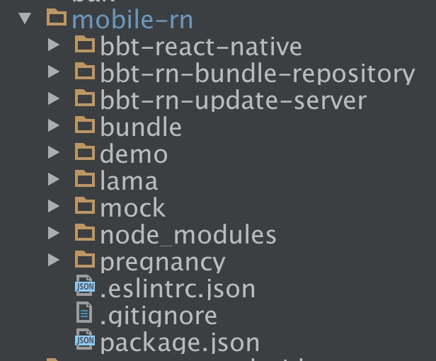
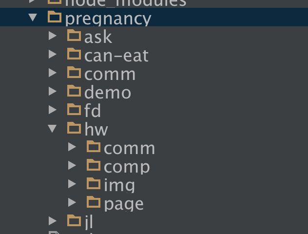
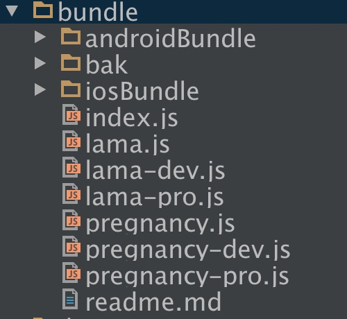

# RN分享5

# 目录结构



bbt-react-native：基础技术框架。存放业务无关的可复用的组件、接口等。

bbt-rn-bundle-repository：包仓库。打包命令；存放全量包、增量包。

bbt-rn-update-server：增量升级后台（已废弃）

bundle：打包配置。业务模块的打包配置。

demo：（已废弃）

lama：小时光app模块（尚未使用）。

mock：数据模拟接口（已废弃）

node_modules：node模块安装包

pregnancy：孕育app模块。包含，专家答，记录tab，好玩等。

### app模块目录结构



ask：问答（未启用）

can-eat：能不能吃（未启用）

comm：基础业务框架。存放业务有关的可复用的组件、接口等。

demo：demo

fd：专家答

hw：好玩

jl：记录tab

#### 业务模块

comm：本模块内的可复用的接口等。

comp：本模块内的组件（不一定可复用）。

img：图片。

page：页面级组件。

# 打包配置




bundle目录下的文件主要有2个作用。

1. 开发模式下的入口文件配置。

孕育:localhost:8081/bundle/pregnancy-dev.bundle?platform=ios&dev=false

时光:localhost:8081/bundle/lama-dev.bundle?platform=ios&dev=false

2. 打正式包的入口文件配置。

执行打包命令可以看到执行的命令，里面包含这个位置。

文件说明，每个app都会有如下的文件，比如孕育中的：

1. pregnancy.js。孕育app的入口文件配置。
2. pregnancy-dev.js。开发环境下的孕育app入口文件配置。
3. pregnancy-pro.js。正式环境下的孕育app入口文件配置，并屏蔽了默认的错误处理，同理其它正式环境下的一些配置和代码也可以写在这个文件中。打包命令会使用这个文件作为打包的入口文件。

# 官方提供的基础组件

1. view
1. text
1. touch*
1. scrollview
1. listview

# 框架体系结构及其引用方式

### 体系结构

快速开发出质量高的功能是我们追求的目标。

答案：复用！！！

1. 快速：无需开发功能，只需将可复用成果引入并配置即可使用。
2. 高质量：可复用成果是经历过测试验证的。

复用带来的问题：个性化。

答案：分层。不同层解决不同范围内个性化的问题。

```
业务组件和接口。业务模块内可复用。pregnancy/hw/comp,pregnancy/hw/comm.
业务页面。不需复用。pregnancy/hw/page。
业务模块。不需复用。pregnancy/hw。
基础业务框架。app内可复用。pregnancy/comm。
基础技术框架。任何项目都可复用。bbt-react-native。
```

各层的职责划分，讲bbtFetch的例子，直接跳讲到bbtFetch章节。

### 引用方式

这里主要说的是技术框架和业务框架的引用方式。其余直接按相对目录引用即可。

1. 基础技术框架：业务无关，只提供纯技术的可复用组件。
2. 基础业务框架：依赖于app的某些接口或者实现了某些app的特有业务。会对基础技术框架中的内容进行业务扩展。

我们开发时直接面对的是【基础业务框架】。所以只引用它即可。

基础业务框架的入口文件会自动的将技术框架中的内容发布出来。

```
import {
    Navigator, // 其实是属于技术框架的，但是也可以引用到
    BaseComponent,
} from '../../comm';
```

1. 基础业务框架入口文件：pregnancy/comm/index.js。
2. 基础技术框架入口文件：bbt-react-native/index.js。


# 业务模块注册

需要与app约定好的业务模块名称。

```
// demo
AppRegistry.registerComponent('demo', () => DemoIndex);

// 好玩频道
AppRegistry.registerComponent('hw', () => HwIndex);

```

# 导航

### 业务模块的一般页面结构

1. index页面：只定义nav对象，无任何显示view
2. home页面：本模块的首页
3. 其它页面页面

### route对象

处于页面栈中的每一个页面，都会有一个route对象与其对应。

它大概长这个样子：

```
{
	name: 'PageA', // 必填
	page: () => <PageA />, // 必填
	
	onHardwareBackPress: ()=> true,
}
```

### 如何使用

一个业务模块，有且只有一个Navigator组件被定义。

在rn首页定义Navigator组件。

```
render() {
    return (
            <Navigator nav={this.props.nav}            
                       ref={(nav) => {
                               global.nav = nav;
                       }}
                       initialRouteStack={this.getInitialRouteStack()}
        
            />
            );
       }

```

各个子页面统一使用首页定义的Navigator组件对象，通过global对象传递。

跳转：global.nav.push(route);

返回：global.nav.pop();

### 转场动画的流畅性保证

Navigator组件完全使用js实现，由于js的单线程特点，如果在页面转场动画过程中，js干其他事情【比如渲染个某个jsx】超过了16ms，那么转场动画将不足60帧，给用户的感觉就是动画有卡顿。

为了避免这种情况，办法就是在转场动画中不要让js来干别的事情。

那么我们如何知道转场动画什么时候结束呢，官方提供了动画交互管理器InteractionManager，示例伪代码如下：

```
InteractionManager.runAfterInteractions(() => {
      alert('转场动画结束了！');
    });
```

大多数的场景：点击page1的某个按钮，要跳转到page2，并且page2要和服务器请求数据，根据返回的数据来渲染page2的部分or全部内容。

针对上述场景，解决方案如下，用伪代码描述：

1. page2的state至少有2个值，转场动画进行中=true，服务器查询中=true
1. page2的componentWillMount方法中发起异步服务器交互请求,当请求结束setState:服务器查询中=false
2. page2的componentWillMount方法中注册InteractionManager.runAfterInteractions事件，当转场结束setState:转场动画进行中=false
3. page2的render方法中，先判断（转场动画进行中=true || 服务器查询中=true）就返回一个loading的提示，否则返回真正的jsx，并且此时，服务器返回的数据已经可用了
4. listview组件已经实现了这个算法，无需单独实现

示例代码：FdMyInfo

### 场景 参数传递

1. 属性 page1传给page2
2. 事件 page2传给page1

### 场景 直接跳转xxx页面

1. app会将需要显示的页面的url传递到index页面
2. 利用index页面声明nav时定义的initialRouteStack来路由

### 场景 android物理返回建的拦截。比如模态窗口按返回键。

主要通过route中定义的onHardwareBackPress的事件来实现。

返回true，继续本次返回动作。

返回false，终止本次返回动作。

参考modal的示例

# 网络请求

bbtFetch统一了http请求的入口，并封装了如下功能：

技术层：

4. 断网时的处理
5. 将参数对象转换为http请求格式字符串【将{a: '1'，b: '2'}转换为a=1&b=2的格式】
4. 特殊字符替换
4. 请求和返回的日志打印

业务层：

1. 域名拼装 
2. 公用参数拼装 和 生成加密串


示例代码：FdMyInfo

```
bbtFetch(url).
    then((res) => res.json()).then((res) => {
        this.setState({data: res.data});
    }).catch((e) => {
        console.log(e);
        FetchErrorApi.showPage({
            header: <FdHeader title='个人信息' />,
        });
    });
```

# 网络错误处理

### 需页面刷新的处理

参考代码：FdMyInfo
```
bbtFetch(url).
    then((res) => res.json()).then((res) => {
        this.setState({data: res.data});
    }).catch((e) => {
        console.log(e);
        FetchErrorApi.showPage({
            header: <FdHeader title='个人信息' />,
        });
    });
```

### 无需页面刷新的处理

参考代码：FdAnswerUserInfo的focus方法

```
catch((e) => {
    this.setRootState({loading: false});
    FetchErrorApi.showMsg();
    console.log(e);
});

```

# 列表

提供的功能：

1. 页面转场的流畅保证；
2. 无网络情况的处理；
3. 无数据的提示文案；
4. 数据缓存机制；
5. 上拉分页；
6. 下拉刷新；
7. 返回顶部的按钮；
8. 更丰富的滚动事件；
9. 增量刷新列表的接口；

三个必填属性

1. url的拼装
2. 列表数据的获得
3. row的渲染

### 场景：列表的增量更新

list.refresh接口

参考代码：评论点赞

### 场景：头尾有固定的内容

使用renderHeader renderFooter方法。

参考代码：游戏列表

注意：不要和scrollview嵌套使用！

### 场景：滚动事件的使用

onScroll onRowShow onRow***等

参考代码：视频列表 视频详情 用户主页

### 场景：特殊的下拉刷新场景-模拟智能推荐

巧妙的利用getUrl接口

参考代码：视频列表


# 其它内容

loading。
模态窗口。
输入框和键盘。

动画和动画view。

与原生的交互-rnm。
自定义原生组件。音频，视频。

