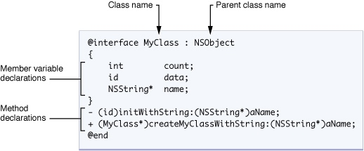
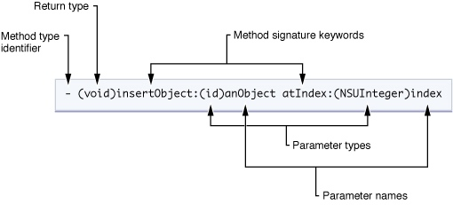

# 前端应该掌握的一些app开发知识-ios篇（2）

移动端混合开发是各大公司非常常见的开发模式，作为前端能了解一些原生开发的基础知识，对程序设计，问题分析都会有很大的益处。

此系列文章对ios原生app开发的一些基础知识做出了归纳和总结，方便前端的同学快速的了解ios开发的知识。

本文主要对知识点进行归纳和总结，不做细节的描述。

在上一篇中已经简单整理了object-c的内容，因为oc的语法结构与js差异化较大，所以，在第二篇文章中，继续总结一下oc的基础。

# NSString

字符串类型，相当于java中的String，js中的""。

NSString *string = @"Hello World!";

# NSArray

数组类型，相当于java中的数组，js中的Array。

NSArray *array = [NSArray arrayWithObjects:@"a", @"b", @"c", nil];


# NSDictionary

字典类型，相当于java中的Map，js中的object，即键值对的集合。

```
NSDictionary *dictinary;
dictionary = [NSDictionary dictionaryWithObjectsAndKeys:
 @"value1",@"key1",
@"value2",@"key2",
nil,
];

```

# .h 和 .m

类的声明一般写在.h文件中，而实现则写在.m文件中。.h文件又称为接口文件，它只会规定一个类有哪些成员变量和成员函数，而不去具体实现它。

# 对象的创建和内存的释放

创建一个对象，使用alloc+init系列。然后使用releaseh或者autorelease的方式释放。

因为没有垃圾回收机制，Objective-C采用计数器的方式来管理内存，使用的时候要特别小心。
用retain方法对计数器加1，用release方法对计数器减1


初始化时，用alloc函数+init系列函数方法时，计数器的状态会被设为1，使用完毕后，务必记得要用release方法来释放内存。

```
NSArray *array = [[NSArray alloc] initWithObjects:@"a", @"b", @"c", nil];
// 对array的一些处理
[array release]; // 释放array的内存
```

用alloc函数+init系列函数的方法生成的对象也可以委托autorelease来释放。

```
NSArray *array = [[[NSArray alloc] initWithObjects:@"a", @"b", @"c", nil] autorelease];
```

# Protocol

类如果声明为符合某种Protocol的话，就要按照Protocol所规定的方法来实现这个类。Protocol和Java中的Interface类似。

# 类的定义



1. 类定义在@interface和@end之间。
2. MyClass:NSObject的方式定义子类和父类。
3. {}中定义类的对象成员
4. －／＋定义的是方法，－定义的是对象的方法，+定义的是类的方法。对象是类的一个实例。对于对象的方法，也即是，当使用该方法之前必须先生成该类的一个特定对象。

# 函数定义和调用



函数的定义由函数的类型标记（Method type identifier）、返回值(return type)、一个或者多个的函数签名关键字(Method signature)、参数的类型和命名信息组成。

函数的真实命名由各个级联的函数签名关键字组成。例如上述函数定义中函数真实的命名是（insertObject:atIndex:）冒号隔开参数的声明。

上述的函数调用可以写成 [myArray insertObject:anObject atIndex:0]; 


