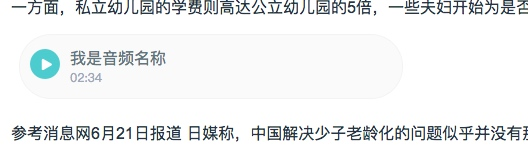

# 富文本编辑器3~自定义元素

# 业务场景

编写文章的过程中需要插入一些特殊的元素。

比如，商品：


比如，音频：



总结一下，自定义元素就是文字图片等基础元素组成的，具有某种固定样式的html结构。

# 方案探索过程

其中主要要解决的问题就是：

**自定义元素是一个整体，内部的元素不能被编辑**

因为整个富文本编辑器都是用contenteditable=true实现的，所以很自然的想到了方案1.

#### 方案1 contenteditable="false"

在自定义元素上添加contenteditable="false"，就可以保证其子元素不可编辑。但是经过测试，这个方案会有2个不好解决的问题：

1. 光标选择自定义元素的开始和结束会选不上
2. 复制粘贴自定义元素会自动在头尾加br

所以放弃了方案1。

然后又想到了iframe，因为iframe的内部是独立的一个页面，不会受父页面的根组件定义的contenteditable="true"的影响，所以，应该可以保证自定义元素的完整性。

#### 方案2 iframe

经过测试，iframe只存在一个问题：

**iframe被复制粘贴后，里面的html会被丢弃**

其实这个问题是因为，当复制剪切粘贴iframe元素后，iframe都会被重新加载，由于iframe里面的html是添加的时候用js装载进去的，所以，当复制剪切粘贴的时候，并没有触发这个动作。

因为是被重新加载，所以复制剪切粘贴会触发iframe的onload事件，利用这个事件来触发js的装载html动作即可。

# 方案设计

因为考虑到后边会添加很多新的自定义元素，所以，要把通用的逻辑进行封装，后边只需添加新元素的个性化定义就可以了。

这里应用了模板模式：定义一个操作中的算法的骨架，而将步骤延迟到子类中。模板方法使得子类可以不改变一个算法的结构即可重定义算法的某些特定步骤。

将【onload事件，自定义元素数据的获取，不同自定义元素渲染器的路由，html装载到iframe】作为算法的骨架，这部分代码写完就会保持不变，未来会自动复用。

将【生成html的算法，getHtml，getCss，getClass】作为抽象的接口，再有新的自定义元素只需实现这2个接口即可。

# 部分代码

骨架代码：

```
export default class TextInput2IframeRender {

    static render = (event) => {
        const ifr = event.target;
        const doc = ifr.contentDocument;
        // const win = ifr.contentWindow;
        const json = JSON.parse(ifr.getAttribute(BBT_JSON));

        let render; // 路由要使用的render
        if (json.t === '3') { // 商品
            render = GoodsRender;
        } else if (json.t === '5') { // 音频
            render = AudioRender;
        }

        if (render) {
            ifr.setAttribute('class', render.getClass());
            doc.body.insertAdjacentHTML('beforeend', render.getCss());
            doc.body.insertAdjacentHTML('beforeend', render.getHtml(json));
        } else {
            throw new Error(`找不到t=${json.t}的iframe处理器`);
        }
    }
}

```

商品接口的实现代码：

```
// render需要实现getHtml 和 getCss 和 getClass 三个接口即可
class GoodsRender {
    static getHtml(content) {
        const html = [];
        html.push('<div class="content-good-wrapper2" >');
        html.push(`<div class="img" style="background-image: url(${content.main_picture})" ></div>`);
        html.push('<div class="content" >');
        html.push(`<a href=${content.pc_link} target="blank" >`);
        html.push(content.main_title);
        html.push('</a>');
        html.push('<div>');
        html.push(`￥${content.price}&nbsp;&nbsp;`);
        html.push(`<span>${content.sales_count}人已囤</span>`);
        html.push('</div></div></div>');
        return html.join('');
    }
    static getCss() {
        const css = [];
        css.push('<style>');
        css.push('.content-good-wrapper2{padding-left: 90px;position: relative;max-width: 530px;}');
        css.push('.content-good-wrapper2 .img {width: 80px;height: 80px;position: absolute;left: 0;top: 0;background-position: center;background-size: cover;}');
        css.push('.content-good-wrapper2 .content {height: 80px;}');
        css.push('.content-good-wrapper2 a{color: #23344B;font-size: 14px;display: inline-block;padding-top: 6px;height: 50px;}');
        css.push('.content-good-wrapper2 a:hover{text-decoration: underline;color: #28B3CA;}');
        css.push('.content-good-wrapper2 div{color: #E7317D;font-size: 18px;}');
        css.push('.content-good-wrapper2 span{color: #6B7C93;font-size: 12px;text-indent: 10px;}');
        css.push('</style>');
        return css.join('');
    }
    static getClass() {
        return 'goods';
    }
}
```


