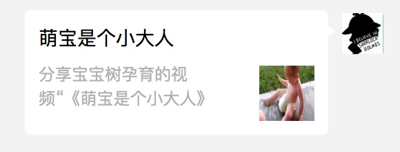
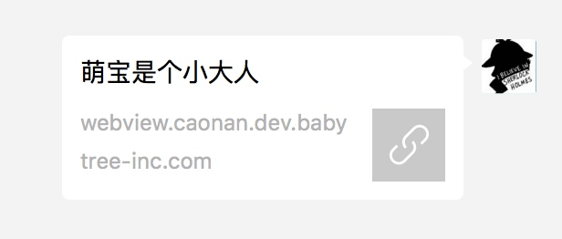

# 微信二次分享遇到的一些坑

# 什么是微信二次分享

微信二次分享指的是，当从app中调用微信sdk分享一篇文章之后，这个分享会在微信中按照固定的格式进行显示，比如下面这样：




但是，如果在微信中打开这个文章，再次将其分享给别人，就会显示成这样：



如何让这类二次分享也能显示成第一种的样式呢，微信官方已经给了解决方案。

# 官方使用条件

1. 微信公众平台配置安全域名。
	
	先登录微信公众平台进入“公众号设置”的“功能设置”里填写“JS接口安全域名”，可以按照提示进行填写，最多填写三个。

2. 引入js文件。

在需要调用JS接口的页面引入如下JS文件，（支持https）：http://res.wx.qq.com/open/js/jweixin-1.2.0.js

3. 通过wx.config接口认证权限等信息。

所有需要使用JS-SDK的页面必须先注入配置信息，否则将无法调用。其中，签名等信息需要后端生成。

```
wx.config({
    debug: true, // 开启调试模式,调用的所有api的返回值会在客户端alert出来，若要查看传入的参数，可以在pc端打开，参数信息会通过log打出，仅在pc端时才会打印。
    appId: '', // 必填，公众号的唯一标识
    timestamp: , // 必填，生成签名的时间戳
    nonceStr: '', // 必填，生成签名的随机串
    signature: '',// 必填，签名，见附录1
    jsApiList: [] // 必填，需要使用的JS接口列表，所有JS接口列表见附录2
});
```

4. 设置分享的数据

比如分享给朋友的
```
wx.onMenuShareAppMessage({
    title: '', // 分享标题
    desc: '', // 分享描述
    link: '', // 分享链接
    imgUrl: '', // 分享图标
    type: '', // 分享类型,music、video或link，不填默认为link
    dataUrl: '', // 如果type是music或video，则要提供数据链接，默认为空
    success: function () { 
        // 用户确认分享后执行的回调函数
    },
    cancel: function () { 
        // 用户取消分享后执行的回调函数
    }
});
```

# 遇到的问题

1. 域名不对

这个问题是因为页面的地址的域名必须要在微信公众平台后台配置，否则就会通不过校验。要注意，源头url是app调用微信sdk产生的，所以，要在app中修改这部分代码。

因为公众平台配置的数量是有限制的，而且只能配置外网url，所以建议app中判断如果是测试环境就写死一个测试环境的url。

2. 签名不对 invalid signature 

签名是由后端通过当前页面的url和其它一些参数生成的，一般是由于后端获取的当前页面的url不对造成的，所以，此处建议要在后端生成签名之前将url打印出来，然后与当前页面的url就行比较，差一个字符都不行。


