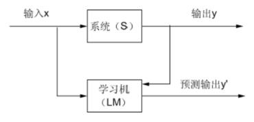
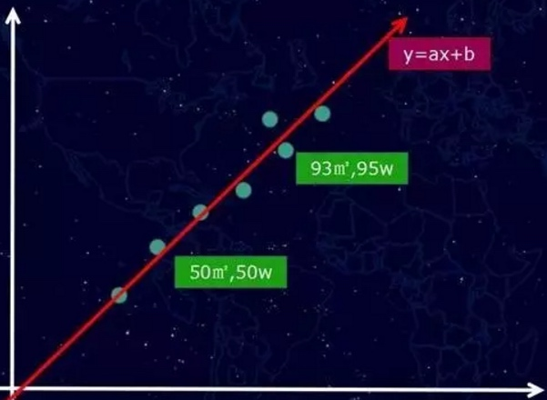
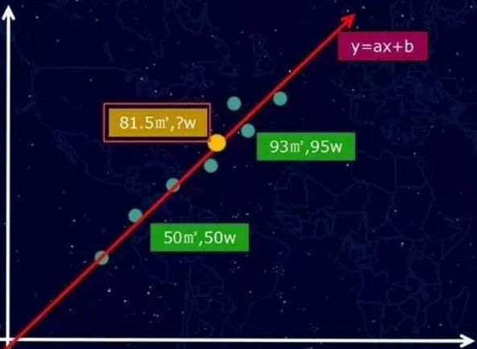

# 机器学习-入门篇（1）

# 我们的世界正在发生着巨大的改变

我们的世界正在发生着巨大的改变，伴随着海量数据的积累和计算机计算能力的不断增强，人工智能领域发展迅速，正在逐渐的改变着我们的生活，原来科幻小说和机器猫里的桥段已经和正在变为现实。

随着高考的来临，柯洁VS阿尔法狗的绝世之战被人们渐渐抛在了脑后，但是其实人工智能的话题可是一点也没有减少，就连高考，人工智能也前来参加了。

在没有网络和题库的支持下，它完成了考卷，得分105分，对于许多人来说，这个分数并不是很高，而且还是一向简单的文科数学试卷。但是“高考机器人”仅仅是用了22分钟的时间，就完成了学生们所需要2小时完成的内容，平均下来，连奋笔疾书都不能形容他的速度了。

前有“阿尔法狗”站到世界围棋巅峰，后有“高考机器人”迎战高考，号称2020年考上清华北大，让我们不禁期待，人工智能的时代是不是真的就要到来了。

其实，人工智能早已融入了我们的生活：

语音识别，苹果的siri，开各种峰会时候用的同声翻译，苹果新发布的智能音箱等。

人脸识别，照相时自动人脸对焦，美剧中FBI用的人脸识别系统，美图秀秀自动美颜等。

精准推送，今日头条、网易新闻的内容推送算法，百度、google广告的推送算法等。

垃圾邮件拦截，邮箱中自动识别垃圾邮件的算法。

无人驾驶汽车，用到了很多人工智能的技术，识别人，识别汽车，识别路等。

阿尔法狗，在对战柯杰的比赛中，下出了很多人类想不到的棋路，完全颠覆了围棋界的认知。

。。。。等等等等。

机器学习是人工智能领域中的一个核心技术体系,研究的是怎样让机器能够通过经验数据自我学习，怎样让机器在没有明显规律的情况下获得人类的智慧，获得类似人类凭经验判断、决策的能力。

# 基本概念

顾名思义，机器学习的目的就是让机器具有类似于人类的学习、认识、理解事物的能力。

一个典型的机器学习系统可以用下面的图来表示：

其中，系统S是我们研究的对象，它在给定一个输入x的情况下，得到一定的输出y,LM是我们所求的学习机，其输出为y'。机器学习的目的是根据给定的训练样本（一堆已有的数据，包含x和y）求取系统输入输出之间的依赖关系的估计（图中的学习机），使它能够对未知的输出做出尽可能准确的预测。

# 举个栗子

我们以“房屋价格测算”作为例子，一起来看看：

一套房子的价格，会受到很多因素的影响，例如地段、朝向、房龄、面积、银行利率等等，这些因素如果细分，可能会有几十个。一般在机器学习模型里，这些影响结果的因素我们称之为特征。我们先假设一种极端的场景，比如影响价格的特征只有一种，就是房子面积。然后我们收集一批相关的数据，例如，50平米50万、93平米95万等一系列样本数据，如果将这些样本数据放到二维坐标里看，则如下图：（绿点表示了所有的已知经验数据）

然后，正如我们前面所说的，我们尝试用一个“函数”去表示这个输入（面积x）和输出（价格y），简而言之，我们就是要通过一条直线或者曲线将这些点“拟合”起来。

假设情况也比较极端，这些点刚好可以用一条“直线”拟合（真实情况通常不会是直线），如下图：

那么我们的函数是一个一次元方程f(x) = ax +b（这个就是机器学习训练出来的模型），当然，如果是曲线的话，我们得到的将是多次元方程。我们获得这个f(x) = ax +b的函数之后，接下来就可以做房价“预测”，例如，我们可以计算一个我们从未看见的面积案例81.5平方米，它究竟是多少钱？

这个新的样本案例，可以通过直线找到对应的点（黄色的点），如图下：

粗略的理解，上面就是AI的概括性的运作方式。这一切似乎显得过于简单了？当然不会，因为，我们前面提到，影响房价其实远不止一个特征，而是有几十个，这样问题就比较复杂了。

本篇介绍了机器学习的基本概念，并用一个简单的例子描述了AI的基本运作模式，后面文章会介绍当特征增多的时候，如何处理。

ps: 听说人工智能已经能从UI设计稿生成UI代码了。。。。。。

