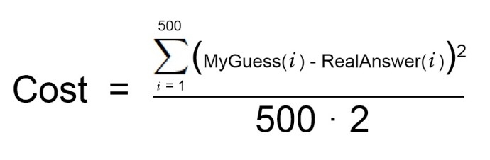
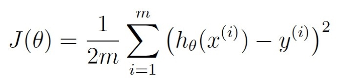
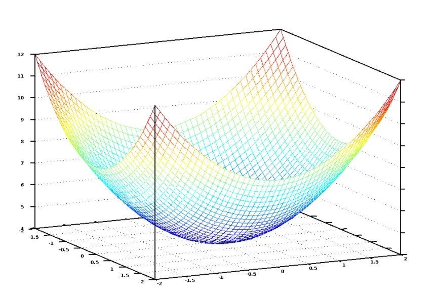

# 机器学习-入门篇（4）

书接上回，如何能快速的找到一组优秀的权重值呢。

首先，写出一个简单的等式表示前述步骤2：

这是你的代价函数：

接着，让我们将这同一个等式用机器学习的数学术语，进行重写：
 

θ表示当前的权重值。J(θ) 意为“当前权重值对应的代价”。

这个等式表示我们的估价程序在当前权重值下偏离程度的大小。

如果将所有赋给卧室数和面积的可能权重值以图形形式显示，我们会得到类似下图的图表：

代价函数的图形像一支碗。纵轴表示代价。

图中蓝色的最低点就是代价最低的地方——即我们的程序偏离最小。最高点意味着偏离最大。所以，如果我们能找到一组权重值带领我们到达图中的最低点，我们就找到了答案！

因此，我们只需要调整权重值使我们在图上能向着最低点“走下坡路”。如果对于权重的细小调节能一直使我们保持向最低点移动，那么最终我们不用尝试太多权重值就能到达那里。

如果你还记得一点微积分的话，你也许记得如果你对一个函数求导，结果会告诉你函数在任一点的斜率。换句话说，对于图上给定一点，它告诉我们那条路是下坡路。我们可以利用这一点朝底部进发。

所以，如果我们对代价函数关于每一个权重求偏导，那么我们就可以从每一个权重中减去该值。这样可以让我们更加接近山底。一直这样做，最终我们将到达底部，得到权重的最优值。

这种找出最佳权重的办法被称为批量梯度下降，上面是对它的高度概括。

上面我描述的三步算法被称为多元线性回归。你估算等式是在求一条能够拟合所有房价数据点的直线。然后，你再根据房价在你的直线上可能出现的位置用这个等式来估算从未见过的房屋的价格。

但是，我为你展示的这种方法可能在简单的情况下有效，它不会在所有情况下都有用。原因之一是因为房价不会一直那么简单地跟随一条连续直线。

但是，幸运的是，有很多办法来处理这种情况。对于非线性数据，很多其他类型的机器学习算法可以处理（如神经网络或有核向量机）。还有很多方法运用线性回归更灵活，想到了用更复杂的线条来拟合。在所有的情况中，寻找最优权重值这一基本思路依然适用。

还有，我忽略了过拟合的概念。很容易碰上这样一组权重值，它们对于你原始数据集中的房价都能完美预测，但对于原始数据集之外的任何新房屋都预测不准。这种情况的解决之道也有不少（如正则化以及使用交叉验证数据集）。学会如何处理这一问题对于顺利应用机器学习至关重要。

换言之，基本概念非常简单，要想运用机器学习得到有用的结果还需要一些技巧和经验。

一旦你开始明白机器学习技术很容易应用于解决貌似很困难的问题（如手写识别），你心中会有一种感觉，只要有足够的数据，你就能够用机器学习解决任何问题。只需要将数据输入进去，就能看到计算机变戏法一样找出拟合数据的等式。

但是很重要的一点你要记住，机器学习只能对用你占有的数据实际可解的问题才适用。

例如，如果你建立了一个模型来根据每套房屋内盆栽数量来预测房价，它就永远不会成功。房屋内盆栽数量和房价之间没有任何的关系。所以，无论它怎么去尝试，计算机也推导不出两者之间的关系。

只能对实际存在的关系建模。

