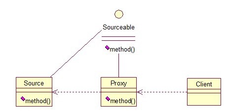

# 代理模式

代理模式就是多一个代理类出来，替原对象进行一些操作，比如我们在租房子的时候回去找中介，为什么呢？因为你对该地区房屋的信息掌握的不够全面，希望找一个更熟悉的人去帮你做，此处的代理就是这个意思。再如我们有的时候打官司，我们需要请律师，因为律师在法律方面有专长，可以替我们进行操作，表达我们的想法。先来看看关系图：





根据上文的阐述，代理模式就比较容易的理解了，我们看下代码：


```
	1.	public interface Sourceable {  
	2.	    public void method();  
	3.	}  

	1.	public class Source implements Sourceable {  
	2.	  
	3.	    @Override  
	4.	    public void method() {  
	5.	        System.out.println("the original method!");  
	6.	    }  
	7.	}  

	1.	public class Proxy implements Sourceable {  
	2.	  
	3.	    private Source source;  
	4.	    public Proxy(){  
	5.	        super();  
	6.	        this.source = new Source();  
	7.	    }  
	8.	    @Override  
	9.	    public void method() {  
	10.	        before();  
	11.	        source.method();  
	12.	        atfer();  
	13.	    }  
	14.	    private void atfer() {  
	15.	        System.out.println("after proxy!");  
	16.	    }  
	17.	    private void before() {  
	18.	        System.out.println("before proxy!");  
	19.	    }  
	20.	}  

	
测试类：

	1.	public class ProxyTest {  
	2.	  
	3.	    public static void main(String[] args) {  
	4.	        Sourceable source = new Proxy();  
	5.	        source.method();  
	6.	    }  
	7.	  
	8.	}  


输出：
before proxy!
the original method!
after proxy!


```

代理模式的应用场景：

如果已有的方法在使用的时候需要对原有的方法进行改进，此时有两种办法：

1. 修改原有的方法来适应。这样违反了“对扩展开放，对修改关闭”的原则。
2. 就是采用一个代理类调用原有的方法，且对产生的结果进行控制。这种方法就是代理模式。

使用代理模式，可以将功能划分的更加清晰，有助于后期维护！


