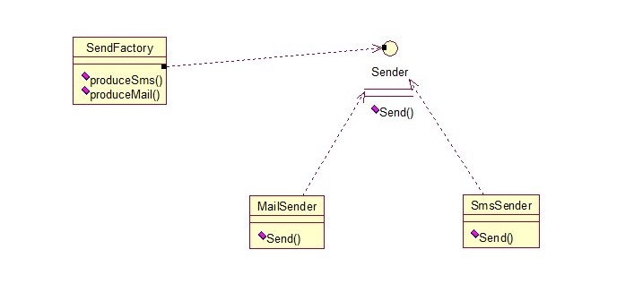

# 多个工厂方法模式

多个工厂方法模式，是对普通工厂方法模式的改进，在普通工厂方法模式中，如果传递的字符串出错，则不能正确创建对象，而多个工厂方法模式是提供多个工厂方法，分别创建对象。关系图：




将上面的代码做下修改，改动下SendFactory类就行，如下：

```
class SendFactory {  
   public Sender produceMail(){  
         return new MailSender();  
 	    }  
       
 	    public Sender produceSms(){  
 	        return new SmsSender();  
 	    }  
}  

```

测试类如下：

```
	1.	public class FactoryTest {  
	2.	  
	3.	    public static void main(String[] args) {  
	4.	        SendFactory factory = new SendFactory();  
	5.	        Sender sender = factory.produceMail();  
	6.	        sender.Send();  
	7.	    }  
	8.	}  

```

输出：this is mailsender!


