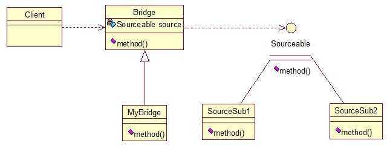
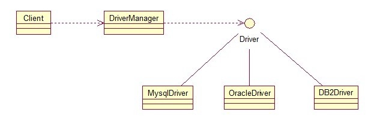

# 桥接模式

桥接模式就是把事物和其具体实现分开，使他们可以各自独立的变化。桥接的用意是：将抽象化与实现化解耦，使得二者可以独立变化，像我们常用的JDBC桥DriverManager一样，JDBC进行连接数据库的时候，在各个数据库之间进行切换，基本不需要动太多的代码，甚至丝毫不用动，原因就是JDBC提供统一接口，每个数据库提供各自的实现，用一个叫做数据库驱动的程序来桥接就行了。我们来看看关系图：



```
先定义接口：
	1.	public interface Sourceable {  
	2.	    public void method();  
	3.	}  

	
分别定义两个实现类：
	1.	public class SourceSub1 implements Sourceable {  
	2.	  
	3.	    @Override  
	4.	    public void method() {  
	5.	        System.out.println("this is the first sub!");  
	6.	    }  
	7.	}  

	1.	public class SourceSub2 implements Sourceable {  
	2.	  
	3.	    @Override  
	4.	    public void method() {  
	5.	        System.out.println("this is the second sub!");  
	6.	    }  
	7.	}  
定义一个桥，持有Sourceable的一个实例：
	1.	public abstract class Bridge {  
	2.	    private Sourceable source;  
	3.	  
	4.	    public void method(){  
	5.	        source.method();  
	6.	    }  
	7.	      
	8.	    public Sourceable getSource() {  
	9.	        return source;  
	10.	    }  
	11.	  
	12.	    public void setSource(Sourceable source) {  
	13.	        this.source = source;  
	14.	    }  
	15.	}  
	1.	public class MyBridge extends Bridge {  
	2.	    public void method(){  
	3.	        getSource().method();  
	4.	    }  
	5.	}  
测试类：
	1.	public class BridgeTest {  
	2.	      
	3.	    public static void main(String[] args) {  
	4.	          
	5.	        Bridge bridge = new MyBridge();  
	6.	          
	7.	        /*调用第一个对象*/  
	8.	        Sourceable source1 = new SourceSub1();  
	9.	        bridge.setSource(source1);  
	10.	        bridge.method();  
	11.	          
	12.	        /*调用第二个对象*/  
	13.	        Sourceable source2 = new SourceSub2();  
	14.	        bridge.setSource(source2);  
	15.	        bridge.method();  
	16.	    }  
	17.	}  
output：
this is the first sub!
this is the second sub!


```

这样，就通过对Bridge类的调用，实现了对接口Sourceable的实现类SourceSub1和SourceSub2的调用。接下来我再画个图，大家就应该明白了，因为这个图是我们JDBC连接的原理，有数据库学习基础的，一结合就都懂了。





