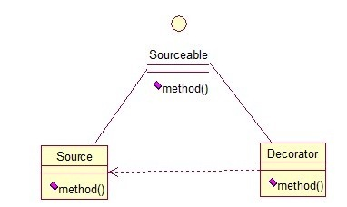

# 装饰器模式

顾名思义，装饰模式就是给一个对象增加一些新的功能，而且是动态的，要求装饰对象和被装饰对象实现同一个接口，装饰对象持有被装饰对象的实例，关系图如下：




Source类是被装饰类，Decorator类是一个装饰类，可以为Source类动态的添加一些功能，代码如下：

```
	1.	public interface Sourceable {  
	2.	    public void method();  
	3.	}  


	1.	public class Source implements Sourceable {  
	2.	  
	3.	    @Override  
	4.	    public void method() {  
	5.	        System.out.println("the original method!");  
	6.	    }  
	7.	}  

	1.	public class Decorator implements Sourceable {  
	2.	  
	3.	    private Sourceable source;  
	4.	      
	5.	    public Decorator(Sourceable source){  
	6.	        super();  
	7.	        this.source = source;  
	8.	    }  
	9.	    @Override  
	10.	    public void method() {  
	11.	        System.out.println("before decorator!");  
	12.	        source.method();  
	13.	        System.out.println("after decorator!");  
	14.	    }  
	15.	}  


	1.	public class DecoratorTest {  
	2.	  
	3.	    public static void main(String[] args) {  
	4.	        Sourceable source = new Source();  
	5.	        Sourceable obj = new Decorator(source);  
	6.	        obj.method();  
	7.	    }  
	8.	}  

```

输出：
before decorator!

the original method!

after decorator!

装饰器模式的应用场景：
1. 需要扩展一个类的功能。
2. 动态的为一个对象增加功能，而且还能动态撤销。（继承不能做到这一点，继承的功能是静态的，不能动态增删。）


