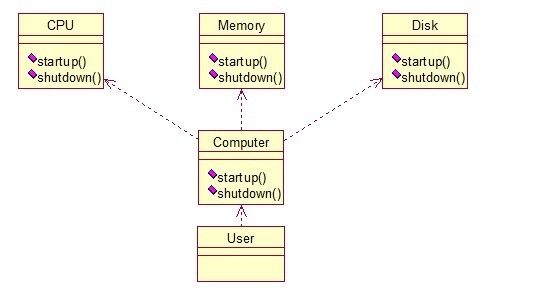

# 门面模式

门面模式是为了解决类与类之家的依赖关系的，像spring一样，可以将类和类之间的关系配置到配置文件中，而门面模式就是将他们的关系放在一个Facade类中，降低了类类之间的耦合度，该模式中没有涉及到接口，看下类图：（我们以一个计算机的启动过程为例）




```
我们先看下实现类：

	1.	public class CPU {  
	2.	      
	3.	    public void startup(){  
	4.	        System.out.println("cpu startup!");  
	5.	    }  
	6.	      
	7.	    public void shutdown(){  
	8.	        System.out.println("cpu shutdown!");  
	9.	    }  
	10.	}  

	1.	public class Memory {  
	2.	      
	3.	    public void startup(){  
	4.	        System.out.println("memory startup!");  
	5.	    }  
	6.	      
	7.	    public void shutdown(){  
	8.	        System.out.println("memory shutdown!");  
	9.	    }  
	10.	}  


	1.	public class Disk {  
	2.	      
	3.	    public void startup(){  
	4.	        System.out.println("disk startup!");  
	5.	    }  
	6.	      
	7.	    public void shutdown(){  
	8.	        System.out.println("disk shutdown!");  
	9.	    }  
	10.	}  


	1.	public class Computer {  
	2.	    private CPU cpu;  
	3.	    private Memory memory;  
	4.	    private Disk disk;  
	5.	      
	6.	    public Computer(){  
	7.	        cpu = new CPU();  
	8.	        memory = new Memory();  
	9.	        disk = new Disk();  
	10.	    }  
	11.	      
	12.	    public void startup(){  
	13.	        System.out.println("start the computer!");  
	14.	        cpu.startup();  
	15.	        memory.startup();  
	16.	        disk.startup();  
	17.	        System.out.println("start computer finished!");  
	18.	    }  
	19.	      
	20.	    public void shutdown(){  
	21.	        System.out.println("begin to close the computer!");  
	22.	        cpu.shutdown();  
	23.	        memory.shutdown();  
	24.	        disk.shutdown();  
	25.	        System.out.println("computer closed!");  
	26.	    }  
	27.	}  
	
User类如下：

	1.	public class User {  
	2.	  
	3.	    public static void main(String[] args) {  
	4.	        Computer computer = new Computer();  
	5.	        computer.startup();  
	6.	        computer.shutdown();  
	7.	    }  
	8.	}  

	
输出：
start the computer!
cpu startup!
memory startup!
disk startup!
start computer finished!
begin to close the computer!
cpu shutdown!
memory shutdown!
disk shutdown!
computer closed!

```

如果我们没有Computer类，那么，CPU、Memory、Disk他们之间将会相互持有实例，产生关系，这样会造成严重的依赖，修改一个类，可能会带来其他类的修改，这不是我们想要看到的，有了Computer类，他们之间的关系被放在了Computer类里，这样就起到了解耦的作用，这，就是门面模式！


